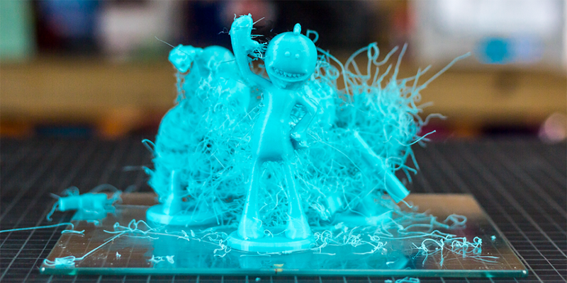

# FDM 3D Printer Common Problem Troubleshooting Guide 
Use this guide to help you identify and solve the most common issues that may occur while 3D printing.     
 

When printing, unexpected challenges may arise that will need to be resolved in order to complete a successful print.  Often times, the appropriate response to a printing issue is not immediately apparent.  This guide outlines some of the most common issues faced by 3D printing practitioners and highlights steps that may be taken to resolve those issues.

----
### Contents
The guide is organized into a table with the following format. 
<table><tbody><tr><td><strong>Issue/Title</strong></td><td>This highlights the action of a printer or print result that is not optimal or correct. This is comparable to a medical examination where the doctor inquires about the symptoms or behavior the patient is exhibiting or experiencing while being ill.</td></tr><tr><td><strong>Example Image/Graphic</strong></td><td>This is an image or graphical representation of the issue.</td></tr><tr><td><strong>Issue Details</strong></td><td>This provides additional information on the issue from actions during printing or the results upon completion.</td></tr><tr><td><strong>Cause and Suggested Solutions</strong></td><td>This lists in order from highest to lowest probability the source or cause of the issue and suggested solutions to follow for issue resolution.</td></tr></tbody></table>

- [Issue1: Not extruding at the start of the print](#issue1) 
- [Issue2: Print not sticking to bed](#issue2)  
- [Issue3: Jammed nozzle / clogged extruder](#issue3)  
- [Issue4: Pillowing, e.g. incomplete top layer fills, top layer holes/gaps](#issue4)  
- [Issue5: Smashed first layer, aka elephant’s foot; bulging first layer](#issue5)  
- [Issue6: Warping or corner lifting](#issue6)  
- [Issue7: Layer separation or warping within the part](#issue7)  
- [Issue8: Shifted layers or leaning prints](#issue8)  
- [Issue9: Stringing / hairy prints](#issue9)  
- [Issue10: Overhangs or sagging sections in the print](#issue10)  
- [Issue11: Support material difficult to remove](#issue11)  
- [Issue12: Under extrusion, e.g. not extruding enough plastic or insufficient material](#issue12)  
- [Issue13: Grinding filament and/or extruder motor skipping](#issue13)  
- [Issue14: Small features not printed](#issue14)  
- [Issue15: Scars on top surface](#issue15)  
- [Issue16: Blobs and/or pimples on exterior surface](#issue16)  
- [Issue17: Weak infill](#issue17)  
- [Issue18: Stops extruding in the middle of a print](#issue18)  
- [Issue19: Infill showing on exterior of print](#issue19)

----
## Not Extruding At The Start Of The Print
<table><tbody><tr><td>
Issue/Title
</td><td>
Not extruding at the start of the print
</td></tr><tr><td>
Example Image / Graphic
</td><td>

</td></tr><tr><td>
Issue Details
</td><td>
Print grooves left in bed with no filament and/or flaky or intermittent lines of filament on the first and subsequent layers
</td></tr><tr><td>
Cause 1
</td><td>
Incorrect extruder calibration/offset
</td></tr><tr><td>
Suggested Solutions 1
</td><td><ol><li>
Prime extruder
</li><li>
Adjust nozzle height
</li><li>
Adjust first layer height
</li><li>
Adjust filament extrusion width
</li><li>
Babysteping; Z offset
</li></ol></td></tr><tr><td>
Cause 2
</td><td>
Clogged extruder/nozzle
</td></tr><tr><td>
Suggested Solutions 2
</td><td><ol><li>
Hobbed gear
</li><li>
Clear nozzle
</li></ol></td></tr></tbody></table>

----
##  Print Not Sticking To Bed
<table><tbody><tr><td>
Issue/Title
</td><td>
Print not sticking to bed
</td></tr><tr><td>
Example Image / Graphic
</td><td>

</td></tr><tr><td>
Issue Details
</td><td>
Insufficient bed adhesion
</td></tr><tr><td>
Cause 1
</td><td>
Bed is not level
</td></tr><tr><td>
Suggested Solutions 1
</td><td><ol><li>
Level bed
</li><li>
Reduce print speed (first layer speed)
</li></ol></td></tr><tr><td>
Cause 2
</td><td>
Incorrect nozzle calibration/offset
</td></tr><tr><td>
Suggested Solutions 2
</td><td><ol><li>
Adjust nozzle height
</li><li>
Adjust first layer height (Use baby-stepping to ensure proper first layer height)
</li></ol></td></tr><tr><td>
Cause 3
</td><td>
Improper bed surface or settings for filament
</td></tr><tr><td>
Suggested Solutions 3
</td><td><ol><li>
Change bed surface (glass/tape/BuildTak)
</li><li>
Use adhesives (tape/glue/hairspray)
</li><li>
Adjust bed temperature (for some materials)
</li><li>
Adjust extrusion temperature
</li><li>
Pro Tip - Use raft and brim
</li></ol></td></tr></tbody></table>

----
##  Jammed Nozzle / Clogged Extruder
<table><tbody><tr><td>
Issue/Title
</td><td>
Jammed nozzle/clogged extruder
</td></tr><tr><td>
Example Image / Graphic
</td><td>

</td></tr><tr><td>
Issue Details
</td><td>
Extruder is unable to feed filament through nozzle and is often accompanied by a grinding or “clicking” sound from the feed motor
</td></tr><tr><td>
Cause 1
</td><td>
Heat creep for PLA
</td></tr><tr><td>
Suggested Solutions 1
</td><td><ol><li>
Manually push filament through extruder
</li><li>
Reload filament
</li><li>
Cool extruder and reheat
</li></ol></td></tr><tr><td>
Cause 2
</td><td>
Particle or carbonized filament blocking nozzle
</td></tr><tr><td>
Suggested Solutions 2
</td><td><ol><li>
Clear with small diameter needle, e.g. acupuncture needle
</li><li>
Nylon cold pull
</li><li>
Disassemble extruder and nozzle
</li><li>
<a href="http://forums.matterhackers.com/topic/39/unclogging-nozzles">http://forums.matterhackers.com/topic/39/unclogging-nozzles</a>
</li></ol></td></tr></tbody></table>

----
##  Pillowing, e.g. incomplete top layer fills, top layer holes/gaps
<table><tbody><tr><td>
Issue/Title
</td><td>
Pillowing, e.g. incomplete top layer fills, top layer holes/gaps
</td></tr><tr><td>
Example Image / Graphic
</td><td>

</td></tr><tr><td>
Issue Details
</td><td>
Pillowing is usually PLA filament specific
</td></tr><tr><td>
Cause 1
</td><td>
Layer cooling too fast for PLA
</td></tr><tr><td>
Suggested Solutions 1
</td><td><ol><li>
Increase the number of top layers
</li><li>
Increase infill density
</li><li>
Lower speed for solid top layers
</li></ol></td></tr></tbody></table>

----
##  Smashed first layer, aka elephant’s foot; bulging first layer
<table><tbody><tr><td>
Issue/Title
</td><td>
Smashed first layer, aka elephant’s foot; bulging first layer
</td></tr><tr><td>
Example Image / Graphic
</td><td>

</td></tr><tr><td>
Issue Details
</td><td>
Side profile of the printed part shows a bow near the bottom or next to the surface that was adjacent to the print bed
</td></tr><tr><td>
Cause 1
</td><td>
Bed is not level
</td></tr><tr><td>
Suggested Solutions 1
</td><td><ol><li>
Level bed
</li></ol></td></tr><tr><td>
Cause 2
</td><td>
First layer height is too low
</td></tr><tr><td>
Suggested Solutions 2
</td><td><ol><li>
Increase first layer height
</li><li>
Balance height adjustment with first layer quality
</li></ol></td></tr><tr><td>
Cause 3
</td><td>
Extrusion rate for the first layer is greater than 100%
</td></tr><tr><td>
Suggested Solutions 3
</td><td><ol><li>
Adjust first layer extrusion rate
</li><li>
Pro Tip - Design a chamfer into the part
</li></ol></td></tr></tbody></table>

----
##  Warping or corner lifting
<table><tbody><tr><td>
Issue/Title
</td><td>
Warping or corner lifting
</td></tr><tr><td>
Example Image / Graphic
</td><td>

</td></tr><tr><td>
Issue Details
</td><td>
Edge near the bottom of the print or surface adjacent to the print bed is not level or flat
</td></tr><tr><td>
Cause 1
</td><td>
<a href="https://www.matterhackers.com/3d-printer-filament-compare">Materials</a>, e.g. ABS and Nylon may shrink upon cooling and/or curing
</td></tr><tr><td>
Suggested Solutions 1
</td><td><ol><li>
Level bed
</li><li>
Use glues/adhesives on borosilicate glass
</li><li>
For ABS, use BuildTak, WolfBite, or ABS “juice”
</li><li>
Use baby-stepping to ensure proper first layer height
</li><li>
Pro Tip - Use Enclosure for environmental control
</li><li>
Pro Tip - Keep printer away from air vents
</li></ol></td></tr><tr><td>
Cause 2
</td><td>
Design of part has sharp corners or thin areas
</td></tr><tr><td>
Suggested Solutions 2
</td><td><ol><li>
Level bed
</li><li>
Use baby-stepping to ensure proper first layer height
</li><li>
Design “lily pads” for suspected problem areas and integrate into the model
</li></ol></td></tr></tbody></table>

----
##  Layer separation or warping within the part
<table><tbody><tr><td>
Issue/Title
</td><td>
Layer separation or warping within the part
</td></tr><tr><td>
Example Image / Graphic
</td><td>

</td></tr><tr><td>
Issue Details
</td><td>
Layers do not adhere to previously printed layers and pulls from print bed
</td></tr><tr><td>
Cause 1
</td><td>
Print temperature is set too low
</td></tr><tr><td>
Suggested Solutions 1
</td><td><ol><li>
Adjust print temperature higher
</li></ol></td></tr><tr><td>
Cause 2
</td><td>
Too much layer cooling during and after deposition
</td></tr><tr><td>
Suggested Solutions 2
</td><td><ol><li>
Disable layer cooling
</li></ol></td></tr><tr><td>
Cause 3
</td><td>
Ambient air temperature is too cold and uneven
</td></tr><tr><td>
Suggested Solutions 3
</td><td><ol><li>
Use an enclosure, e.g. cardboard box or shower curtain to control environment
</li></ol></td></tr><tr><td>
Cause 4
</td><td>
Printer is printing too fast
</td></tr><tr><td>
Suggested Solutions 4
</td><td><ol><li>
Decrease print speed
</li></ol></td></tr></tbody></table>

----
##  Shifted layers or leaning prints
<table><tbody><tr><td>
Issue/Title
</td><td>
Shifted layers or leaning prints
</td></tr><tr><td>
Example Image / Graphic
</td><td>

</td></tr><tr><td>
Issue Details
</td><td>
Layers shift in the z-direction as print progresses
</td></tr><tr><td>
Cause 1
</td><td>
Printer is printing too fast
</td></tr><tr><td>
Suggested Solutions 1
</td><td><ol><li>
Lower printing speed
</li></ol></td></tr><tr><td>
Cause 2
</td><td>
There nozzle is getting caught on raised or warped sections of the print
</td></tr><tr><td>
Suggested Solutions 2
</td><td><ol><li>Change your Z-Lift to be a small positive number so the nozzle will be above the part during moves. A good number for most printers is 1mm or approximately 5 layers.</li></ol></td></tr><tr><td>
Cause 3
</td><td>
There are loose pulleys on the x-axis and/or y-axis
</td></tr><tr><td>
Suggested Solutions 3
</td><td><ol><li>
Make sure there is no “play” in the pulleys and tighten
</li><li>
Check to see if there is friction on the pulleys and adjust
</li><li>
<a href="http://forums.matterhackers.com/topic/76/how-to-fix-shifting-layers">http://forums.matterhackers.com/topic/76/how-to-fix-shifting-layers</a>
</li></ol></td></tr><tr><td>
Cause 4
</td><td>
Belts are skipping teeth on the x-axis and/or y-axis
</td></tr><tr><td>
Suggested Solutions 4
</td><td><ol><li>
Check for friction along the entire axis
</li><li>
Check that belts are tight and adjust tension screw
</li><li>
<a href="http://forums.matterhackers.com/topic/76/how-to-fix-shifting-layers">http://forums.matterhackers.com/topic/76/how-to-fix-shifting-layers</a>
</li></ol></td></tr></tbody></table>

----
##  Stringing / hairy prints
<table><tbody><tr><td>
Issue/Title
</td><td>
Stringing / hairy prints
</td></tr><tr><td>
Example Image / Graphic
</td><td>

</td></tr><tr><td>
Issue Details
</td><td>
Filament in the hot end of the extruder continues to ooze out of the nozzle during non-print moves
</td></tr><tr><td>
Cause 1
</td><td>
Slow extruder movement between sections of a part or more than one part
</td></tr><tr><td>
Suggested Solutions 1
</td><td><ol><li>
Retraction calibration
</li><li>
Increase extruder speed on non-printing movements
</li><li>
<a href="https://www.matterhackers.com/articles/retraction-just-say-no-to-oozing">Retraction: Just say "No" to oozing</a>
</li><li>
<a href="http://www.matterhackers.com/store/digital-designs/retraction-cubes">Retraction Cubes</a> download
</li></ol></td></tr><tr><td>
Cause 2
</td><td>
Length of filament retraction is too short
</td></tr><tr><td>
Suggested Solutions 2
</td><td><ol><li>
Retraction calibration
</li><li>
Increase length of filament retraction
</li><li>
<a href="https://www.matterhackers.com/articles/retraction-just-say-no-to-oozing">Retraction: Just say "No" to oozing</a>
</li><li>
<a href="http://www.matterhackers.com/store/digital-designs/retraction-cubes">Retraction Cubes</a> download
</li></ol></td></tr><tr><td>
Cause 3
</td><td>
You are printing with PET
</td></tr><tr><td>
Suggested Solutions 3
</td><td><ol><li>
Use dry filament
</li><li>
Adjust extruder temperature
</li></ol></td></tr><tr><td>
Cause 4
</td><td>
Printer crosses gaps when moving from one place to another
</td></tr><tr><td>
Suggested Solutions 4
</td><td><ol><li>
Turn on <a href="http://wiki.mattercontrol.com/Settings/General/Layers-Surface/Outer_Surface_-_Perimeters/Avoid_Crossing_Perimeters">avoid crossing perimeters</a>
</li></ol></td></tr></tbody></table>

----
##  Overhangs or sagging sections in the print
<table><tbody><tr><td>
Issue/Title
</td><td>
Overhangs or sagging sections in the print
</td></tr><tr><td>
Example Image / Graphic
</td><td>

</td></tr><tr><td>
Issue Details
</td><td>
Unsupported or protruding part faces may not print properly or not print at all
</td></tr><tr><td>
Cause 1
</td><td>
Design of model or positioning of part
</td></tr><tr><td>
Suggested Solutions 1
</td><td><ol><li>
Add supports
</li><li>
Reduce layer heights
</li><li>
Slow speed
</li><li>
Reposition model for better printing
</li><li>
Keep overhangs typically at a 45 degree angle or less
</li></ol></td></tr></tbody></table>

----
##  Support material difficult to remove
<table><tbody><tr><td>
Issue/Title
</td><td>
Support material difficult to remove
</td></tr><tr><td>
Example Image / Graphic
</td><td>

</td></tr><tr><td>
Issue Details
</td><td>
Removing supports is difficult due to fused support material with the initial part layers and often results in pitted initial layers once supports are removed
</td></tr><tr><td>
Cause 1
</td><td>
No gap or layer height offset between support layer and initial part layer
</td></tr><tr><td>
Suggested Solutions 1
</td><td><ol><li>
Increase air gap
</li><li>
Increase the pattern spacing
</li><li>
Decrease the support percentage
</li><li>
Turn off create perimeter
</li></ol></td></tr></tbody></table>

----
##  Under extrusion, e.g. not extruding enough plastic or insufficient material
<table><tbody><tr><td>
Issue/Title
</td><td>
Under extrusion, e.g. not extruding enough plastic or insufficient material
</td></tr><tr><td>
Example Image / Graphic
</td><td>

</td></tr><tr><td>
Issue Details
</td><td>
Under extrusion is identified by “silky” residue or gaps between extrusion lines or layers
</td></tr><tr><td>
Cause 1
</td><td>
Printer settings for filament size is incorrect
</td></tr><tr><td>
Suggested Solutions 1
</td><td><ol><li>
Measure filament diameter
</li><ol><li>
Change filament extrusion multiplier to compensate on the fly
</li><li>
Some machines require 2.85 mm filament instead of 3.00 mm filament (Airwolf, Ultimaker).
</li></ol></ol></td></tr><tr><td>
Cause 2
</td><td>
Filament extrusion temperature is too low
</td></tr><tr><td>
Suggested Solutions 3
</td><td><ol><li>
Increase extruder temperature
</li></ol></td></tr><tr><td>
Cause 3
</td><td>
Nozzle or extruder may be clogged or not properly calibrated
</td></tr><tr><td>
Suggested Solutions 3
</td><td><ol><li>
Check that the filament path is clear
</li><li>
Clear nozzle and/or extruder
</li><li>
<a href="https://www.matterhackers.com/articles/how-to-calibrate-your-extruder">Calibrate your extruder</a>
</li><ol><li>
<a href="https://www.matterhackers.com/articles/calibrating-your-makerbot-using-mattercontrol">Calibrating a Makerbot</a>
</li></ol></ol></td></tr></tbody></table>

----
##  Grinding filament and/or extruder motor skipping
<table><tbody><tr><td>
Issue/Title
</td><td>
Grinding filament and/or extruder motor skipping
</td></tr><tr><td>
Example Image / Graphic
</td><td>

</td></tr><tr><td>
Issue Details
</td><td>
Noise from the feed motor makes a grinding or clicking sound
</td></tr><tr><td>
Cause 1
</td><td>
Heat creep from the extruder that creates a “bulb” at the end of the filament between the gear and the extruder
</td></tr><tr><td>
Suggested Solutions 1
</td><td><ol><li>
Check that filament is extruding
</li><li>
Increase extruder temperature
</li><li>
Clear nozzle jam
</li><li>
Check extruder motor and hobbed gear for filament residue
</li></ol></td></tr></tbody></table>

----
##  Small features not printed
<table><tbody><tr><td>
Issue/Title
</td><td>
Small features not printed
</td></tr><tr><td>
Example Image / Graphic
</td><td>

</td></tr><tr><td>
Issue Details
</td><td>
Small details such as sharp corners, thin walls, or intricate designs are not fully formed or are missing in the final print. This can often be seen in highly detailed models or prints with small, intricate parts.
</td></tr><tr><td>
Cause 1
</td><td>
Features are below the nozzle extrusion width is the most common cause of this issue
</td></tr><tr><td>
Suggested Solutions 1
</td><td><ol><li>
Turn on thin wall detection. This is sometimes call aracne in Cura and Prusa Slicer.
</li><li>
If you have access to the source files, re-model the walls with more thickness.
</li></ol></td></tr></tbody></table>

----
##  Scars on top surface
<table><tbody><tr><td>
Issue/Title
</td><td>
Scars on top surface
</td></tr><tr><td>
Example Image / Graphic
</td><td>

</td></tr><tr><td>
Issue Details
</td><td>
Filament residue is “leaked” upon the top of the print surface
</td></tr><tr><td>
Cause 1
</td><td>
Lack of z-lift or retraction between moves
</td></tr><tr><td>
Suggested Solutions 1
</td><td><ol><li>
Increase z- lift
</li></ol></td></tr></tbody></table>

----
##  Blobs and/or pimples on exterior surface
<table><tbody><tr><td>
Issue/Title
</td><td>
Blobs and/or pimples on exterior surface
</td></tr><tr><td>
Example Image / Graphic
</td><td>

</td></tr><tr><td>
Issue Details
</td><td>&nbsp;The exterior surface of the print has small, unwanted extrusions or bumps, often referred to as blobs or pimples. These can occur randomly or at consistent intervals, disrupting the smooth finish of the print. They can vary in size and are usually more noticeable on the surface of the print.</td></tr><tr><td>
Cause 1
</td><td>
&nbsp;Incorrect retraction settings and/or temperature fluctuations

Blobs and pimples often occur when the printer retracts the filament too slowly or not far enough, causing excess filament to leak out of the nozzle. This can also be caused by inconsistent temperature control, where the heat from the extruder causes the filament to ooze out in unwanted areas.
</td></tr><tr><td>
Suggested Solutions
</td><td><ol><li>
Clean nozzle
</li><li>Adjust the retraction length and speed</li><li>
Check connection (USB)
</li><li>
Pauses, try printing from SD
</li></ol></td></tr></tbody></table>

----
##  Weak infill
<table><tbody><tr><td>
Issue/Title
</td><td>
Weak infill
</td></tr><tr><td>
Example Image / Graphic
</td><td>

</td></tr><tr><td>
Issue Details
</td><td>&nbsp;The infill of the print, which provides internal support, is not strong or dense enough. This may result in a print that is weak, flimsy, or more susceptible to breakage. The infill may appear sparse, incomplete, or may not adhere properly to the rest of the print.</td></tr><tr><td>
Cause 1
</td><td>&nbsp;
Incorrect infill settings and/or low print temperature

Weak infill is often caused by incorrect infill settings in the slicing software, such as a too low infill density or an inappropriate infill pattern for the specific print. Additionally, a print temperature that is too low can lead to poor layer adhesion, resulting in a weak infill structure.
</td></tr><tr><td>
Suggested Solutions 1
</td><td><ol><li>
Change infill pattern
</li><li>
Lower print speed
</li><li>
Increase infill extrusion width
</li></ol></td></tr></tbody></table>

----
##  Stops extruding in the middle of a print
<table><tbody><tr><td>
Issue/Title
</td><td>
Stops extruding in the middle of a print
</td></tr><tr><td>
Example Image / Graphic
</td><td>

</td></tr><tr><td>
Issue Details
</td><td>The printer abruptly stops extruding filament during the print process. This can result in incomplete prints, with layers missing from the point of stoppage. The issue can occur at any point during the print and can affect any part of the model being printed.</td></tr><tr><td>
Cause 1
</td><td>&nbsp;
Filament feed issues and/or extruder hardware problems

The printer may stop extruding if there are issues with the filament feed, such as the filament running out, getting tangled, or being stripped. Additionally, hardware problems like a jammed nozzle or heat creep (where heat travels up the extruder, causing the filament to soften and jam before it reaches the nozzle) can also cause the printer to stop extruding.
</td></tr><tr><td>
Suggested Solutions 1
</td><td><ol><li>
Out of filament
</li><li>
Filament tangle before extruder
</li><li>
Stripped filament
</li><li>
Nozzle jam
</li><li>
Heat creep
</li></ol></td></tr></tbody></table>

----
##  Infill showing on exterior of print
<table><tbody><tr><td>
Issue/Title
</td><td>
Infill showing on exterior of print
</td></tr><tr><td>
Example Image / Graphic
</td><td>

</td></tr><tr><td>
Issue Details
</td><td>
Infill structure is visible on the top, bottom or sides of a printed part
</td></tr><tr><td>
Cause 1
</td><td>
Infill shows on top or bottom surfaces due to insufficient number of top/solid bottom layers or wrong layer speeds
</td></tr><tr><td>
Suggested Solutions 1
</td><td><ol><li>
Increase number of surface layers
</li><li>
Decrease <a href="http://wiki.mattercontrol.com/Settings/General/Speed/Speed_for_Infill/Top_Solid_Infill">top solid infill speed</a>
</li></ol></td></tr><tr><td>
Cause 2
</td><td>
Infill shows on side surfaces due to insufficient number of perimeters or too much infill overlap
</td></tr><tr><td>
Suggested Solutions 2
</td><td><ol><li>
Increase <a href="http://wiki.mattercontrol.com/Settings/General/Layers-Surface/Outer_Surface_-_Perimeters/Perimeters">number of perimeters</a>
</li><li>
Decrease <a href="http://wiki.mattercontrol.com/Settings/General/Infill/Advanced/Infill_Overlap">infill overlap</a>
</li></ol></td></tr></tbody></table>