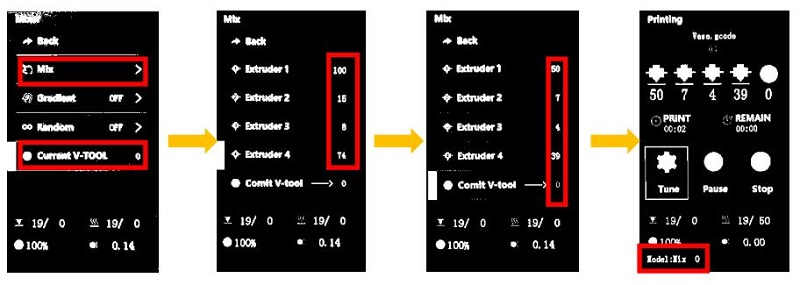
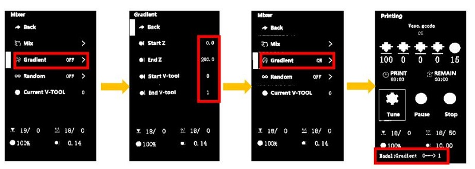
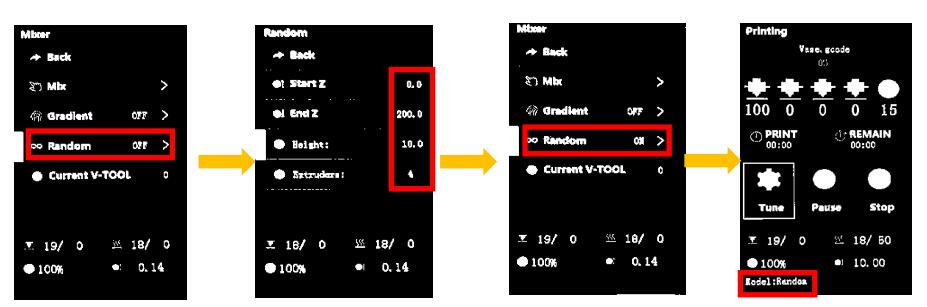

### Choose Language (Translated by google)

-----
# Auto mixing color operation manual

-----
## Manual change mixing rate on printing 
When printing from SD card, you can change the color mixing ratio of the extruders at any time to change the filament color. The steps are as follows:     
- Start to print a singel color gcode file from SD card.
- Wait until the print start to print the first layer, and then set on the LCD menu. 
- **Tune>>Mixer>>Mix>>VTOOL: 0** set the Vtool to 0
- **Tune>>Mixer>>Mix>>Extruder1~4:** Adjust the percentage of extruder #1 to extruder #4, the range is 0 ~ 100.  
- **Tune>>Mixer>>Mix>>Comit:** Redistribute the percentage of all extruders in proportion and send it to the current vtool. 
After setting up, on the ideal menu shows Current **VTOOL = 0**

-----
## Gradient mixing printing
When printing from SD card, you can start a gradient mixing feature, to let the printer auto change the mixing ratio when printing height changed. The steps are as follows:       
[:clapper:Video tutorial](https://youtu.be/VOlXvy38aFs)    

- Start to print a one color gcode file from SD card.  
- Set the paremeters for auto gradient mix printing on the LCD menu when the printer start to to print the first layer.
- **Tune>>Mixer>>Gradient:OFF>>**
  - **Start Z:** set the start Z heigth(such as:0mm)      
  - **End Z:** set the END Z heigth(such as:200mm)     
  - **Start V-tool:** set the start VTOOL(such as:0)        
  - **End V-tool:** set the end VTOOL(such as:1)  
After set **Start Z** isn’t equal to **End Z**, and **Start V-tool** isn’t equal to **End V-tool**, the LCD will shows **Gradient : ON**.      
:page_with_curl: About how to set the mixing ratio of VTOOL, please refer to [**here**](#how-to-set-mixing-ratio-of-virtual-extruder).     
    
### Realize gradient mixing by modifing gcode file
By adding a M166 command into the "Start G-code" of slicing software, and sliced the 3d model as single color, it can realize gradient mixing automatically when printing from SD card.   
> 
	Descitpion of M166 command
	M166: Start a gradient mix  
	S[bool] - Enable / disable gradients
	A[float] - Starting Z for the gradient
	Z[float] - Ending Z for the gradient.
	I[index] - VTool to use as the starting mix.
	J[index] - VTool to use as the ending mix.
	
	For example: M166 S1 A0 Z200 I0 J1
	S1->Enable gradient mix 
	A0->startZ is 0mm 
	Z200-> EndZ is 200mm 
	I0 -> Start VTool is 0 
	J1 -> End VTool is 1

-----
## Random mixing printing
When printing from SD card, you can start a gradient mixing feature, to let the printer auto change the mixing ratio when printing height changed. The steps are as follows:      
[:clapper:Video tutorial](https://youtu.be/-mQ4bCnrIaw)    
    
- Start to print a singel color gcode file from SD card.  
- Wait until the print start to print, set on the LCD menu. 
- **Tune>>Mixer>>Random Mix:>>**
	- **Start Z:** Set the start Z heigth(such as:0mm) 
	- **End Z:** Set the end Z heigth(such as:200mm)    
	- **Height:** Set interval distance(such as:10mm), when printing heigth changed beyond this value, the mixing ratio be changed once.    
	- **Extruders:** Set the number of extruders participating in printing(1~4). :warning: When the "Extruders" is set to 1, all four extruders will participate in printing, but they doesn't mixing instead of the extruders is randomly selected one by one each time to print.     
After set Start Z isn’t equal to the End Z, the LCD will shows **Random : ON**.
     
### Realize random mixing by modifing gcode file
By adding a M167 command into the "Start G-code" of slicing software, and sliced the 3d model as single color, it can realize random mixing automatically when printing from SD card.
> 
	Descitpion of M167 command.
	M167: Start a random mix.
	S[bool] - Enable / disable random mix.
	A[float] - Starting Z for the random.
	Z[float] - Ending Z for the random.
	H[float] - Minimum height of changing mixing rate.
	E[int] - how many extruders used on random mixing.

	For example: M167 S1 A0 Z100 H0.2 E3
	S1->Enable Random mix 
	A0->start Z heigth is 0mm 
	Z100->End Z heigth is 100mm 
	H0.2->change color every 0.2mm
	E3->3 extruders (Extruder #1 to Extruder #3) will be used to mix

-----
## How to set mixing ratio of virtual extruder (for 4-IN-1-OUT mix Color hot end)
We can set the mixing ratio of each virtual extruder by LCD control panel or adding command in the "Start G-code" of slicing software.
:warning:If a printing from SD card is finished or abort, the machine will automatically reset mixing ratio of all virtual extruders to default.
### Set mixing ratio by LCD control panel
Steps:
- **Control>>Mixer>>Mix>>VTOOL: x** Choose the virtual extruder number which you need to set(x is from 0 to 15)
- **Control>>Mixer>>Mix>>Extruder1~4:** Adjust the percentage of extruder #1 to extruder #4, the range is 0 ~ 100.  
- **Control>>Mixer>>Mix>>Comit:** Redistribute the percentage of all extruders in proportion and save it to the virtual extruder x. 
### Set mixing ratio by adding command
We can also add M163 and M164 command into the "Start G-code" of slicing software, to set the mixing ratio of the virtual extruder.
Commands list as below:
>
	M163 S0 Px		; set the mix ratio of actual extruder #1, "x" is from 0 to 100
	M163 S1 Py		; set the mix ratio of actual extruder #2, "y" is from 0 to 100
	M163 S2 Pz		; set the mix ratio of actual extruder #3, "z" is from 0 to 100
	M163 S3 Pn		; set the mix ratio of actual extruder #4, "n" is from 0 to 100
	M164 Sm   		; save the mix ratio of extruders to the "VTOOLm", "m" is from 0 to 16
	
	For example, you added the below commands into the "Start G-code" of slicing software
	M163 S0 P10		
	M163 S1 P20		
	M163 S2 P30		
	M163 S3 P40		
	M164 S4
	
	After that, the VTOOL4 has been set mix ratio "E1:E2:E3:E4 = 10:20:30:40". When using VTOOL4, 4 actual extruders will feed 
	filaments in a ratio of 10:20:30:40.
