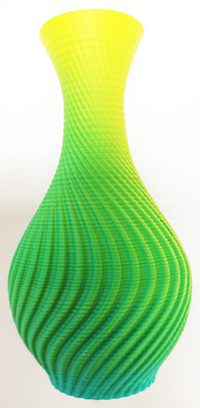

----
## <a id="choose-language">:globe_with_meridians: Choose language </a>

<!--  -->

----
# <a id="en">Auto mixing color operation manual </a>
### :warning: This guide is made for 4 extruders with 4-IN-1-OUT mix color hot end.
The color mixing feature is a function to mix multi different color filaments and extruded from one nozzle to get a new color filament. By adjusting the extrude ratio of each extruder, it can get different color filament. For example, mix Magenta and Yellow filament as a ratio 5:1 to get Red filament, and mix Magenta and Yellow filament as a ratio 1:1 to get Orange filament.  

## <a id="a">Manual change mixing rate on printing </a>
When printing from SD card, you can change the color mixing ratio of the extruders at any time to change the filament color. The steps are as follows:     
- Start to print a singel color gcode file from SD card.
- Wait until the print start to print the first layer, and then set on the LCD menu. 
- **Tune>>Mixer>>Mix>>VTOOL: 0** set the Vtool to 0
- **Tune>>Mixer>>Mix>>Extruder1~4:** Adjust the percentage of extruder #1 to extruder #4, the range is 0 ~ 100.  
- **Tune>>Mixer>>Mix>>Comit:** Redistribute the percentage of all extruders in proportion and send it to the current vtool. 
After setting up, on the ideal menu shows Current **VTOOL = 0**
###### 

## <a id="b">Gradient mixing printing </a>
When printing from SD card, you can start a gradient mixing feature, to let the printer auto change the mixing ratio when printing height changed. The steps are as follows:       
###### 

- Start to print a one color gcode file from SD card.  
- Set the paremeters for auto gradient mix printing on the LCD menu when the printer start to to print the first layer.
- **Tune>>Mixer>>Gradient:OFF>>**
  - **Start Z:** set the start Z heigth(such as:0mm)      
  - **End Z:** set the END Z heigth(such as:200mm)     
  - **Start V-tool:** set the start VTOOL(such as:0)        
  - **End V-tool:** set the end VTOOL(such as:1)  
After set **Start Z** isn’t equal to **End Z**, and **Start V-tool** isn’t equal to **End V-tool**, the LCD will shows **Gradient : ON**.      
:page_with_curl: About how to set the mixing ratio of VTOOL, please refer to [**here**](#d).     
######     
### Realize gradient mixing by modifing gcode file
By adding a M166 command into the "Start G-code" of slicing software, and sliced the 3d model as single color, it can realize gradient mixing automatically when printing from SD card.   
> 
	Descitpion of M166 command
	M166: Start a gradient mix  
	S[bool] - Enable / disable gradients
	A[float] - Starting Z for the gradient
	Z[float] - Ending Z for the gradient.
	I[index] - VTool to use as the starting mix.
	J[index] - VTool to use as the ending mix.
	
	For example: M166 S1 A0 Z200 I0 J1
	S1->Enable gradient mix 
	A0->startZ is 0mm 
	Z200-> EndZ is 200mm 
	I0 -> Start VTool is 0 
	J1 -> End VTool is 1

## <a id="c">Random mixing printing </a>
When printing from SD card, you can start a gradient mixing feature, to let the printer auto change the mixing ratio when printing height changed. The steps are as follows:      
###### 
    
- Start to print a singel color gcode file from SD card.  
- Wait until the print start to print, set on the LCD menu. 
- **Tune>>Mixer>>Random Mix:>>**
	- **Start Z:** Set the start Z heigth(such as:0mm) 
	- **End Z:** Set the end Z heigth(such as:200mm)    
	- **Height:** Set interval distance(such as:10mm), when printing heigth changed beyond this value, the mixing ratio be changed once.    
	- **Extruders:** Set the number of extruders participating in printing(1~4). :warning: When the "Extruders" is set to 1, all four extruders will participate in printing, but they doesn't mixing instead of the extruders is randomly selected one by one each time to print.     
After set Start Z isn’t equal to the End Z, the LCD will shows **Random : ON**.
######      
### Realize random mixing by modifing gcode file
By adding a M167 command into the "Start G-code" of slicing software, and sliced the 3d model as single color, it can realize random mixing automatically when printing from SD card.
> 
	Descitpion of M167 command.
	M167: Start a random mix.
	S[bool] - Enable / disable random mix.
	A[float] - Starting Z for the random.
	Z[float] - Ending Z for the random.
	H[float] - Minimum height of changing mixing rate.
	E[int] - how many extruders used on random mixing.

	For example: M167 S1 A0 Z100 H0.2 E3
	S1->Enable Random mix 
	A0->start Z heigth is 0mm 
	Z100->End Z heigth is 100mm 
	H0.2->change color every 0.2mm
	E3->3 extruders (Extruder #1 to Extruder #3) will be used to mix

## <a id="d">How to set mixing ratio of virtual extruder </d>
We can set the mixing ratio of each virtual extruder by LCD control panel or adding command in the "Start G-code" of slicing software.
:warning:If a printing from SD card is finished or abort, the machine will automatically reset mixing ratio of all virtual extruders to default.
### Set mixing ratio by LCD control panel
Steps:
- **Control>>Mixer>>Mix>>VTOOL: x** Choose the virtual extruder number which you need to set(x is from 0 to 15)
- **Control>>Mixer>>Mix>>Extruder1~4:** Adjust the percentage of extruder #1 to extruder #4, the range is 0 ~ 100.  
- **Control>>Mixer>>Mix>>Comit:** Redistribute the percentage of all extruders in proportion and save it to the virtual extruder x. 
### Set mixing ratio by adding command
We can also add M163 and M164 command into the "Start G-code" of slicing software, to set the mixing ratio of the virtual extruder.
Commands list as below:
>
	M163 S0 Px		; set the mix ratio of actual extruder #1, "x" is from 0 to 100
	M163 S1 Py		; set the mix ratio of actual extruder #2, "y" is from 0 to 100
	M163 S2 Pz		; set the mix ratio of actual extruder #3, "z" is from 0 to 100
	M163 S3 Pn		; set the mix ratio of actual extruder #4, "n" is from 0 to 100
	M164 Sm   		; save the mix ratio of extruders to the "VTOOLm", "m" is from 0 to 16
	
	For example, you added the below commands into the "Start G-code" of slicing software
	M163 S0 P10		
	M163 S1 P20		
	M163 S2 P30		
	M163 S3 P40		
	M164 S4
	
	After that, the VTOOL4 has been set mix ratio "E1:E2:E3:E4 = 10:20:30:40". When using VTOOL4, 4 actual extruders will feed 
	filaments in a ratio of 10:20:30:40.

----
# <a id="es">Manual de operación de mezcla automática de colores </a> [:arrow_heading_up:](#choose-language)
### :warning: Esta guía está hecha para 4 extrusoras con extremo caliente de mezcla de colores 4 EN 1 SALIDA.
La función de mezcla de colores es una función para mezclar filamentos de varios colores diferentes y extruirlos desde una boquilla para obtener un filamento de nuevo color. Al ajustar la relación de extrusión de cada extrusora, se pueden obtener filamentos de diferentes colores. Por ejemplo, mezcle el filamento magenta y amarillo en una proporción de 5:1 para obtener el filamento rojo, y mezcle el filamento magenta y amarillo en una proporción de 1:1 para obtener el filamento naranja.

## <a id="a">Cambio manual de tasa de mezcla al imprimir </a>
Al imprimir desde una tarjeta SD, puede cambiar la proporción de mezcla de colores de los extrusores en cualquier momento para cambiar el color del filamento. Los pasos son los siguientes:
- Comience a imprimir un archivo gcode de un solo color desde la tarjeta SD.
- Espere hasta que comience la impresión para imprimir la primera capa y luego configúrelo en el menú LCD.
- **Tune>>Mixer>>Mix>>VTOOL: 0** establece Vtool en 0
- **Tune>>Mixer>>Mix>>Extruder1~4:** Ajuste el porcentaje del extrusor n.° 1 al extrusor n.° 4, el rango es 0 ~ 100.
- **Tune>>Mixer>>Mix>>Comit:** Redistribuye el porcentaje de todos los extrusores en proporción y envíalo a la vtool actual.
Después de la configuración, en el menú ideal se muestra Actual **VTOOL = 0**
###### 

## <a id="b">Impresión de mezcla de degradado </a>
Al imprimir desde una tarjeta SD, puede iniciar una función de mezcla de degradado para permitir que la impresora cambie automáticamente la proporción de mezcla cuando cambia la altura de impresión. Los pasos son los siguientes:
###### 

- Comience a imprimir un archivo gcode de un color desde la tarjeta SD.
- Configure los parámetros para la impresión de mezcla de gradiente automático en el menú LCD cuando la impresora comience a imprimir la primera capa.
- **Sintonización>>Mezclador>>Gradiente: APAGADO>>**
 - **Inicio Z:** establece la altura inicial de Z (como: 0 mm)
 - **Fin Z:** establece la altura del FINAL Z (por ejemplo: 200 mm)
 - **Iniciar V-tool:** establece el inicio VTOOL (como: 0)
 - **Fin de herramienta V:** establece la herramienta VTOOL final (como por ejemplo:1)
Después de configurar **Iniciar Z** no es igual a **Fin Z**, y **Iniciar herramienta V** no es igual a **Fin herramienta V**, la pantalla LCD mostrará **Gradiente : EN**.
:page_with_curl: Acerca de cómo configurar la proporción de mezcla de VTOOL, consulte [**aquí**](#d).
###### 
### Realice la mezcla de gradientes modificando el archivo gcode
Al agregar un comando M166 al "código G de inicio" del software de corte y cortar el modelo 3D en un solo color, se puede realizar la mezcla de degradados automáticamente al imprimir desde una tarjeta SD.
>
  Descripción del comando M166
  M166: Iniciar una mezcla de degradado
  S[bool] - Activar/desactivar gradientes
  A[float] - Iniciando Z para el gradiente
  Z[float] - Z final para el gradiente.
  I[índice] - VTool para usar como mezcla inicial.
  J[índice] - VTool para usar como mezcla final.

  Por ejemplo: M166 S1 A0 Z200 I0 J1
  S1->Habilitar mezcla de degradado
  A0->startZ es 0mm
  Z200-> EndZ es 200 mm
  I0 -> Iniciar VTool es 0
  J1 -> Finalizar VTool es 1

## <a id="c">Impresión de mezcla aleatoria </a>
Al imprimir desde una tarjeta SD, puede iniciar una función de mezcla de degradado para permitir que la impresora cambie automáticamente la proporción de mezcla cuando cambia la altura de impresión. Los pasos son los siguientes:
###### 

- Comience a imprimir un archivo gcode de un solo color desde la tarjeta SD.
- Espere hasta que comience a imprimirse, configurado en el menú LCD.
- **Melodía>>Mezclador>>Mezcla aleatoria:>>**
  - **Inicio Z:** Establezca la altura inicial de Z (como: 0 mm)
  - **Fin Z:** Establezca la altura del extremo Z (como: 200 mm)
  - **Altura:** Establezca la distancia del intervalo (por ejemplo: 10 mm). Cuando la altura de impresión cambie más allá de este valor, la proporción de mezcla se cambiará una vez.
  - **Extrusores:** Establece el número de extrusores que participan en la impresión (1~4). :warning: Cuando "Extrusores" está configurado en 1, los cuatro extrusores participarán en la impresión, pero no se mezclan en lugar de que los extrusores se seleccionen aleatoriamente uno por uno cada vez para imprimir.
Después de que la Z inicial configurada no sea igual a la Z final, la pantalla LCD mostrará **Aleatorio: ENCENDIDO**.
###### 
### Realice una mezcla aleatoria modificando el archivo gcode
Al agregar un comando M167 al "código G de inicio" del software de corte y cortar el modelo 3D en un solo color, se puede realizar una mezcla aleatoria automáticamente al imprimir desde una tarjeta SD.
>
	Descripción del comando M167.
	M167: Inicia una mezcla aleatoria.
		S[bool] - Activa/desactiva la mezcla aleatoria.
		A[flotador] - Iniciando Z para el azar.
		Z[float] - Finalizando Z para lo aleatorio.
		H[flotador] - Altura mínima para cambiar la tasa de mezcla.
		E[int] - cuántas extrusoras se utilizaron en la mezcla aleatoria.

	Por ejemplo: M167 S1 A0 Z100 H0.2 E3
		S1->Habilitar mezcla aleatoria
		A0->la altura inicial Z es 0 mm
		Z100->La altura del extremo Z es de 100 mm.
		H0.2->cambiar color cada 0,2 mm
		Se utilizarán E3->3 extrusoras (Extrusora n.° 1 a Extrusora n.° 3) para mezclar

## <a id="d">Cómo configurar la proporción de mezcla del extrusor virtual </d>
Podemos establecer la proporción de mezcla de cada extrusora virtual mediante el panel de control LCD o agregando un comando en el "código G de inicio" del software de corte.
:warning:Si finaliza o se cancela una impresión desde la tarjeta SD, la máquina restablecerá automáticamente la proporción de mezcla de todos los extrusores virtuales a los valores predeterminados.
### Establecer la proporción de mezcla mediante el panel de control LCD
Pasos:
- **Control>>Mezclador>>Mix>>VTOOL: x** Elija el número de extrusor virtual que necesita configurar (x es de 0 a 15)
- **Control>>Mezclador>>Mezcla>>Extrusor1~4:** Ajuste el porcentaje del extrusor n.° 1 al extrusor n.° 4, el rango es 0 ~ 100.
- **Control>>Mixer>>Mix>>Comit:** Redistribuye el porcentaje de todos los extrusores en proporción y guárdalo en el extrusor virtual x.
### Establezca la proporción de mezcla agregando un comando
También podemos agregar los comandos M163 y M164 al "Iniciar código G" del software de corte para establecer la proporción de mezcla del extrusor virtual.
La lista de comandos es la siguiente:
>
	M163 S0 Px; establezca la proporción de mezcla del extrusor real #1, "x" es de 0 a 100
	M163 S1 Pi ; establezca la proporción de mezcla del extrusor real #2, "y" es de 0 a 100
	M163 S2 Pz; establezca la proporción de mezcla del extrusor real n.° 3, "z" es de 0 a 100
	M163 S3 Pn; establezca la proporción de mezcla del extrusor real #4, "n" es de 0 a 100
	M164 SM ; guarde la proporción de mezcla de las extrusoras en "VTOOLm", "m" es de 0 a 16

	Por ejemplo, agregó los siguientes comandos al "Iniciar código G" del software de corte
	M163 S0 P10
	M163 S1 P20
	M163 S2 P30
	M163 S3 P40
	M164 S4

  Después de eso, en el VTOOL4 se ha configurado la relación de mezcla "E1:E2:E3:E4 = 10:20:30:40". Cuando se utiliza VTOOL4, 4 extrusoras reales alimentarán
  filamentos en una proporción de 10:20:30:40.

----
# <a id="pt">Manual de operação de mistura automática de cores </a> [:arrow_heading_up:](#choose-language)
### :warning: Este guia é feito para 4 extrusoras com hot end de cores misturadas 4-IN-1-OUT.
O recurso de mistura de cores é uma função para misturar vários filamentos de cores diferentes e extrudados de um bico para obter um novo filamento de cor. Ao ajustar a proporção de extrusão de cada extrusora, pode-se obter filamentos de cores diferentes. Por exemplo, misture os filamentos Magenta e Amarelo na proporção de 5:1 para obter o filamento Vermelho, e misture os filamentos Magenta e Amarelo na proporção de 1:1 para obter o filamento Laranja.

## <a id="a">Alterar manualmente a taxa de mistura na impressão </a>
Ao imprimir a partir de um cartão SD, você pode alterar a proporção de mistura de cores das extrusoras a qualquer momento para alterar a cor do filamento. As etapas são as seguintes:
- Comece a imprimir um arquivo gcode de cor única do cartão SD.
- Aguarde o início da impressão para imprimir a primeira camada e depois configure no menu LCD.
- **Tune>>Mixer>>Mix>>VTOOL: 0** defina o Vtool para 0
- **Tune>>Mixer>>Mix>>Extruder1~4:** Ajuste a porcentagem da extrusora #1 para a extrusora #4, o intervalo é de 0 ~ 100.
- **Tune>>Mixer>>Mix>>Comit:** Redistribua a porcentagem de todas as extrusoras proporcionalmente e envie para o vtool atual.
Após a configuração, no menu ideal aparece Atual **VTOOL = 0**
###### 

## <a id="b">Impressão de mistura de gradiente </a>
Ao imprimir a partir do cartão SD, você pode iniciar um recurso de mistura de gradiente, para permitir que a impressora altere automaticamente a taxa de mistura quando a altura de impressão for alterada. As etapas são as seguintes:
###### 

- Comece a imprimir um arquivo gcode de uma cor do cartão SD.
- Defina os parâmetros para impressão automática de mistura de gradiente no menu LCD quando a impressora começar a imprimir a primeira camada.
- **Tune>>Mixer>>Gradiente:OFF>>**
 - **Iniciar Z:** definir a altura Z inicial (como: 0mm)
 - **End Z:** defina a altura do END Z (como: 200 mm)
 - **Iniciar V-tool:** definir o VTOOL inicial (como:0)
 - **Ferramenta V final:** defina o VTOOL final (como: 1)
Após definir **Início Z** não é igual a **Fim Z**, e **Início V-ferramenta** não é igual a **End V-ferramenta**, o LCD mostrará **Gradiente : SOBRE**.
:page_with_curl: Sobre como definir a taxa de mistura do VTOOL, consulte [**aqui**](#d).
###### 
### Realize a mistura de gradiente modificando o arquivo gcode
Ao adicionar um comando M166 ao "Iniciar código G" do software de fatiamento e fatiar o modelo 3D como uma única cor, ele pode realizar a mistura de gradiente automaticamente ao imprimir a partir do cartão SD.
>
	Descrição do comando M166
	M166: Inicie uma mistura de gradiente
		S[bool] - Habilitar/desabilitar gradientes
		A[float] - Z inicial para o gradiente
		Z[float] - Finalizando Z para o gradiente.
		I[index] - VTool para usar como mix inicial.
		J[index] - VTool para usar como mixagem final.

	Por exemplo: M166 S1 A0 Z200 I0 J1
		S1->Ativar mistura de gradiente
		A0->startZ é 0mm
		Z200-> EndZ é 200 mm
		I0 -> Iniciar VTool é 0
		J1 -> Final VTool é 1

## <a id="c">Impressão de mistura aleatória </a>
Ao imprimir a partir do cartão SD, você pode iniciar um recurso de mistura de gradiente, para permitir que a impressora altere automaticamente a taxa de mistura quando a altura de impressão for alterada. As etapas são as seguintes:
###### 

- Comece a imprimir um arquivo gcode de cor única do cartão SD.
- Aguarde até que a impressão comece a ser impressa, definida no menu LCD.
- **Tune>>Mixer>>Random Mix:>>**
  - **Iniciar Z:** Defina a altura Z inicial (como: 0mm)
  - **Fim Z:** Defina a altura final Z (como: 200 mm)
  - **Altura:** Defina a distância do intervalo (como: 10 mm), quando a altura de impressão for alterada além deste valor, a taxa de mistura será alterada uma vez.
  - **Extrusoras:** Defina o número de extrusoras participantes na impressão (1~4). : aviso: Quando "Extrusoras" é definida como 1, todas as quatro extrusoras participarão da impressão, mas não se misturam em vez das extrusoras serem selecionadas aleatoriamente uma por uma a cada vez para imprimir.
Depois que o Start Z definido não for igual ao End Z, o LCD mostrará **Random: ON**.
###### 
### Realize mixagem aleatória modificando o arquivo gcode
Ao adicionar um comando M167 ao "Iniciar código G" do software de fatiamento e fatiar o modelo 3D como uma única cor, ele pode realizar a mistura aleatória automaticamente ao imprimir a partir do cartão SD.
>
	Descrição do comando M167.
	M167: Inicie uma mixagem aleatória.
		S[bool] - Habilita/desabilita mixagem aleatória.
		A[float] - Iniciando Z para o aleatório.
		Z[float] - Finalizando Z para o aleatório.
		H[float] - Altura mínima de alteração da taxa de mistura.
		E[int] - quantas extrusoras usadas na mistura aleatória.

	Por exemplo: M167 S1 A0 Z100 H0.2 E3
		S1->Ativar mixagem aleatória
		A0->iniciar altura Z é 0mm
		Z100-> A altura da extremidade Z é 100 mm
		H0.2->mudar de cor a cada 0,2mm
		Extrusoras E3->3 (Extrusora #1 a Extrusora #3) serão usadas para misturar	

## <a id="d">Como definir a taxa de mistura da extrusora virtual </d>
Podemos definir a proporção de mistura de cada extrusora virtual pelo painel de controle LCD ou adicionar o comando no "Iniciar código G" do software de fatiamento.
:aviso:Se uma impressão do cartão SD for concluída ou abortada, a máquina redefinirá automaticamente a proporção de mistura de todas as extrusoras virtuais para o padrão.
### Defina a proporção de mistura pelo painel de controle LCD
Passos:
- **Control>>Mixer>>Mix>>VTOOL: x** Escolha o número da extrusora virtual que você precisa definir (x é de 0 a 15)
- **Control>>Mixer>>Mix>>Extruder1~4:** Ajuste a porcentagem da extrusora #1 para a extrusora #4, o intervalo é de 0 ~ 100.
- **Control>>Mixer>>Mix>>Comit:** Redistribua a porcentagem de todas as extrusoras proporcionalmente e salve-a na extrusora virtual x.
### Defina a proporção de mistura adicionando o comando
Também podemos adicionar os comandos M163 e M164 ao "Iniciar código G" do software de fatiamento, para definir a taxa de mistura da extrusora virtual.
Lista de comandos conforme abaixo:
>
		M163 S0Px; defina a proporção de mistura da extrusora real nº 1, "x" é de 0 a 100
		M163 S1Py; defina a proporção de mistura da extrusora real nº 2, "y" é de 0 a 100
		M163 S2Pz; defina a proporção de mistura da extrusora real nº 3, "z" é de 0 a 100
		M163 S3Pn; defina a proporção de mistura da extrusora real nº 4, "n" é de 0 a 100
		M164Sm; salve a proporção de mistura das extrusoras para o "VTOOLm", "m" é de 0 a 16

		Por exemplo, você adicionou os comandos abaixo ao "Iniciar código G" do software de fatiamento
		M163 S0 P10
		M163 S1 P20
		M163 S2 P30
		M163 S3 P40
		M164 S4

  Depois disso, o VTOOL4 foi definido na proporção de mixagem "E1:E2:E3:E4 = 10:20:30:40". Ao usar o VTOOL4, 4 extrusoras reais alimentarão
  filamentos em uma proporção de 10:20:30:40.

----
# <a id="fr">Manuel d'utilisation du mélange automatique des couleurs </a>  [:arrow_heading_up:](#choose-language)
### :warning: Ce guide est destiné à 4 extrudeuses avec hot end de couleurs mélangées 4-IN-1-OUT.
La fonction de mélange de couleurs est une fonction permettant de mélanger plusieurs filaments de couleurs différentes et d'être extrudés à partir d'une buse pour obtenir un nouveau filament de couleur. En ajustant le taux d'extrusion de chaque extrudeuse, vous pouvez obtenir un filament de couleur différente. Par exemple, mélangez les filaments magenta et jaune dans un rapport de 5:1 pour obtenir un filament rouge, et mélangez les filaments magenta et jaune dans un rapport de 1:1 pour obtenir un filament orange.

## <a id="a">Changement manuel du taux de mélange à l'impression </a>
Lors de l'impression à partir d'une carte SD, vous pouvez modifier le rapport de mélange des couleurs des extrudeuses à tout moment pour changer la couleur du filament. Les étapes sont les suivantes:
- Commencez à imprimer un fichier gcode couleur unique à partir de la carte SD.
- Attendez le début de l'impression pour imprimer la première couche, puis réglez sur le menu LCD.
- **Tune>>Mixer>>Mix>>VTOOL : 0** met le Vtool à 0
- **Tune>>Mixer>>Mix>>Extruder1~4 :** Ajustez le pourcentage de l'extrudeuse n°1 à l'extrudeuse n°4, la plage est de 0 à 100.
- **Tune>>Mixer>>Mix>>Comit :** Redistribuez le pourcentage de tous les extrudeurs en proportion et envoyez-le au vtool actuel.
Après la configuration, le menu idéal affiche Current **VTOOL = 0**
###### 

## <a id="b">Impression de mélange de dégradés </a>
Lors de l'impression à partir d'une carte SD, vous pouvez démarrer une fonction de mélange de dégradés, pour permettre à l'imprimante de modifier automatiquement le rapport de mélange lorsque la hauteur d'impression change. Les étapes sont les suivantes:
###### 

- Commencez à imprimer un fichier gcode d'une couleur à partir de la carte SD.
- Définissez les paramètres d'impression automatique du mélange de dégradés sur le menu LCD lorsque l'imprimante commence à imprimer la première couche.
- **Tune>>Mixeur>>Gradient : OFF>>**
 - **Start Z :** définit la hauteur Z de départ (telle que : 0 mm)
 - **Fin Z :** définit la hauteur de FIN Z (telle que : 200 mm)
 - **Démarrer le V-tool :** définit le VTOOL de démarrage (tel que :0)
 - **Fin du V-tool :** définit le VTOOL de fin (tel que : 1)
Une fois que **Start Z** n'est pas égal à **End Z** et **Start V-tool** n'est pas égal à **End V-tool**, l'écran LCD affiche **Gradient : SUR**.
:page_with_curl : Pour savoir comment définir le rapport de mélange de VTOOL, veuillez vous référer à [**ici**](#d).
###### 
### Réalisez un mélange de dégradés en modifiant le fichier gcode
En ajoutant une commande M166 dans le « Démarrer le G-code » du logiciel de découpage et en découpant le modèle 3D en une seule couleur, il peut réaliser automatiquement un mélange de dégradés lors de l'impression à partir d'une carte SD.
>
	Description de la commande M166
	M166 : Démarrer un mélange de dégradés
		S[bool] - Activer/désactiver les dégradés
		A[float] - Démarrage de Z pour le dégradé
		Z[float] - Fin de Z pour le dégradé.
		I[index] - VTool à utiliser comme mix de départ.
		J[index] - VTool à utiliser comme mix de fin.

	Par exemple : M166 S1 A0 Z200 I0 J1
		S1-> Activer le mélange de dégradés
		A0 -> startZ est 0 mm
		Z200 -> EndZ est de 200 mm
		I0 -> Démarrer VTool est 0
		J1 -> Fin du VTool est 1

## <a id="c">Impression de mélange aléatoire </a>
Lors de l'impression à partir d'une carte SD, vous pouvez démarrer une fonction de mélange de dégradés, pour permettre à l'imprimante de modifier automatiquement le rapport de mélange lorsque la hauteur d'impression change. Les étapes sont les suivantes:
###### 

- Commencez à imprimer un fichier gcode couleur unique à partir de la carte SD.
- Attendez que l'impression démarre, réglé sur le menu LCD.
- **Tune>>Mixeur>>Mélange aléatoire :>>**
  - **Début Z :** Définissez la hauteur Z de départ (telle que : 0 mm)
  - **Fin Z :** Définissez la hauteur de l'extrémité Z (telle que : 200 mm)
  - **Hauteur :** Définissez la distance d'intervalle (telle que : 10 mm), lorsque la hauteur d'impression change au-delà de cette valeur, le rapport de mélange doit être modifié une fois.
  - **Extrudeuses :** Définissez le nombre d'extrudeuses participant à l'impression (1~4). :avertissement : Lorsque "Extrudeuses" est réglé sur 1, les quatre extrudeuses participeront à l'impression, mais elles ne se mélangent pas au lieu de sélectionner les extrudeuses au hasard une par une à chaque fois pour imprimer.
Une fois que Start Z défini n'est pas égal à End Z, l'écran LCD affichera **Aléatoire : ON**.
###### 
### Réalisez un mixage aléatoire en modifiant le fichier gcode
En ajoutant une commande M167 dans le « Démarrer le G-code » du logiciel de découpage et en découpant le modèle 3D en une seule couleur, il peut réaliser automatiquement un mélange aléatoire lors de l'impression à partir d'une carte SD.
>
	Description de la commande M167.
	M167: Démarrer un mixage aléatoire.
		S[bool] - Activer/désactiver le mixage aléatoire.
		A[float] - Démarrage de Z pour le hasard.
		Z[float] - Fin de Z pour le hasard.
		H[float] - Hauteur minimale de changement du taux de mélange.
		E[int] - combien d'extrudeuses utilisées pour un mélange aléatoire.

	Par exemple : M167 S1 A0 Z100 H0.2 E3
		S1-> Activer le mélange aléatoire
		A0 -> la hauteur Z de départ est de 0 mm
		Z100->La hauteur de l'extrémité Z est de 100 mm
		H0.2 -> changer de couleur tous les 0,2 mm
	Les extrudeuses E3->3 (Extrudeuse n°1 à Extrudeuse n°3) seront utilisées pour mélanger

## <a id="d">Comment définir le rapport de mélange de l'extrudeuse virtuelle </d>
Nous pouvons définir le rapport de mélange de chaque extrudeuse virtuelle via le panneau de commande LCD ou en ajoutant une commande dans le « Démarrer le G-code » du logiciel de découpage.
:avertissement:Si une impression à partir d'une carte SD est terminée ou annulée, la machine réinitialisera automatiquement le rapport de mélange de toutes les extrudeuses virtuelles par défaut.
### Régler le rapport de mélange via le panneau de commande LCD
Pas:
- **Control>>Mixer>>Mix>>VTOOL : x** Choisissez le numéro d'extrudeuse virtuelle que vous devez définir (x est de 0 à 15)
- **Contrôle>>Mixeur>>Mix>>Extruder1~4 :** Ajustez le pourcentage de l'extrudeuse n°1 à l'extrudeuse n°4, la plage est de 0 à 100.
- **Control>>Mixer>>Mix>>Comit :** Redistribuez le pourcentage de toutes les extrudeuses en proportion et enregistrez-le sur l'extrudeuse virtuelle x.
### Définir le rapport de mélange en ajoutant une commande
Nous pouvons également ajouter les commandes M163 et M164 dans le « Start G-code » du logiciel de découpage, pour définir le rapport de mélange de l'extrudeuse virtuelle.
Liste des commandes comme ci-dessous :
>
	M163 S0 Px ; définir le rapport de mélange de l'extrudeuse n°1 réelle, "x" est compris entre 0 et 100
	M163 S1 Py ; définir le rapport de mélange de l'extrudeuse n°2 réelle, "y" est compris entre 0 et 100
	M163 S2 Pz ; définir le rapport de mélange de l'extrudeuse n°3 réelle, "z" est compris entre 0 et 100
	M163 S3 Pn ; définir le rapport de mélange de l'extrudeuse réelle n°4, "n" est compris entre 0 et 100
	M164 Sm ; enregistrez le rapport de mélange des extrudeuses sur le "VTOOLm", "m" est de 0 à 16
	
	Par exemple, vous avez ajouté les commandes ci-dessous dans le « Démarrer le G-code » du logiciel de découpage.
	M163 S0 P10
	M163 S1 P20
	M163 S2 P30
	M163 S3 P40
	M164 S4

  Après cela, le VTOOL4 a réglé le rapport de mélange "E1:E2:E3:E4 = 10:20:30:40". Lors de l'utilisation de VTOOL4, 4 extrudeuses réelles alimenteront
  filaments dans un rapport de 10:20:30:40.

----
# <a id="de">Bedienungsanleitung für automatische Farbmischung </a>  [:arrow_heading_up:](#choose-language)
### :warning: Diese Anleitung ist für 4 Extruder mit 4-IN-1-OUT-Mischfarb-Hot-Enden gedacht.
Die Farbmischfunktion ist eine Funktion zum Mischen von Filamenten in mehreren Farben und Extrudieren aus einer Düse, um ein neues Farbfilament zu erhalten. Durch Anpassen des Extrudierverhältnisses jedes Extruders können Filamente in verschiedenen Farben erhalten werden. Mischen Sie beispielsweise magentafarbenes und gelbes Filament im Verhältnis 5:1, um rotes Filament zu erhalten, und mischen Sie magentafarbenes und gelbes Filament im Verhältnis 1:1, um orangefarbenes Filament zu erhalten.

## <a id="a">Manuelle Änderung der Mischrate beim Drucken </a>
Beim Drucken von einer SD-Karte können Sie das Farbmischverhältnis der Extruder jederzeit ändern, um die Filamentfarbe zu ändern. Die Schritte sind wie folgt:
- Beginnen Sie mit dem Drucken einer einfarbigen G-Code-Datei von der SD-Karte.
- Warten Sie, bis der Druck beginnt, um die erste Schicht zu drucken, und stellen Sie sie dann im LCD-Menü ein.
- **Tune>>Mixer>>Mix>>VTOOL: 0** setzt das Vtool auf 0
- **Tune>>Mixer>>Mix>>Extruder1~4:** Passt den Prozentsatz von Extruder Nr. 1 zu Extruder Nr. 4 an, der Bereich liegt zwischen 0 und 100.
- **Tune>>Mixer>>Mix>>Comit:** Verteilt den Prozentsatz aller Extruder proportional neu und sendet ihn an das aktuelle Vtool.
Nach der Einrichtung wird im Idealmenü „Aktuelles **VTOOL = 0**“ angezeigt
###### 

## <a id="b">Drucken mit Farbverlaufsmischung </a>
Beim Drucken von einer SD-Karte können Sie eine Farbverlaufsmischungsfunktion starten, damit der Drucker das Mischungsverhältnis automatisch ändert, wenn sich die Druckhöhe ändert. Die Schritte sind wie folgt:
####### 

- Beginnen Sie mit dem Drucken einer einfarbigen G-Code-Datei von der SD-Karte.
- Stellen Sie die Parameter für den automatischen Farbverlaufsmischungsdruck im LCD-Menü ein, wenn der Drucker mit dem Drucken der ersten Schicht beginnt.
- **Tune>>Mixer>>Gradient:OFF>>**
- **Start Z:** Starthöhe Z festlegen (z. B.: 0 mm)
- **End Z:** Endhöhe Z festlegen (z. B.: 200 mm)
- **Start V-tool:** Start-VTOOL festlegen (z. B.: 0)
- **End V-tool:** End-VTOOL festlegen (z. B.: 1)
Nachdem **Start Z** ungleich **End Z** und **Start V-tool** ungleich **End V-tool** eingestellt ist, zeigt das LCD **Gradient : ON** an.
:page_with_curl: Informationen zum Festlegen des Mischverhältnisses von VTOOL finden Sie [**hier**](#d).
###### 
### Farbverlaufsmischung durch Modifizierung der G-Code-Datei realisieren
Durch Hinzufügen eines M166-Befehls zum „Start-G-Code“ der Slicing-Software und Slicen des 3D-Modells als Einzelfarbe kann beim Drucken von der SD-Karte automatisch eine Farbverlaufsmischung realisiert werden.
>
	Beschreibung des M166-Befehls
	M166: Farbverlaufsmischung starten
		S[bool] – Farbverläufe aktivieren/deaktivieren
		A[float] – Start-Z für den Farbverlauf
		Z[float] – End-Z für den Farbverlauf.
		I[index] – VTool zur Verwendung als Startmischung.
		J[index] – VTool zur Verwendung als Endmischung.

	Beispiel: M166 S1 A0 Z200 I0 J1
		S1->Gradientenmischung aktivieren
		A0->StartZ ist 0 mm
		Z200-> EndZ ist 200 mm
		I0 -> Start VTool ist 0
		J1 -> End VTool ist 1

## <a id="c">Zufällig gemischter Druck </a>
Beim Drucken von einer SD-Karte können Sie eine Gradientenmischfunktion starten, damit der Drucker das Mischverhältnis automatisch ändert, wenn sich die Druckhöhe ändert. Die Schritte sind wie folgt:
###### 

- Beginnen Sie mit dem Drucken einer einfarbigen GCode-Datei von der SD-Karte.
- Warten Sie, bis der Druck beginnt, stellen Sie ihn im LCD-Menü ein.
- **Abstimmen>>Mischer>>Zufällige Mischung:>>**
- **Start Z:** Stellen Sie die Starthöhe von Z ein (z. B. 0 mm)
- **End Z:** Stellen Sie die Endhöhe von Z ein (z. B. 200 mm)
- **Höhe:** Stellen Sie den Intervallabstand ein (z. B. 10 mm). Wenn die Druckhöhe über diesen Wert hinaus geändert wird, wird das Mischungsverhältnis einmal geändert.
- **Extruder:** Stellen Sie die Anzahl der am Druck beteiligten Extruder ein (1–4). :warning: Wenn „Extruder“ auf 1 eingestellt ist, nehmen alle vier Extruder am Druck teil, aber sie mischen sich nicht, sondern die Extruder werden bei jedem Druck zufällig einzeln ausgewählt.
Wenn Start Z nicht gleich End Z ist, zeigt das LCD **Zufällig: EIN** an.
###### 
### Zufälliges Mischen durch Modifizieren der G-Code-Datei realisieren
Durch Hinzufügen eines M167-Befehls zum „Start G-Code“ der Slicing-Software und dem Slicen des 3D-Modells als Einzelfarbe kann beim Drucken von der SD-Karte automatisch zufälliges Mischen realisiert werden.
>
	Beschreibung des M167-Befehls.
	M167: Zufälliges Mischen starten.
		S[bool] – Zufälliges Mischen aktivieren/deaktivieren.
		A[float] – Start-Z für das Zufällige.
		Z[float] – End-Z für das Zufällige.
		H[float] – Mindesthöhe der sich ändernden Mischrate.
		E[int] – Anzahl der Extruder, die beim zufälligen Mischen verwendet werden.

	Zum Beispiel: M167 S1 A0 Z100 H0.2 E3
		S1->Zufällige Mischung aktivieren
		A0->Start-Z-Höhe ist 0 mm
		Z100->End-Z-Höhe ist 100 mm
		H0.2->Farbwechsel alle 0,2 mm
		E3->3 Extruder (Extruder Nr. 1 bis Extruder Nr. 3) werden zum Mischen verwendet

## <a id="d">So stellen Sie das Mischverhältnis des virtuellen Extruders ein</d>
Wir können das Mischverhältnis jedes virtuellen Extruders über das LCD-Bedienfeld oder durch Hinzufügen eines Befehls im „G-Code starten“ der Slicing-Software einstellen.
:warning:Wenn ein Druckvorgang von der SD-Karte abgeschlossen oder abgebrochen wird, setzt die Maschine das Mischverhältnis aller virtuellen Extruder automatisch auf die Standardeinstellung zurück.
### Mischverhältnis über LCD-Bedienfeld einstellen
Schritte:
- **Steuerung>>Mischer>>Mischen>>VTOOL: x** Wählen Sie die virtuelle Extrudernummer, die Sie einstellen möchten (x ist von 0 bis 15)
- **Steuerung>>Mischer>>Mischen>>Extruder1~4:** Passen Sie den Prozentsatz von Extruder Nr. 1 zu Extruder Nr. 4 an, der Bereich ist 0 ~ 100.
- **Steuerung>>Mischer>>Mischen>>Commit:** Verteilen Sie den Prozentsatz aller Extruder proportional neu und speichern Sie ihn im virtuellen Extruder x.
### Mischverhältnis durch Hinzufügen eines Befehls einstellen
Wir können auch die Befehle M163 und M164 in den „G-Code starten“ der Slicing-Software einfügen, um das Mischverhältnis des virtuellen Extruders einzustellen.
Befehlsliste wie folgt:
>
	M163 S0 Px 	; Mischverhältnis des tatsächlichen Extruders Nr. 1 einstellen, „x“ ist von 0 bis 100
	M163 S1 Py	; Mischverhältnis des tatsächlichen Extruders Nr. 2 einstellen, „y“ ist von 0 bis 100
	M163 S2 Pz	; Mischverhältnis des tatsächlichen Extruders Nr. 3 einstellen, „z“ ist von 0 bis 100
	M163 S3 Pn	; Mischverhältnis des tatsächlichen Extruders Nr. 4 einstellen, „n“ ist von 0 bis 100
	M164 Sm			; Speichern Sie das Mischungsverhältnis der Extruder im „VTOOLm“, „m“ ist von 0 bis 16

	Sie haben beispielsweise die folgenden Befehle in den „Start-G-Code“ der Slicing-Software eingefügt:
	M163 S0 P10
	M163 S1 P20
	M163 S2 P30
	M163 S3 P40
	M164 S4

Danach wurde das Mischungsverhältnis im VTOOL4 auf „E1:E2:E3:E4 = 10:20:30:40“ eingestellt. Bei Verwendung von VTOOL4 führen 4 tatsächliche Extruder Filamente im Verhältnis 10:20:30:40 zu.

----
# <a id="it">Manuale operativo per la miscelazione automatica del colore </a>  [:arrow_heading_up:](#choose-language)
### :attenzione: questa guida è fatta per 4 estrusori con hot end di colore mix 4-IN-1-OUT.
La funzione di miscelazione del colore è una funzione per mescolare filamenti di colore diverso ed estrusi da un ugello per ottenere un nuovo filamento di colore. Regolando il rapporto di estrusione di ciascun estrusore, è possibile ottenere filamenti di colore diverso. Ad esempio, mescola il filamento magenta e giallo in un rapporto 5:1 per ottenere il filamento rosso e mescola il filamento magenta e giallo in un rapporto 1:1 per ottenere il filamento arancione.

## <a id="a">Modifica manuale della velocità di miscelazione durante la stampa </a>
Quando si stampa da una scheda SD, è possibile modificare in qualsiasi momento il rapporto di miscelazione dei colori degli estrusori per cambiare il colore del filamento. I passi sono come segue:
- Inizia a stampare un file gcode a colore singolo dalla scheda SD.
- Attendere finché non inizia a stampare il primo strato, quindi impostare sul menu LCD.
- **Tune>>Mixer>>Mix>>VTOOL: 0** imposta Vtool su 0
- **Tune>>Mixer>>Mix>>Extruder1~4:** Regola la percentuale dell'estrusore n. 1 sull'estrusore n. 4, l'intervallo è 0 ~ 100.
- **Tune>>Mixer>>Mix>>Comit:** Ridistribuisce la percentuale di tutti gli estrusori in proporzione e la invia al vtool corrente.
Dopo la configurazione, nel menu ideale viene visualizzato Current **VTOOL = 0**
###### 

## <a id="b">Stampa con miscelazione di gradienti </a>
Quando si stampa da una scheda SD, è possibile avviare una funzione di miscelazione del gradiente, per consentire alla stampante di modificare automaticamente il rapporto di miscelazione quando viene modificata l'altezza di stampa. I passi sono come segue:
###### 

- Inizia a stampare un file gcode a un colore dalla scheda SD.
- Impostare i parametri per la stampa automatica della miscelazione del gradiente sul menu LCD quando la stampante inizia a stampare il primo strato.
- **Tune>>Mixer>>Gradiente:OFF>>**
 - **Z iniziale:** imposta l'altezza Z iniziale (ad esempio: 0 mm)
 - **Fine Z:** imposta l'altezza FINE Z (ad esempio: 200 mm)
 - **Avvia V-tool:** imposta il VTOOL iniziale (come: 0)
 - **End V-tool:** imposta la fine VTOOL (come:1)
Dopo che **Inizio Z** non è uguale a **Fine Z** e **Inizio V-strumento** non è uguale a **Fine V-strumento**, il display LCD mostrerà **Gradiente : SU**.
:page_with_curl: Per informazioni su come impostare il rapporto di miscelazione di VTOOL, fare riferimento a [**qui**](#d).
###### 
### Realizza la miscelazione dei gradienti modificando il file gcode
Aggiungendo un comando M166 nel "Codice G di avvio" del software di slicing e suddividendo il modello 3D come colore singolo, è possibile realizzare automaticamente la miscelazione dei gradienti durante la stampa dalla scheda SD.
>
  Descrizione del comando M166
  M166: avvia una miscelazione sfumata
  S[bool] - Abilita/disabilita i gradienti
  A[float] - Z iniziale per il gradiente
  Z[float] - Z finale per il gradiente.
  I[indice] - VTool da utilizzare come mix iniziale.
  J[indice] - VTool da utilizzare come mix finale.

  Ad esempio: M166 S1 A0 Z200 I0 J1
  S1->Abilita mix gradiente
  A0->Zinizio è 0 mm
  Z200-> EndZ è 200 mm
  I0 -> Avvia VTool è 0
  J1 -> Fine VTool è 1

## <a id="c">Stampa con combinazione casuale </a>
Quando si stampa da una scheda SD, è possibile avviare una funzione di miscelazione del gradiente, per consentire alla stampante di modificare automaticamente il rapporto di miscelazione quando viene modificata l'altezza di stampa. I passi sono come segue:
###### 

- Inizia a stampare un file gcode a colore singolo dalla scheda SD.
- Attendere fino all'inizio della stampa, impostare sul menu LCD.
- **Tune>>Mixer>>Mix casuale:>>**
  - **Z iniziale:** Imposta l'altezza Z iniziale (ad esempio: 0 mm)
  - **Fine Z:** Imposta l'altezza della fine Z (ad esempio: 200 mm)
  - **Altezza:** imposta la distanza dell'intervallo (ad esempio: 10 mm), quando l'altezza di stampa viene modificata oltre questo valore, il rapporto di miscelazione viene modificato una volta.
  - **Estrusori:** imposta il numero di estrusori che partecipano alla stampa (1~4). :avviso: Quando "Estrusori" è impostato su 1, tutti e quattro gli estrusori parteciperanno alla stampa, ma non si mescolano invece gli estrusori vengono selezionati casualmente uno per uno ogni volta per stampare.
Dopo che l'impostazione Start Z non è uguale a End Z, il display LCD mostrerà **Random: ON**.
###### 
### Realizza un mixaggio casuale modificando il file gcode
Aggiungendo un comando M167 nel "Codice G di avvio" del software di slicing e suddividendo il modello 3D come colore singolo, è possibile realizzare automaticamente la miscelazione casuale durante la stampa dalla scheda SD.
>
  Descrizione del comando M167.
  M167: Avvia un mix casuale.
  S[bool] - Abilita/disabilita il mix casuale.
  A[float] - Z iniziale per il casuale.
  Z[float] - Fine Z per il casuale.
  H[float] - Altezza minima di variazione della velocità di miscelazione.
  E[int] - quanti estrusori sono stati utilizzati per la miscelazione casuale.

  Ad esempio: M167 S1 A0 Z100 H0.2 E3
  S1->Abilita mix casuale
  A0->l'altezza iniziale Z è 0 mm
  Z100->L'altezza dell'estremità Z è 100 mm
  H0.2->cambia colore ogni 0,2 mm
  Per la miscelazione verranno utilizzati gli estrusori E3->3 (dall'estrusore n. 1 all'estrusore n. 3).

## <a id="d">Come impostare il rapporto di miscelazione dell'estrusore virtuale </d>
Possiamo impostare il rapporto di miscelazione di ciascun estrusore virtuale tramite il pannello di controllo LCD o aggiungendo il comando nel "Codice G di avvio" del software di slicing.
:avviso:Se la stampa dalla scheda SD viene completata o interrotta, la macchina ripristinerà automaticamente il rapporto di miscelazione di tutti gli estrusori virtuali sui valori predefiniti.
### Imposta il rapporto di miscelazione tramite il pannello di controllo LCD
Passaggi:
- **Control>>Mixer>>Mix>>VTOOL: x** Scegli il numero dell'estrusore virtuale che devi impostare (x è compreso tra 0 e 15)
- **Control>>Mixer>>Mix>>Extruder1~4:** Regola la percentuale dall'estrusore n. 1 all'estrusore n. 4, l'intervallo è 0 ~ 100.
- **Control>>Mixer>>Mix>>Comit:** Ridistribuisci la percentuale di tutti gli estrusori in proporzione e salvala nell'estrusore virtuale x.
### Imposta il rapporto di miscelazione aggiungendo il comando
Possiamo anche aggiungere i comandi M163 e M164 nel "Codice G iniziale" del software di slicing, per impostare il rapporto di miscelazione dell'estrusore virtuale.
Elenco dei comandi come di seguito:
>
	M163 S0 Px ; imposta il rapporto di miscelazione dell'estrusore effettivo n. 1, "x" va da 0 a 100
	M163 S1 Py ; impostare il rapporto di miscelazione dell'effettivo estrusore n. 2, "y" va da 0 a 100
	M163 S2 Pz ; impostare il rapporto di miscelazione dell'effettivo estrusore n. 3, "z" va da 0 a 100
	M163 S3	Pn; impostare il rapporto di miscelazione dell'estrusore effettivo n. 4, "n" va da 0 a 100
	M164 Sm ; salvare il rapporto di miscelazione degli estrusori su "VTOOLm", "m" va da 0 a 16

	Ad esempio, hai aggiunto i comandi seguenti nel "Avvia codice G" del software di slicing
	M163 S0 P10
	M163 S1 P20
	M163 S2 P30
	M163 S3 P40
	M164	S4

	Successivamente, su VTOOL4 è stato impostato il rapporto di mix "E1:E2:E3:E4 = 10:20:30:40". Quando si utilizza VTOOL4, verranno alimentati 4 estrusori effettivi. filamenti in un rapporto di 10:20:30:40.

----
# <a id="ru">Руководство по автоматическому смешиванию цветов </a>  [:arrow_heading_up:](#choose-language)
### :warning: Это руководство предназначено для 4 экструдеров с горячим концом для смешивания цветов 4-В-1-ВЫХ.
Функция смешивания цветов — это функция, позволяющая смешивать нити разных цветов и выдавливать их из одного сопла для получения нити нового цвета. Регулируя коэффициент выдавливания каждого экструдера, можно получить нить разного цвета. Например, смешайте пурпурную и желтую нить в соотношении 5:1, чтобы получить красную нить, а смешайте пурпурную и желтую нить в соотношении 1:1, чтобы получить оранжевую нить.

## <a id="a">Изменение скорости смешивания вручную при печати </a>
При печати с SD-карты вы можете в любой момент изменить соотношение смешивания цветов экструдеров, чтобы изменить цвет нити. Шаги следующие:
- Начните печатать одноцветный файл gcode с SD-карты.
- Подождите, пока начнется печать первого слоя, а затем установите его в меню ЖК-дисплея.
- **Tune>>Mixer>>Mix>>VTOOL: 0** установите Vtool на 0
- **Настройка>>Микшер>>Смешивание>>Экструдер1~4:** Отрегулируйте процентное соотношение экструдера №1 и экструдера №4, диапазон: 0 ~ 100.
- **Tune>>Mixer>>Mix>>Comit:** Пропорционально перераспределить процентное соотношение всех экструдеров и отправить его в текущий vtool.
После настройки в идеальном меню показывает Current **VTOOL = 0**
###### 

## <a id="b">Печать с градиентным смешиванием </a>
При печати с SD-карты вы можете запустить функцию смешивания градиентов, чтобы принтер автоматически менял соотношение смешивания при изменении высоты печати. Шаги следующие:
###### 

- Начните печатать одноцветный файл gcode с SD-карты.
- Установите параметры автоматической печати градиентной смеси в меню ЖК-дисплея, когда принтер начнет печатать первый слой.
- **Мелодия>>Микшер>>Градиент:ВЫКЛ>>**
 - **Начальная Z:** установите начальную высоту Z (например: 0 мм).
 - **Конец Z:** установите высоту КОНЦА Z (например: 200 мм).
 - **Start V-tool:** установите начальный VTOOL (например: 0).
 - **Конечный V-инструмент:** установите конечный VTOOL (например: 1)
После того, как значение **Начальная Z** не равно **Конечная Z**, а **Начальное V-инструмент** не равно **Конечное V-инструмент**, на ЖК-дисплее отобразится **Градиент. : НА**.
:page_with_curl: О том, как установить соотношение смешивания VTOOL, см. [**здесь**](#d).
###### 
### Реализация смешивания градиентов путем изменения файла gcode
Добавив команду M166 в «Начать G-код» программного обеспечения для нарезки и нарезав 3D-модель как один цвет, можно автоматически реализовать смешивание градиентов при печати с SD-карты.
>
  Описание команды M166
  M166: Запустить смешивание градиентов.
  S[bool] - Включить/выключить градиенты
  A[float] — начальная Z для градиента.
  Z[float] — окончание Z градиента.
  I[index] — VTool для использования в качестве стартового микса.
  J[index] — VTool для использования в качестве финального микса.

  Например: M166 S1 A0 Z200 I0 J1.
  S1->Включить смешивание градиентов
  A0->startZ составляет 0 мм.
  Z200-> EndZ составляет 200 мм.
  I0 -> Запуск VTool равен 0
  J1 -> Конец VTool равен 1

## <a id="c">Печать в случайном порядке </a>
При печати с SD-карты вы можете запустить функцию смешивания градиентов, чтобы принтер автоматически менял соотношение смешивания при изменении высоты печати. Шаги следующие:
###### 

- Начните печатать одноцветный файл gcode с SD-карты.
- Подождите, пока не начнется печать, заданная в меню ЖК-дисплея.
- **Мелодия>>Микшер>>Случайный микс:>>**
  - **Начальная Z:** Установите начальную высоту Z (например: 0 мм).
  - **Конец Z:** Установите высоту конца Z (например: 200 мм).
  - **Высота:** Установите расстояние между интервалами (например: 10 мм). Если высота печати превышает это значение, соотношение смешивания следует изменить один раз.
  - **Экструдеры:** Установите количество экструдеров, участвующих в печати (1–4). :warning: Когда для параметра «Экструдеры» установлено значение 1, все четыре экструдера будут участвовать в печати, но они не смешиваются, а экструдеры выбираются случайным образом один за другим каждый раз для печати.
После того, как установленное значение «Начальная Z» не равно «Конечной Z», на ЖК-дисплее отобразится **Случайное: ВКЛ**.
###### 
### Реализуйте случайное смешивание, изменив файл gcode
Добавив команду M167 в «Начать G-код» программного обеспечения для нарезки и нарезав 3D-модель как один цвет, можно автоматически реализовать случайное смешивание при печати с SD-карты.
>
	Описание команды М167.
	M167: Запустить случайное смешивание.
		S[bool] - Включить/отключить случайное смешивание.
		A[float] — начальная Z для рандома.
		Z[float] - Концовка Z для рандома.
		H[float] - Минимальная высота изменения скорости смешивания.
		E[int] — сколько экструдеров используется при случайном смешивании.

	Например: M167 S1 A0 Z100 H0.2 E3
		S1->Включить случайное смешивание
		A0->начальная высота Z равна 0 мм.
		Z100->Высота конца Z составляет 100 мм.
		H0.2-> менять цвет каждые 0,2 мм
	Экструдеры E3->3 (от экструдера №1 до экструдера №3) будут использоваться для смешивания.

## <a id="d">Как установить соотношение смешивания виртуального экструдера </d>
Мы можем установить соотношение смешивания каждого виртуального экструдера с помощью ЖК-панели управления или добавив команду в «Запуск G-кода» программного обеспечения для нарезки.
:warning:Если печать с SD-карты завершена или прервана, машина автоматически сбросит соотношение смешивания всех виртуальных экструдеров на значение по умолчанию.
### Установите соотношение смешивания с помощью ЖК-панели управления.
Шаги:
- **Control>>Mixer>>Mix>>VTOOL: x** Выберите номер виртуального экструдера, который вам нужно установить (x от 0 до 15)
- **Управление>>Микшер>>Смешивание>>Экструдер1~4:** Отрегулируйте процентное соотношение экструдера №1 к экструдеру №4, диапазон: 0 ~ 100.
- **Control>>Mixer>>Mix>>Comit:** Пропорционально перераспределите процентное соотношение всех экструдеров и сохраните его в виртуальном экструдере x.
### Установите соотношение смешивания, добавив команду
Мы также можем добавить команды M163 и M164 в «Запуск G-кода» программного обеспечения для нарезки, чтобы установить соотношение смешивания виртуального экструдера.
Список команд приведен ниже:
>
	M163 S0 Рx	; установите соотношение смешивания фактического экструдера №1, «x» от 0 до 100
	М163 S1 Ру	; установите соотношение смешивания фактического экструдера № 2, «y» от 0 до 100
	М163 S2 Рz	; установите соотношение смешивания фактического экструдера №3, «z» от 0 до 100.
	M163 S3 Рn 	; установите соотношение смешивания фактического экструдера № 4, «n» от 0 до 100
	М164 Sm			; сохранить соотношение смешивания экструдеров в "VTOOLm", "m" от 0 до 16

	Например, вы добавили приведенные ниже команды в «Запуск G-кода» программного обеспечения для нарезки.
	М163 S0 Р10
	М163 S1 Р20
	М163 S2 Р30
	М163 S3 Р40
	М164 S4
	После этого в VTOOL4 было установлено соотношение смешивания «E1:E2:E3:E4 = 10:20:30:40». При использовании VTOOL4 подача будет осуществляться через 4 реальных экструдера.нити в соотношении 10:20:30:40.

----
# <a id="jp">自動カラー混合操作マニュアル </a>  [:arrow_heading_up:](#choose-language)
### :warning: このガイドは、4-IN-1-OUT 混合カラー ホット エンドを備えた 4 つの押し出し機用に作成されています。
カラー混合機能は、複数の異なるカラー フィラメントを混合し、1 つのノズルから押し出して新しいカラー フィラメントを作成する機能です。各押し出し機の押し出し比率を調整することで、異なるカラー フィラメントを作成できます。たとえば、マゼンタとイエローのフィラメントを 5:1 の比率で混合するとレッド フィラメントが作成され、マゼンタとイエローのフィラメントを 1:1 の比率で混合するとオレンジ フィラメントが作成されます。

## <a id="a">印刷時の混合率の手動変更 </a>
SD カードから印刷する場合、いつでも押し出し機のカラー混合比率を変更してフィラメントの色を変更できます。手順は次のとおりです。
- SD カードから単色 gcode ファイルの印刷を開始します。
- 印刷が開始されて最初のレイヤーが印刷されるまで待ってから、LCD メニューで設定します。
- **Tune>>Mixer>>Mix>>VTOOL: 0** Vtool を 0 に設定します
- **Tune>>Mixer>>Mix>>Extruder1~4:** 押出機 #1 から押出機 #4 の割合を調整します。範囲は 0 ~ 100 です。
- **Tune>>Mixer>>Mix>>Comit:** すべての押出機の割合を比例して再配分し、現在の vtool に送信します。
設定後、理想的なメニューに現在の **VTOOL = 0** が表示されます
###### 

## <a id="b">グラデーション混合印刷 </a>
SD カードから印刷する場合、グラデーション混合機能を開始して、印刷の高さが変更されたときにプリンターが混合比を自動的に変更するようにすることができます。手順は次のとおりです:
###### 

- SD カードから 1 色の gcode ファイルの印刷を開始します。
- プリンターが最初のレイヤーの印刷を開始したら、LCD メニューで自動グラデーション ミックス印刷のパラメーターを設定します。
- **Tune>>Mixer>>Gradient:OFF>>**
- **Start Z:** 開始 Z 高さを設定します (例:0mm)
- **End Z:** 終了 Z 高さを設定します (例:200mm)
- **Start V-tool:** 開始 VTOOL を設定します (例:0)
- **End V-tool:** 終了 VTOOL を設定します (例:1)
**Start Z** が **End Z** と等しくなく、**Start V-tool** が **End V-tool** と等しくない場合、LCD には **Gradient : ON** と表示されます。
:page_with_curl: VTOOL の混合比を設定する方法については、[**こちら**](#d) を参照してください。
###### 
### gcode ファイルを変更してグラデーション混合を実現
スライス ソフトウェアの「Start G-code」に M166 コマンドを追加し、3D モデルを単色としてスライスすると、SD カードから印刷するときにグラデーション混合を自動的に実現できます。
>
	M166 コマンドの説明
	M166: グラデーション混合を開始
		S[bool] - グラデーションを有効/無効にする
		A[float] - グラデーションの開始 Z
		Z[float] - グラデーションの終了 Z。
		I[index] - 開始混合として使用する VTool。
		J[index] - 終了混合として使用する VTool。
	
	例: M166 S1 A0 Z200 I0 J1
		S1->グラデーションミックスを有効にする
		A0->開始Zは0mm
		Z200->終了Zは200mm
		I0 ->開始VToolは0
		J1 ->終了VToolは1

## <a id="c">ランダム混合印刷 </a>
SD カードから印刷する場合、グラデーション混合機能を開始して、印刷の高さが変わったときにプリンターが混合比率を自動的に変更するようにすることができます。手順は次のとおりです。
###### 

- SD カードから単色 gcode ファイルの印刷を開始します。
- LCD メニューで設定して、印刷が開始されるまで待ちます。
- **調整>>ミキサー>>ランダム ミックス:>>**
- **開始 Z:** 開始 Z の高さを設定します (例: 0mm)
- **終了 Z:** 終了 Z の高さを設定します (例: 200mm)
- **高さ:** 間隔距離を設定します (例: 10mm)。印刷の高さがこの値を超えて変更されると、混合比が 1 回変更されます。
- **押し出し機:** 印刷に参加する押し出し機の数を設定します (1~4)。:警告: 「押し出し機」が 1 に設定されている場合、4 つの押し出し機すべてが印刷に参加しますが、押し出し機は混合されず、印刷するたびに押し出し機が 1 つずつランダムに選択されます。
開始 Z が終了 Z と等しくない場合、LCD に **ランダム: ON** と表示されます。
###### 
### gcode ファイルを変更してランダム混合を実現
スライス ソフトウェアの「G コードの開始」に M167 コマンドを追加し、3D モデルを単色としてスライスすると、SD カードから印刷するときにランダム混合を自動的に実現できます。
>
	M167 コマンドの説明。
	M167: ランダム混合を開始します。
		S[bool] - ランダム混合を有効/無効にします。
		A[float] - ランダムの開始 Z。
		Z[float] - ランダムの終了 Z。
		H[float] - 混合率を変更する最小の高さ。
		E[int] - ランダム混合で使用する押し出し機の数。

	例: M167 S1 A0 Z100 H0.2 E3
		S1->ランダム混合を有効にする
		A0->開始Z高さは0mm
		Z100->終了Z高さは100mm
		H0.2->0.2mmごとに色を変更する
		E3->3つの押し出し機(押し出し機#1から押し出し機#3)を使用して混合する

## <a id="d">仮想押し出し機の混合比を設定する方法</d>
各仮想押し出し機の混合比は、LCDコントロールパネルまたはスライスソフトウェアの「開始Gコード」にコマンドを追加することで設定できます。
:warning:SDカードからの印刷が終了または中止されると、マシンはすべての仮想押し出し機の混合比を自動的にデフォルトにリセットします。
### LCD コントロール パネルで混合比を設定します
手順:
- **コントロール>>ミキサー>>ミックス>>VTOOL: x** 設定する必要がある仮想押出機番号を選択します (x は 0 から 15 です)
- **コントロール>>ミキサー>>ミックス>>押出機 1 ~ 4:** 押出機 #1 から押出機 #4 の割合を調整します。範囲は 0 ~ 100 です。
- **コントロール>>ミキサー>>ミックス>>コミット:** すべての押出機の割合を比例して再配分し、仮想押出機 x に保存します。
### コマンドを追加して混合比を設定します
スライス ソフトウェアの「G コードの開始」に M163 および M164 コマンドを追加して、仮想押出機の混合比を設定することもできます。
コマンドの一覧は次のとおりです:
>
	M163 S0 Px ;実際の押出機 #1 の混合比を設定します。"x" は 0 から 100 です
	M163 S1 Py ; 実際の押出機 #2 の混合比を設定します。"y" は 0 から 100 です
	M163 S2 Pz ; 実際の押出機 #3 の混合比を設定します。"z" は 0 から 100 です
	M163 S3 Pn ; 実際の押出機 #4 の混合比を設定します。"n" は 0 から 100 です
	M164 Sm ;押し出し機の混合比を「VTOOLm」に保存します。「m」は 0 ～ 16 です。

	たとえば、スライス ソフトウェアの「Start G-code」に以下のコマンドを追加します

	M163 S0 P10
	M163 S1 P20
	M163 S2 P30
	M163 S3 P40
	M164 S4

その後、VTOOL4 は混合比「E1:E2:E3:E4 = 10:20:30:40」に設定されています。VTOOL4 を使用すると、実際の押し出し機 4 台が 10:20:30:40 の比率でフィラメントを供給します。

----
# <a id="kr">자동 혼합 색상 작동 매뉴얼</a>  [:arrow_heading_up:](#choose-language)
### :warning: 이 가이드는 4-IN-1-OUT 혼합 색상 핫엔드가 있는 4개의 압출기에 대해 작성되었습니다.
혼색 기능은 여러 가지 색상의 필라멘트를 혼합하여 하나의 노즐에서 압출하여 새로운 색상의 필라멘트를 얻는 기능입니다. 각 Extruder의 Extruding 비율을 조정하여 다양한 색상의 필라멘트를 얻을 수 있습니다. 예를 들어, 마젠타색과 노란색 필라멘트를 5:1 비율로 혼합하면 빨간색 필라멘트를 얻을 수 있고, 마젠타색과 노란색 필라멘트를 1:1 비율로 혼합하면 주황색 필라멘트를 얻을 수 있습니다.

## <a id="a">인쇄 시 혼합 비율 수동 변경 </a>
SD 카드에서 인쇄할 때 언제든지 압출기의 색상 혼합 비율을 변경하여 필라멘트 색상을 변경할 수 있습니다. 단계는 다음과 같습니다:
- SD 카드에서 단일 컬러 gcode 파일 인쇄를 시작합니다.
- 인쇄가 시작될 때까지 기다려 첫 번째 레이어를 인쇄한 후 LCD 메뉴에서 설정하세요.
- **Tune>>Mixer>>Mix>>VTOOL: 0** Vtool을 0으로 설정합니다.
- **Tune>>Mixer>>Mix>>Extruder1~4:** 압출기 #1과 압출기 #4의 비율을 조정합니다. 범위는 0 ~ 100입니다.
- **Tune>>Mixer>>Mix>>Comit:** 모든 압출기의 비율을 비례적으로 재분배하고 현재 vtool로 보냅니다.
설정 후 이상적인 메뉴에 Current **VTOOL = 0**이 표시됩니다.
###### 

## <a id="b">그라데이션 혼합 인쇄 </a>
SD 카드에서 인쇄할 때 그라데이션 혼합 기능을 시작하여 인쇄 높이가 변경되면 프린터가 혼합 비율을 자동으로 변경할 수 있습니다. 단계는 다음과 같습니다:
###### 

- SD 카드에서 단색 gcode 파일 인쇄를 시작합니다.
- 프린터가 첫 번째 레이어 인쇄를 시작할 때 LCD 메뉴에서 자동 그라데이션 혼합 인쇄에 대한 매개변수를 설정합니다.
- **조정>>믹서>>그라디언트:OFF>>**
 - **시작 Z:** 시작 Z 높이를 설정합니다(예: 0mm).
 - **끝 Z:** 끝 Z 높이 설정(예: 200mm)
 - **V-tool 시작:** 시작 VTOOL을 설정합니다(예: 0).
 - **V-tool 종료:** VTOOL 종료 설정(예: 1)
**Start Z**가 **End Z**와 같지 않고 **Start V-tool**이 **End V-tool**과 같지 않은 경우 LCD에 **Gradient가 표시됩니다. : 에**.
:page_with_curl: VTOOL의 혼합 비율 설정 방법은 [**여기**](#d)를 참고하세요.
###### 
### gcode 파일을 수정하여 그래디언트 믹싱 구현
슬라이싱 소프트웨어의 "Start G-code"에 M166 명령을 추가하고 3D 모델을 단일 색상으로 슬라이싱하면 SD 카드에서 인쇄할 때 자동으로 그라데이션 혼합을 실현할 수 있습니다.
>
	M166 명령 설명
	M166: 그라디언트 혼합 시작
		S[bool] - 그래디언트 활성화/비활성화
		A[float] - 그라데이션의 시작 Z
		Z[float] - 그라데이션의 Z로 끝납니다.
		I[index] - 시작 믹스로 사용할 VTool입니다.
		J[index] - 엔딩 믹스로 사용할 VTool입니다.

	예: M166 S1 A0 Z200 I0 J1
		S1->그라디언트 혼합 활성화
		A0->startZ는 0mm입니다.
		Z200-> EndZ는 200mm입니다.
		I0 -> VTool 시작은 0입니다.
		J1 -> VTool 종료는 1입니다.

## <a id="c">무작위 혼합 인쇄 </a>
SD 카드에서 인쇄할 때 그라데이션 혼합 기능을 시작하여 인쇄 높이가 변경되면 프린터가 혼합 비율을 자동으로 변경할 수 있습니다. 단계는 다음과 같습니다:
###### 

- SD 카드에서 단일 컬러 gcode 파일 인쇄를 시작합니다.
- 인쇄가 시작될 때까지 기다리면 LCD 메뉴에서 설정됩니다.
- **조정>>믹서>>랜덤 믹스:>>**
  - **시작 Z:** 시작 Z 높이 설정(예: 0mm)
  - **끝 Z:** 끝 Z 높이 설정(예: 200mm)
  - **높이:** 간격 거리(예: 10mm)를 설정합니다. 인쇄 높이가 이 값 이상으로 변경되면 혼합 비율이 한 번 변경됩니다.
  - **Extruders:** 프린팅에 참여하는 Extruder의 수(1~4)를 설정합니다. :warning: "압출기"가 1로 설정되면 4개의 압출기가 모두 인쇄에 참여하지만 혼합되지 않고 대신 압출기가 인쇄할 때마다 하나씩 무작위로 선택됩니다.
시작 Z가 끝 Z와 같지 않으면 LCD에 **Random: ON**이 표시됩니다.
###### 
### gcode 파일을 수정하여 랜덤 믹싱 구현
슬라이싱 소프트웨어의 "Start G-code"에 M167 명령을 추가하고 3D 모델을 단일 색상으로 슬라이싱하면 SD 카드에서 인쇄할 때 자동으로 무작위 혼합을 실현할 수 있습니다.
>
	M167 명령 설명.
	M167: 무작위 믹스를 시작합니다.
		S[bool] - 랜덤 믹스를 활성화/비활성화합니다.
		A[float] - 무작위로 Z를 시작합니다.
		Z[float] - 임의의 Z로 끝납니다.
		H[float] - 혼합 속도 변경의 최소 높이입니다.
		E[int] - 무작위 혼합에 사용된 압출기 수입니다.
	
	예: M167 S1 A0 Z100 H0.2 E3
		S1->랜덤 믹스 활성화
		A0-> 시작 Z 높이가 0mm입니다.
		Z100-> 끝 Z 높이가 100mm입니다.
		H0.2->0.2mm마다 색상 변경
		E3->3개의 압출기(압출기 #1 ~ 압출기 #3)를 사용하여 혼합합니다.

## <a id="d">가상 압출기 혼합비 설정 방법</d>
LCD 제어판을 사용하거나 슬라이싱 소프트웨어의 "G 코드 시작"에 명령을 추가하여 각 가상 압출기의 혼합 비율을 설정할 수 있습니다.
:warning:SD 카드에서 프린팅이 완료되거나 중단되면 머신은 자동으로 모든 가상 압출기의 혼합 비율을 기본값으로 재설정합니다.
### LCD 제어판으로 혼합 비율 설정
단계:
- **제어>>믹서>>믹스>>VTOOL: x** 설정해야 하는 가상 압출기 번호를 선택합니다(x는 0에서 15 사이입니다).
- **제어>>믹서>>믹스>>Extruder1~4:** Extruder #1과 Extruder #4의 비율을 조정합니다. 범위는 0 ~ 100입니다.
- **Control>>Mixer>>Mix>>Comit:** 모든 Extruder의 비율을 비율에 맞게 재분배하여 가상 Extruder x에 저장합니다.
### 명령어 추가로 혼합비율 설정
가상 압출기의 혼합 비율을 설정하기 위해 슬라이싱 소프트웨어의 "시작 G 코드"에 M163 및 M164 명령을 추가할 수도 있습니다.
명령 목록은 다음과 같습니다.
>
	M163 S0 px ; 실제 Extruder #1의 혼합비를 설정합니다. "x"는 0에서 100까지입니다.
	M163 S1 Py ; 실제 Extruder #2의 혼합비를 설정합니다. "y"는 0 ~ 100입니다.
	M163 S2 Pz ; 실제 Extruder #3의 혼합비를 설정합니다. "z"는 0~100입니다.
	M163 S3 Pn ; 실제 Extruder #4의 혼합비를 설정합니다. "n"은 0~100입니다.
	M164 SM ; 압출기의 혼합 비율을 "VTOOLm"에 저장합니다. "m"은 0에서 16입니다.

	예를 들어, 슬라이싱 소프트웨어의 "Start G-code"에 아래 명령을 추가했습니다.
	M163 S0 P10
	M163 S1 P20
	M163 S2 P30
	M163 S3 P40
	M164 S4

  그 후 VTOOL4는 혼합 비율 "E1:E2:E3:E4 = 10:20:30:40"으로 설정되었습니다. VTOOL4를 사용하면 실제 압출기 4개가 공급됩니다.
  필라멘트를 10:20:30:40 비율로 사용합니다.

	----