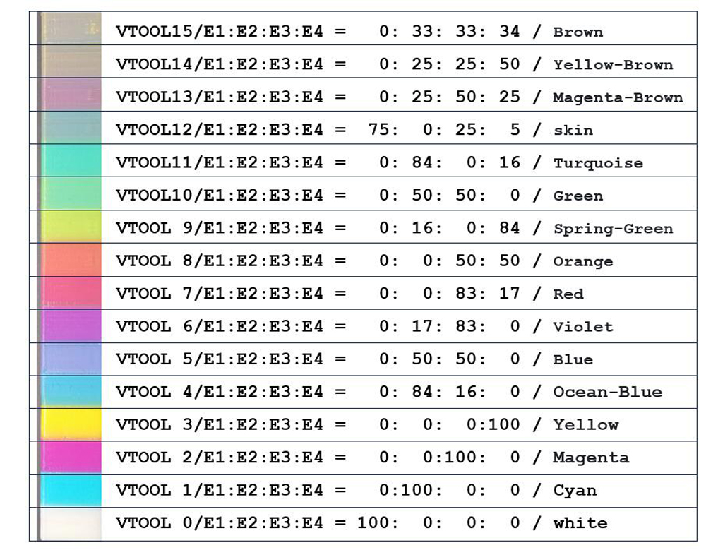

[MIX_COLOR_GUIDE]: https://github.com/ZONESTAR3D/Document-and-User-Guide/tree/master/Mixing_Color
[M4_HOTEND]:  https://github.com/ZONESTAR3D/Upgrade-kit-guide/tree/main/HOTEND/M4
[EN_B]: https://github.com/ZONESTAR3D/Document-and-User-Guide/tree/master/Mixing_Color#en_b
[ES_B]: https://github.com/ZONESTAR3D/Document-and-User-Guide/tree/master/Mixing_Color#es_b
[PT_B]: https://github.com/ZONESTAR3D/Document-and-User-Guide/tree/master/Mixing_Color#pt_b
[FR_B]: https://github.com/ZONESTAR3D/Document-and-User-Guide/tree/master/Mixing_Color#fr_b
[DE_B]: https://github.com/ZONESTAR3D/Document-and-User-Guide/tree/master/Mixing_Color#de_b
[IT_B]: https://github.com/ZONESTAR3D/Document-and-User-Guide/tree/master/Mixing_Color#it_b
[RU_B]: https://github.com/ZONESTAR3D/Document-and-User-Guide/tree/master/Mixing_Color#ru_b
[JP_B]: https://github.com/ZONESTAR3D/Document-and-User-Guide/tree/master/Mixing_Color#jp_b
[KR_B]: https://github.com/ZONESTAR3D/Document-and-User-Guide/tree/master/Mixing_Color#kr_b

----
## <a id="choose-language">:globe_with_meridians: Choose language </a>

----
# <a id="en"> Mixed multi-color operation manual </a>
This guide introduce how to print 6 to 16 colors 3D model with a 4-IN-1-OUT Mixing Color Hotend.

### :warning: NOTE
- **This guide is based on PrusaSlicer slicing software. How to download, install and use PrusaSlicer, please refer to [:point_right:here](https://github.com/ZONESTAR3D/Slicing-Guide/tree/master/PrusaSlicer).**     
- **To know more about mix color feature, please refer to [:point_right:here][MIX_COLOR_GUIDE].**
- **To know more about ZONESTAR 4-IN-1-OUT mix color extruder, please refer to [:point_right:here][M4_HOTEND].**

## Slicing steps
### Step 1: Set the number of extruders

### Step 2: Set the mixing ratios of VTOOLs
Add mixing ratios of VTOOLs setting into the "Start G-code". [:page_with_curl: How to set mixing ratio of Virtual extruder][EN_B]
###### 
### :pushpin: Note
You can download the setting from the bewlow link and unzip it, and then import the setting to your PrusaSlicer.
- [:arrow_down: Download config file](./config_WCMY.zip)    
- [:clapper: Video tutorial](https://user-images.githubusercontent.com/29502731/232972117-387a9e15-f3c7-417b-aff6-d876e119b70d.mp4)
### Step 3: Assign an extruder to the components of 3d model or "painting color" to the 3d model

### Step 4: Slicing and save gcode to SD card
### Step 5: Print the file from SD card

## Examples
### 6 color OWL

- **[:clapper:Slicing video tutorial](https://user-images.githubusercontent.com/29502731/232977232-4e8031b2-9142-4db2-9cef-12b85759fa17.mp4)**
- **[:arrow_down:Download stl file](https://www.thingiverse.com/thing:2373415)**
- **[:arrow_down:Download 3mf & gcode file](https://github.com/ZONESTAR3D/Document-and-User-Guide/tree/master/Mixing_Color/M4_6c_owl.zip)**
### 10 color Noahs

- **[Slicing video tutorial::clapper:Part1](https://user-images.githubusercontent.com/29502731/233287512-25575666-60ff-4b08-88a2-e3ff8149599f.mp4) [:clapper:Part2](https://user-images.githubusercontent.com/29502731/233287715-8dd8517e-8260-41ec-888b-8ba28b692c27.mp4)  [:clapper:Part3](https://user-images.githubusercontent.com/29502731/233287893-a31ec2ab-e4e6-4080-8a97-6ccf92502fa4.mp4)**
- **[:arrow_down:Download stl file](https://github.com/ZONESTAR3D/Document-and-User-Guide/tree/master/Mixing_Color/noahs.zip)**
- **[:arrow_down:Download 3mf & gcode file](https://github.com/ZONESTAR3D/Document-and-User-Guide/tree/master/Mixing_Color/M4_10c_noahs.zip)**
### 16 color tower
     
- **[:clapper:Slicing video tutorial](https://user-images.githubusercontent.com/29502731/233582725-251e2a25-62b9-4c75-b5f1-ad7929ffa192.mp4)**
- **[:arrow_down:Download stl file](https://github.com/ZONESTAR3D/Document-and-User-Guide/tree/master/Mixing_Color/colortower_stl.zip)**
- **[:arrow_down:Download 3mf & gcode file](https://github.com/ZONESTAR3D/Document-and-User-Guide/tree/master/Mixing_Color/M4_16c_colortower.zip)**    
#### :warning: Note
1. When slicing, the wipe tower (prime tower) is disabled, so the color at the boundary may be inaccurate.
2. To print this color tower, you can check the actual print color after setting the mixing ratio.

### Appendix: Color mixing ratio reference settings
Here is a set of reference mixing ratio settings to mix Cyan, Magenta, and Yellow filament to another color.
-	**Filament color:**
	-	E1: White
	- E2: Cyan
	- E3: Magenta
	- E4: Yellow
-	**mix ratio and extruder color:**

|VTOOL number|Mixing Ratio| Color after Mixed  |Extruder Color * |
|:----------:|:----------:|:------------------:|:--------------------------:|
|    0       |  100/0/0/0 |      White         |      R255 G255 B255        |
|    1       |  0/100/0/0 |      Cyan          |      R0   G255 B255        |
|    2       |  0/0/100/0 |      Magenta       |      R255 G0   B255        |
|    3       |  0/0/0/100 |      Yellow        |      R255 G255 B0          |
|    4       |  0/84/16/0 |      Ocean-Blue    |      R0   G191 B255        |
|    5       |  0/50/50/0 |      Blue          |      R0   G0   B255        |
|    6       |  0/17/83/0 |      Violet        |      R169 G0   B255        |
|    7       |  0/0/83/17 |      Red           |      R255 G0   B0          |
|    8       |  0/0/50/50 |      Orange        |      R255 G159 B0          |
|    9       |  0/17/0/83 |      Spring-Green  |      R191 G255 B0          |
|   10       |  0/50/0/50 |      Green         |      R0   G255 B0          |
|   11       |  0/84/0/16 |      Turquoise     |      R0   G255 B191        |
|   12       |  75/0/25/5 |      skin          |      R255 G210 B255        |
|   13       | 0/25/50/25 |      Magenta-Brown |      R106 G83  B83         |
|   14       | 0/25/25/50 |      Yellow-Brown  |      R106 G106 B83         |
|   15       | 0/33/33/34 |      Brown         |      R83  G83  B83         |

**\*Extruder color:** The RGB value is used to set the extruder color in the slicing software, and it is only used to distinguish different parts of the 3D model, it isn't the actual printed color.
######     
- **The following figure shows the mixed printing results according to the above ratio.**   
######     
-	**Gcodes list:** 
You can copy the below to the "Start G-code" in slicing software to set the mixing ratios of the virtual extruders.

>
		;White
		M163 S0 P100
		M163 S1 P0
		M163 S2 P0
		M163 S3 P0
		M164 S0
		;Cyan
		M163 S0 P0
		M163 S1 P100
		M163 S2 P0
		M163 S3 P0
		M164 S1
		;Magenta
		M163 S0 P0
		M163 S1 P0
		M163 S2 P100
		M163 S3 P0
		M164 S2
		;Yellow
		M163 S0 P0
		M163 S1 P0
		M163 S2 P0
		M163 S3 P100
		M164 S3
		;Ocean-Blue
		M163 S0 P0
		M163 S1 P83
		M163 S2 P17
		M163 S3 P0
		M164 S4
		;Blue
		M163 S0 P0
		M163 S1 P50
		M163 S2 P50
		M163 S3 P0
		M164 S5
		;Violet
		M163 S0 P0
		M163 S1 P17
		M163 S2 P83
		M163 S3 P0
		M164 S6
		;Red
		M163 S0 P0
		M163 S1 P0
		M163 S2 P83
		M163 S3 P17
		M164 S7
		;Orange
		M163 S0 P0
		M163 S1 P0
		M163 S2 P50
		M163 S3 P50
		M164 S8
		;Spring-Green
		M163 S0 P0
		M163 S1 P17
		M163 S2 P0
		M163 S3 P83
		M164 S9
		;Green
		M163 S0 P0
		M163 S1 P50
		M163 S2 P0
		M163 S3 P50
		M164 S10
		;Turquoise
		M163 S0 P0
		M163 S1 P83
		M163 S2 P0
		M163 S3 P17
		M164 S11
		;skin
		M163 S0 P18
		M163 S1 P0
		M163 S2 P5
		M163 S3 P1
		M164 S12
		;Magenta-Brown
		M163 S0 P0
		M163 S1 P25
		M163 S2 P50
		M163 S3 P25
		M164 S13
		;Yellow-Brown
		M163 S0 P0
		M163 S1 P25
		M163 S2 P25
		M163 S3 P50
		M164 S14
		;Brown
		M163 S0 P0
		M163 S0 P33
		M163 S1 P33
		M163 S2 P34
		M164 S15

----

----

# <a id="es"> Manual de operación multicolor mixto </a>  [:arrow_heading_up:](#choose-language)
Esta guía presenta cómo imprimir un modelo 3D de 6 a 16 colores con un hotend de mezcla de colores 4 EN 1 SALIDA.

### :warning: NOTA
- **Esta guía está basada en el software de corte PrusaSlicer. Para descargar, instalar y utilizar PrusaSlicer, consulte [:point_right:aquí][ES_B].**
- **Para obtener más información sobre la función de mezcla de colores, consulte [:point_right:aquí][MIX_COLOR_GUIDE].**
- **Para saber más sobre la extrusora de colores mezclados ZONESTAR 4-IN-1-OUT, consulte [:point_right:aquí][M4_HOTEND].**

## Pasos de corte
### Paso 1: Establecer el número de extrusores

### Paso 2: Establecer las proporciones de mezcla de VTOOL
Agregue proporciones de mezcla de la configuración de VTOOL en el "código G de inicio". [:page_with_curl: Cómo configurar la proporción de mezcla del extrusor virtual](#cómo-configurar-la-proporción-de-mezcla-del-extrusor-virtual)

### :pushpin: Nota
Puede descargar la configuración desde el siguiente enlace, descomprimirla y luego importarla a su PrusaSlicer.
- [:arrow_down: Descargar archivo de configuración](./config_WCMY.zip)
- [:clapper: vídeo tutorial](https://user-images.githubusercontent.com/29502731/232972117-387a9e15-f3c7-417b-aff6-d876e119b70d.mp4)
### Paso 3: Asigne una extrusora a los componentes del modelo 3D o "color de pintura" al modelo 3D

### Paso 4: Cortar y guardar gcode en la tarjeta SD
### Paso 5: Imprima el archivo desde la tarjeta SD

## Ejemplos
### BÚHO de 6 colores

- **[:clapper:videotutorial de corte](https://user-images.githubusercontent.com/29502731/232977232-4e8031b2-9142-4db2-9cef-12b85759fa17.mp4)**
- **[:arrow_down:Descargar archivo stl](https://www.thingiverse.com/thing:2373415)**
- **[:arrow_down:Descargar archivo 3mf y gcode](https://github.com/ZONESTAR3D/Document-and-User-Guide/tree/master/Mixing_Color/M4_6c_owl.zip)**
### 10 Noé de colores

- **[Video tutorial de corte::clapper:Part1](https://user-images.githubusercontent.com/29502731/233287512-25575666-60ff-4b08-88a2-e3ff8149599f.mp4) [:clapper:Part2](https ://user-images.githubusercontent.com/29502731/233287715-8dd8517e-8260-41ec-888b-8ba28b692c27.mp4) [:clapper:Part3](https://user-images.githubusercontent.com/29502731/233287893- a31ec2ab-e4e6-4080-8a97-6ccf92502fa4.mp4)**
- **[:arrow_down:Descargar archivo stl](https://github.com/ZONESTAR3D/Document-and-User-Guide/tree/master/Mixing_Color/noahs.zip)**
- **[:arrow_down:Descargar archivo 3mf y gcode](https://github.com/ZONESTAR3D/Document-and-User-Guide/tree/master/Mixing_Color/M4_10c_noahs.zip)**
### Torre de 16 colores

- **[:clapper: vídeo tutorial sobre corte](https://user-images.githubusercontent.com/29502731/233582725-251e2a25-62b9-4c75-b5f1-ad7929ffa192.mp4)**
- **[:arrow_down:Descargar archivo stl](https://github.com/ZONESTAR3D/Document-and-User-Guide/tree/master/Mixing_Color/colortower_stl.zip)**
- **[:arrow_down:Descargar archivo 3mf y gcode](https://github.com/ZONESTAR3D/Document-and-User-Guide/tree/master/Mixing_Color/M4_16c_colortower.zip)**
#### :warning: Nota
1. Al cortar, la torre de limpieza (torre principal) está desactivada, por lo que el color en el límite puede ser inexacto.
2. Para imprimir esta torre de color, puede verificar el color de impresión real después de configurar la proporción de mezcla.

### Apéndice: Configuración de referencia de proporción de mezcla de colores
Aquí hay un conjunto de configuraciones de proporciones de mezcla de referencia para mezclar filamentos cian, magenta y amarillo con otro color.
- **Color del filamento:**
  - E1: Blanco
  - E2: cian
  - E3: Magenta
  - E4: Amarillo
- **proporción de mezcla y color del extrusor:**

|VTOOL number|Mixing Ratio| Color after Mixed  |Extruder Color * |
|:----------:|:----------:|:------------------:|:--------------------------:|
|    0       |  100/0/0/0 |      White         |      R255 G255 B255        |
|    1       |  0/100/0/0 |      Cyan          |      R0   G255 B255        |
|    2       |  0/0/100/0 |      Magenta       |      R255 G0   B255        |
|    3       |  0/0/0/100 |      Yellow        |      R255 G255 B0          |
|    4       |  0/84/16/0 |      Ocean-Blue    |      R0   G191 B255        |
|    5       |  0/50/50/0 |      Blue          |      R0   G0   B255        |
|    6       |  0/17/83/0 |      Violet        |      R169 G0   B255        |
|    7       |  0/0/83/17 |      Red           |      R255 G0   B0          |
|    8       |  0/0/50/50 |      Orange        |      R255 G159 B0          |
|    9       |  0/17/0/83 |      Spring-Green  |      R191 G255 B0          |
|   10       |  0/50/0/50 |      Green         |      R0   G255 B0          |
|   11       |  0/84/0/16 |      Turquoise     |      R0   G255 B191        |
|   12       |  75/0/25/5 |      skin          |      R255 G210 B255        |
|   13       | 0/25/50/25 |      Magenta-Brown |      R106 G83  B83         |
|   14       | 0/25/25/50 |      Yellow-Brown  |      R106 G106 B83         |
|   15       | 0/33/33/34 |      Brown         |      R83  G83  B83         |

**\*Color del extrusor:** El valor RGB se usa para configurar el color del extrusor en el software de corte y solo se usa para distinguir diferentes partes del modelo 3D, no es el color impreso real.
###### 
- **La siguiente figura muestra los resultados de impresión mixtos según la proporción anterior.**
###### 
- [:point_up: **Lista de códigos G:**](#_gcode_list)
Puede copiar lo siguiente al "código G de inicio" en el software de corte para establecer las proporciones de mezcla de las extrusoras virtuales.

----

----

# <a id="pt"> Manual de operação multicolorido misto </a>  [:arrow_heading_up:](#choose-language)
Este guia apresenta como imprimir modelos 3D de 6 a 16 cores com um Hotend de mistura de cores 4-IN-1-OUT.

### :warning: NOTA
- **Este guia é baseado no software de fatiamento PrusaSlicer. Como baixar, instalar e usar o PrusaSlicer, consulte [:point_right:here](https://github.com/ZONESTAR3D/Slicing-Guide/tree/master/PrusaSlicer).**
- **Para saber mais sobre o recurso de mistura de cores, consulte [:point_right:aqui][MIX_COLOR_GUIDE].**
- **Para saber mais sobre a extrusora de cores misturadas ZONESTAR 4-IN-1-OUT, consulte [:point_right:aqui][M4_HOTEND].**

## Etapas de fatiamento
### Etapa 1: Defina o número de extrusoras

### Etapa 2: Definir as proporções de mistura dos VTOOLs
Adicione proporções de mistura de configuração de VTOOLs no "Código G inicial". [:page_with_curl: Como definir a taxa de mistura da extrusora virtual][PT_B]
###### 
### :pushpin:Nota
Você pode baixar a configuração no link abaixo, descompactá-la e, em seguida, importar a configuração para o seu PrusaSlicer.
- [:arrow_down: Baixar arquivo de configuração](./config_WCMY.zip)
- [:clapper: Tutorial em vídeo](https://user-images.githubusercontent.com/29502731/232972117-387a9e15-f3c7-417b-aff6-d876e119b70d.mp4)
### Etapa 3: Atribuir uma extrusora aos componentes do modelo 3D ou "cor de pintura" ao modelo 3D

### Etapa 4: Fatiar e salvar o gcode no cartão SD
### Etapa 5: Imprima o arquivo do cartão SD

## Exemplos
### CORUJA de 6 cores

- **[:clapper:Tutorial em vídeo sobre como fatiar](https://user-images.githubusercontent.com/29502731/232977232-4e8031b2-9142-4db2-9cef-12b85759fa17.mp4)**
- **[:arrow_down:Baixar arquivo stl](https://www.thingiverse.com/thing:2373415)**
- **[:arrow_down:Baixe o arquivo 3mf e gcode](https://github.com/ZONESTAR3D/Document-and-User-Guide/tree/master/Mixing_Color/M4_6c_owl.zip)**
### Noahs de 10 cores

- **[Tutorial em vídeo sobre como fatiar::clapper:Part1](https://user-images.githubusercontent.com/29502731/233287512-25575666-60ff-4b08-88a2-e3ff8149599f.mp4) [:clapper:Part2](https ://user-images.githubusercontent.com/29502731/233287715-8dd8517e-8260-41ec-888b-8ba28b692c27.mp4) [:clapper:Part3](https://user-images.githubusercontent.com/29502731/233287893- a31ec2ab-e4e6-4080-8a97-6ccf92502fa4.mp4)**
- **[:arrow_down:Baixar arquivo stl](https://github.com/ZONESTAR3D/Document-and-User-Guide/tree/master/Mixing_Color/noahs.zip)**
- **[:arrow_down:Baixe o arquivo 3mf e gcode](https://github.com/ZONESTAR3D/Document-and-User-Guide/tree/master/Mixing_Color/M4_10c_noahs.zip)**
### torre de 16 cores

- **[:clapper:Tutorial em vídeo sobre como fatiar](https://user-images.githubusercontent.com/29502731/233582725-251e2a25-62b9-4c75-b5f1-ad7929ffa192.mp4)**
- **[:arrow_down:Baixar arquivo stl](https://github.com/ZONESTAR3D/Document-and-User-Guide/tree/master/Mixing_Color/colortower_stl.zip)**
- **[:arrow_down:Baixe o arquivo 3mf e gcode](https://github.com/ZONESTAR3D/Document-and-User-Guide/tree/master/Mixing_Color/M4_16c_colortower.zip)**
#### :warning: Nota
1. Ao fatiar, a torre de limpeza (torre principal) é desativada, portanto a cor no limite pode ficar imprecisa.
2. Para imprimir esta torre de cores, você pode verificar a cor de impressão real após definir a proporção de mistura.

### Apêndice: Configurações de referência da proporção de mistura de cores
Aqui está um conjunto de configurações de proporção de mistura de referência para misturar filamentos Ciano, Magenta e Amarelo com outra cor.
- **Cor do filamento:**
  - E1: Branco
  - E2: Ciano
  - E3: Magenta
  - E4: Amarelo
- **proporção de mistura e cor da extrusora:**

|Número VTOOL|Proporção de mistura| Cor após mistura |Cor da extrusora * |
|:----------:|:----------:|:------------------:|:--------------------------:|
| 0 | 100/0/0/0 | Branco | R255 G255 B255 |
| 1 | 0/100/0/0 | Ciano | R0 G255 B255 |
| 2 | 0/0/100/0 | Magenta | R255 G0 B255 |
| 3 | 0/0/0/100 | Amarelo | R255 G255 B0 |
| 4 | 0/84/16/0 | Azul oceano | R0 G191 B255 |
| 5 | 0/50/50/0 | Azul | R0 G0 B255 |
| 6 | 17/0/83/0 | Violeta | R169 G0 B255 |
| 7 | 0/0/83/17 | Vermelho | R255 G0 B0 |
| 8 | 0/0/50/50 | Laranja | R255 G159 B0 |
| 9 | 17/0/0/83 | Primavera-Verde | R191 G255 B0 |
| 10 | 0/50/0/50 | Verde | R0 G255 B0 |
| 11 | 0/84/0/16 | Turquesa | R0 G255 B191 |
| 12 | 75/0/25/5 | pele | R255 G210 B255 |
| 13 | 25/0/50/25 | Magenta-Marrom | R106 G83 B83 |
| 14 | 25/0/25/50 | Amarelo-Marrom | R106 G106 B83 |
| 15 | 0/33/33/34 | Marrom | R83 G83 B83 |

**\*Cor da extrusora:** O valor RGB é usado para definir a cor da extrusora no software de fatiamento e é usado apenas para distinguir diferentes partes do modelo 3D, não é a cor impressa real.
###### 
- **A figura a seguir mostra os resultados de impressão mistos de acordo com a proporção acima.**
###### 
- [:point_up: **Lista de códigos G:**](#_gcode_list)
Você pode copiar o texto abaixo para o "Iniciar código G" no software de fatiamento para definir as proporções de mistura das extrusoras virtuais.

----

----
# <a id="fr"> Manuel d'utilisation multicolore mixte </a> [:arrow_heading_up:](#choose-language)
Ce guide explique comment imprimer un modèle 3D de 6 à 16 couleurs avec un Hotend de mélange de couleurs 4-IN-1-OUT.

### :warning: REMARQUE
- **Ce guide est basé sur le logiciel de découpage PrusaSlicer. Comment télécharger, installer et utiliser PrusaSlicer, veuillez vous référer à [:point_right:here](https://github.com/ZONESTAR3D/Slicing-Guide/tree/master/PrusaSlicer).**
- **Pour en savoir plus sur la fonctionnalité de mélange de couleurs, veuillez vous référer à [:point_right:here][MIX_COLOR_GUIDE].**
- **Pour en savoir plus sur l'extrudeuse de couleurs mélangées ZONESTAR 4-IN-1-OUT, veuillez vous référer à [:point_right:here][M4_HOTEND].**

## Étapes de découpage
### Étape 1 : Définir le nombre d'extrudeuses

### Étape 2 : Définir les taux de mélange des VTOOL
Ajoutez les ratios de mélange des paramètres VTOOL dans le "Démarrer le G-code". [:page_with_curl : Comment définir le rapport de mélange de l'extrudeuse virtuelle][EN_B]
###### 
### :pushpin: Remarque
Vous pouvez télécharger le paramètre à partir du lien ci-dessous et le décompresser, puis importer le paramètre sur votre PrusaSlicer.
- [:arrow_down: Télécharger le fichier de configuration](./config_WCMY.zip)
- [:clapper: Tutoriel vidéo](https://user-images.githubusercontent.com/29502731/232972117-387a9e15-f3c7-417b-aff6-d876e119b70d.mp4)
### Étape 3 : Attribuez une extrudeuse aux composants du modèle 3D ou une "couleur de peinture" au modèle 3D

### Étape 4 : Découper et enregistrer le gcode sur la carte SD
### Étape 5 : Imprimez le fichier depuis la carte SD

## Exemples
### CHOUETTE 6 couleurs

- **[:clapper: Tutoriel vidéo sur le découpage](https://user-images.githubusercontent.com/29502731/232977232-4e8031b2-9142-4db2-9cef-12b85759fa17.mp4)**
- **[:arrow_down: Télécharger le fichier stl](https://www.thingverse.com/thing:2373415)**
- **[:arrow_down: Télécharger le fichier 3mf et gcode](https://github.com/ZONESTAR3D/Document-and-User-Guide/tree/master/Mixing_Color/M4_6c_owl.zip)**
### Noé 10 couleurs

- **[Tutoriel vidéo sur le découpage ::clapper:Part1](https://user-images.githubusercontent.com/29502731/233287512-25575666-60ff-4b08-88a2-e3ff8149599f.mp4) [:clapper:Part2](https ://user-images.githubusercontent.com/29502731/233287715-8dd8517e-8260-41ec-888b-8ba28b692c27.mp4) [:clapper:Part3](https://user-images.githubusercontent.com/29502731/233287893- a31ec2ab-e4e6-4080-8a97-6ccf92502fa4.mp4)**
- **[:arrow_down: Télécharger le fichier stl](https://github.com/ZONESTAR3D/Document-and-User-Guide/tree/master/Mixing_Color/noahs.zip)**
- **[:arrow_down: Télécharger le fichier 3mf et gcode](https://github.com/ZONESTAR3D/Document-and-User-Guide/tree/master/Mixing_Color/M4_10c_noahs.zip)**
### Tour de 16 couleurs

- **[:clapper: Tutoriel vidéo sur le découpage](https://user-images.githubusercontent.com/29502731/233582725-251e2a25-62b9-4c75-b5f1-ad7929ffa192.mp4)**
- **[:arrow_down: Télécharger le fichier stl](https://github.com/ZONESTAR3D/Document-and-User-Guide/tree/master/Mixing_Color/colortower_stl.zip)**
- **[:arrow_down: Télécharger le fichier 3mf et gcode](https://github.com/ZONESTAR3D/Document-and-User-Guide/tree/master/Mixing_Color/M4_16c_colortower.zip)**
#### :warning: Remarque
1. Lors du découpage, la tour d'effacement (tour principale) est désactivée, de sorte que la couleur à la limite peut être inexacte.
2. Pour imprimer cette tour de couleur, vous pouvez vérifier la couleur d'impression réelle après avoir défini le rapport de mélange.

### Annexe: Paramètres de référence du rapport de mélange des couleurs
Voici un ensemble de paramètres de rapport de mélange de référence pour mélanger les filaments cyan, magenta et jaune à une autre couleur.
- **Couleur du filament :**
  - E1 : Blanc
  - E2 : Cyan
  - E3 : Magenta
  - E4 : Jaune
- **rapport de mélange et couleur de l'extrudeuse :**

|Número VTOOL|Proporção de mistura| Cor após mistura |Cor da extrusora * |
|:----------:|:----------:|:------------------:|:--------------------------:|
| 0 | 100/0/0/0 | Branco | R255 G255 B255 |
| 1 | 0/100/0/0 | Ciano | R0 G255 B255 |
| 2 | 0/0/100/0 | Magenta | R255 G0 B255 |
| 3 | 0/0/0/100 | Amarelo | R255 G255 B0 |
| 4 | 0/84/16/0 | Azul oceano | R0 G191 B255 |
| 5 | 0/50/50/0 | Azul | R0 G0 B255 |
| 6 | 17/0/83/0 | Violeta | R169 G0 B255 |
| 7 | 0/0/83/17 | Vermelho | R255 G0 B0 |
| 8 | 0/0/50/50 | Laranja | R255 G159 B0 |
| 9 | 17/0/0/83 | Primavera-Verde | R191 G255 B0 |
| 10 | 0/50/0/50 | Verde | R0 G255 B0 |
| 11 | 0/84/0/16 | Turquesa | R0 G255 B191 |
| 12 | 75/0/25/5 | pele | R255 G210 B255 |
| 13 | 25/0/50/25 | Magenta-Marrom | R106 G83 B83 |
| 14 | 25/0/25/50 | Amarelo-Marrom | R106 G106 B83 |
| 15 | 0/33/33/34 | Marrom | R83 G83 B83 |

**\*Cor da extrusora:** O valor RGB é usado para configurar a cor da extrusora no software de corte e apenas é usado para distinguir diferentes partes do modelo 3D, não é a cor impressa real.
###### 
- **A próxima figura mostra os resultados da impressão mixtos de acordo com a proporção anterior.**
###### 
- [:point_up: **Lista de códigos G:**](#_gcode_list)
Você pode copiar o próximo código G de início no software de corte para estabelecer as proporções da mistura das extrusoras virtuais.

----

----
# <a id="de"> Bedienungsanleitung für gemischte Mehrfarben </a> [:arrow_heading_up:](#choose-language)
Diese Anleitung zeigt, wie man mit einem 4-IN-1-OUT-Mixing-Color-Hotend ein 3D-Modell mit 6 bis 16 Farben druckt.

### :warning: HINWEIS
- **Diese Anleitung basiert auf der Slicing-Software PrusaSlicer. Wie Sie PrusaSlicer herunterladen, installieren und verwenden, erfahren Sie [:point_right:hier](https://github.com/ZONESTAR3D/Slicing-Guide/tree/master/PrusaSlicer).**
- **Weitere Informationen zur Mischfarbenfunktion finden Sie [:point_right:hier][MIX_COLOR_GUIDE].**
- **Weitere Informationen zum ZONESTAR 4-IN-1-OUT-Mischfarbenextruder finden Sie [:point_right:hier][M4_HOTEND].**

## Slicing-Schritte
### Schritt 1: Anzahl der Extruder festlegen

### Schritt 2: Mischverhältnisse der VTOOLs festlegen
Fügen Sie die Mischverhältnisse der VTOOLs-Einstellung in den „Start-G-Code“ ein. [:page_with_curl: So legen Sie das Mischverhältnis des virtuellen Extruders fest][EN_B]
###### 
### :pushpin: Hinweis
Sie können die Einstellung über den folgenden Link herunterladen, entpacken und dann in Ihren PrusaSlicer importieren.
- [:arrow_down: Konfigurationsdatei herunterladen](./config_WCMY.zip)
- [:clapper: Video-Tutorial](https://user-images.githubusercontent.com/29502731/232972117-387a9e15-f3c7-417b-aff6-d876e119b70d.mp4)
### Schritt 3: Den Komponenten des 3D-Modells einen Extruder oder dem 3D-Modell eine „Malfarbe“ zuweisen

### Schritt 4: Slicen und G-Code auf SD-Karte speichern
### Schritt 5: Die Datei von der SD-Karte drucken

## Beispiele
### 6-Farben-OWL

- **[:clapper: Slicing-Video Tutorial](https://user-images.githubusercontent.com/29502731/232977232-4e8031b2-9142-4db2-9cef-12b85759fa17.mp4)**
- **[:arrow_down: STL-Datei herunterladen](https://www.thingiverse.com/thing:2373415)**
- **[:arrow_down: 3mf- und Gcode-Datei herunterladen](https://github.com/ZONESTAR3D/Document-and-User-Guide/tree/master/Mixing_Color/M4_6c_owl.zip)**
### 10-farbige Noahs

- **[Video zum Schneiden Tutorial::clapper:Teil1](https://user-images.githubusercontent.com/29502731/233287512-25575666-60ff-4b08-88a2-e3ff8149599f.mp4) [:clapper:Teil2](https://user-images.githubusercontent.com/29502731/233287715-8dd8517e-8260-41ec-888b-8ba28b692c27.mp4) [:clapper:Teil3](https://user-images.githubusercontent.com/29502731/233287893-a31ec2ab-e4e6-4080-8a97-6ccf92502fa4.mp4)**
- **[:arrow_down: stl herunterladen Datei](https://github.com/ZONESTAR3D/Document-and-User-Guide/tree/master/Mixing_Color/noahs.zip)**
- **[:arrow_down: 3mf- und Gcode-Datei herunterladen](https://github.com/ZONESTAR3D/Document-and-User-Guide/tree/master/Mixing_Color/M4_10c_noahs.zip)**
### 16-Farben-Turm

- **[:clapper: Video-Tutorial zum Schneiden](https://user-images.githubusercontent.com/29502731/233582725-251e2a25-62b9-4c75-b5f1-ad7929ffa192.mp4)**
- **[:arrow_down: stl herunterladen Datei](https://github.com/ZONESTAR3D/Document-and-User-Guide/tree/master/Mixing_Color/colortower_stl.zip)**
- **[:arrow_down: 3mf- und Gcode-Datei herunterladen](https://github.com/ZONESTAR3D/Document-and-User-Guide/tree/master/Mixing_Color/M4_16c_colortower.zip)**
#### :warning: Hinweis
1. Beim Slicen ist der Wischturm (Prime Tower) deaktiviert, daher kann die Farbe an der Grenze ungenau sein.
2. Um diesen Farbturm zu drucken, können Sie die tatsächliche Druckfarbe überprüfen, nachdem Sie das Mischverhältnis eingestellt haben.

### Anhang: Referenzeinstellungen für Farbmischverhältnisse
Hier ist eine Reihe von Referenzeinstellungen für Mischverhältnisse, um Cyan-, Magenta- und Gelbfilament mit einer anderen Farbe zu mischen.
- **Filamentfarbe:**
- E1: Weiß
- E2: Cyan
- E3: Magenta
- E4: Gelb
- **Mischungsverhältnis und Extruderfarbe:**

|VTOOL-Nummer|Mischverhältnis| Farbe nach dem Mischen |Extruderfarbe * |
|:----------:|:----------:|:------------------:|:---------------------------:|
| 0 | 100/0/0/0 | Weiß | R255 G255 B255 |
| 1 | 0/100/0/0 | Cyan | R0 G255 B255 |
| 2 | 0/0/100/0 | Magenta | R255 G0 B255 |
| 3 | 0/0/0/100 | Gelb | R255 G255 B0 |
| 4 | 0/84/16/0 | Ozeanblau | R0 G191 B255 |
| 5 | 0/50/50/0 | Blau | R0 G0 B255 |
| 6 | 0/17/83/0 | Violett | R169 G0 B255 |
| 7 | 0/0/83/17 | Rot | R255 G0 B0 |
| 8 | 0/0/50/50 | Orange | R255 G159 B0 |
| 9 | 0/17/0/83 | Frühlingsgrün | R191 G255 B0 |
| 10 | 0/50/0/50 | Grün | R0 G255 B0 |
| 11 | 0/84/0/16 | Türkis | R0 G255 B191 |
| 12 | 75/0/25/5 | haut | R255 G210 B255 |
| 13 | 0/25/50/25 | Magentabraun | R106 G83 B83 |
| 14 | 0/25/25/50 | Gelbbraun | R106 G106 B83 |
| 15 | 0/33/33/34 | Braun | R83 G83 B83 |

**\*Extruderfarbe:** Der RGB-Wert wird verwendet, um die Extruderfarbe in der Schneidesoftware zu konfigurieren und wird nur verwendet, um die verschiedenen Teile des 3D-Modells zu unterscheiden. Es handelt sich nicht um die tatsächlich gedruckte Farbe.
###### 
- **Die folgende Abbildung zeigt die Ergebnisse des Mischdrucks nach dem vorherigen Verhältnis.**
###### 
- [:point_up: **G-Codeliste:**](#_gcode_list)
Sie können das Folgende in den „Startcode G“ der Schnittsoftware kopieren, um die Verteilung der virtuellen Extruder festzulegen.

----

----
# <a id="it"> Manuale operativo multicolore misto </a> [:arrow_heading_up:](#scegli-lingua)
Questa guida spiega come stampare un modello 3D da 6 a 16 colori con un hotend di miscelazione colori 4-IN-1-OUT.

### :warning: NOTA
- **Questa guida è basata sul software di slicing PrusaSlicer. Per scaricare, installare e utilizzare PrusaSlicer fare riferimento a [:point_right: qui](https://github.com/ZONESTAR3D/Slicing-Guide/tree/master/PrusaSlicer).**
- **Per saperne di più sulla funzionalità Mix Color, fare riferimento a [:point_right:qui][MIX_COLOR_GUIDE].**
- **Per saperne di più sull'estrusore di colori misti ZONESTAR 4-IN-1-OUT, fare riferimento a [:point_right:qui][M4_HOTEND].**

## Passaggi per affettare
### Passaggio 1: imposta il numero di estrusori

### Passaggio 2: impostare i rapporti di miscelazione dei VTOOL
Aggiungi i rapporti di miscelazione delle impostazioni VTOOL nel "Codice G iniziale". [:page_with_curl: Come impostare il rapporto di miscelazione dell'estrusore virtuale][EN_B]
###### 
### :pushpin: Nota
Puoi scaricare l'impostazione dal link sottostante e decomprimerla, quindi importare l'impostazione sul tuo PrusaSlicer.
- [:arrow_down: Scarica il file di configurazione](./config_WCMY.zip)
- [:clapper: Tutorial video](https://user-images.githubusercontent.com/29502731/232972117-387a9e15-f3c7-417b-aff6-d876e119b70d.mp4)
### Passaggio 3: assegna un estrusore ai componenti del modello 3D o un "colore di pittura" al modello 3D

### Passaggio 4: suddividere e salvare il gcode sulla scheda SD
### Passaggio 5: stampare il file dalla scheda SD

## Esempi
### GUFO a 6 colori

- **[:clapper: Tutorial video sull'affettatura](https://user-images.githubusercontent.com/29502731/232977232-4e8031b2-9142-4db2-9cef-12b85759fa17.mp4)**
- **[:arrow_down: Scarica file stl](https://www.thingiverse.com/thing:2373415)**
- **[:arrow_down: Scarica file 3mf e gcode](https://github.com/ZONESTAR3D/Document-and-User-Guide/tree/master/Mixing_Color/M4_6c_owl.zip)**
### Noè a 10 colori

- **[Tutorial video sull'affettatura::clapper:Part1](https://user-images.githubusercontent.com/29502731/233287512-25575666-60ff-4b08-88a2-e3ff8149599f.mp4) [:clapper:Part2](https ://user-images.githubusercontent.com/29502731/233287715-8dd8517e-8260-41ec-888b-8ba28b692c27.mp4) [:clapper:Part3](https://user-images.githubusercontent.com/29502731/233287893- a31ec2ab-e4e6-4080-8a97-6ccf92502fa4.mp4)**
- **[:arrow_down: Scarica file stl](https://github.com/ZONESTAR3D/Document-and-User-Guide/tree/master/Mixing_Color/noahs.zip)**
- **[:arrow_down: Scarica file 3mf e gcode](https://github.com/ZONESTAR3D/Document-and-User-Guide/tree/master/Mixing_Color/M4_10c_noahs.zip)**
### Torre a 16 colori

- **[:clapper: Tutorial video sull'affettatura](https://user-images.githubusercontent.com/29502731/233582725-251e2a25-62b9-4c75-b5f1-ad7929ffa192.mp4)**
- **[:arrow_down: Scarica file stl](https://github.com/ZONESTAR3D/Document-and-User-Guide/tree/master/Mixing_Color/colortower_stl.zip)**
- **[:arrow_down: Scarica file 3mf e gcode](https://github.com/ZONESTAR3D/Document-and-User-Guide/tree/master/Mixing_Color/M4_16c_colortower.zip)**
#### :warning: Nota
1. Durante il taglio, la torre di pulizia (torre principale) è disabilitata, quindi il colore al confine potrebbe essere impreciso.
2. Per stampare questa torre dei colori, è possibile controllare il colore di stampa effettivo dopo aver impostato il rapporto di miscelazione.

### Appendice: impostazioni di riferimento del rapporto di miscelazione dei colori
Ecco una serie di impostazioni del rapporto di miscelazione di riferimento per miscelare il filamento ciano, magenta e giallo con un altro colore.
- **Colore filamento:**
  - E1: bianco
  - E2: ciano
  -E3: Magenta
  - E4: Giallo
- **Rapporto di miscelazione e colore dell'estrusore:**

|Numero VTOOL|Rapporto di miscelazione| Colore dopo la miscelazione |Colore estrusore * |
|:----------:|:----------:|:------------:|:-------------------------:|
| 0| 100/0/0/0 | Bianco | R255 G255 B255 |
| 1| 0/100/0/0 | Ciano | R0 G255 B255 |
| 2| 0/0/100/0 | Magenta | R255 G0 B255 |
| 3| 0/0/0/100 | Giallo | R255 G255 B0|
| 4| 0/84/16/0 | Blu oceano | R0 G191 B255 |
| 5| 0/50/50/0 | Blu | R0 G0 B255 |
| 6| 17/0/83/0 | Viola | R169 G0 B255 |
| 7| 0/0/83/17 | Rosso | R255 G0 B0 |
| 8| 0/0/50/50 | Arancione | R255 G159 B0 |
| 9| 17/0/0/83 | Verde primavera | R191 G255 B0 |
| 10| 0/50/0/50 | Verde | R0 G255 B0 |
| 11| 0/84/0/16 | Turchese | R0 G255 B191 |
| 12| 75/0/25/5 | pelle | R255 G210 B255 |
| 13| 0/25/50/25 | Magenta-Marrone | R106 G83 B83 |
| 14| 0/25/25/50 | Giallo-Marrone | R106 G106 B83 |
| 15| 0/33/33/34 | Marrone | R83 G83 B83 |

**\*Colore dell'estrusore:** Il valore RGB viene utilizzato per configurare il colore dell'estrusore nel software di corte e viene utilizzato solo per distinguere le diverse parti del modello 3D, non è il colore stampato reale.
###### 
- **La figura successiva mostra i risultati della stampa mista secondo la proporzione precedente.**
###### 
- [:point_up: **Elenco codici G:**](#_gcode_list)
Puoi copiare il successivo nel "codice G di inizio" nel software di corte per stabilire le proporzioni del mixcla degli estrusori virtuali.

----

----
# <a id="ru"> Руководство по эксплуатации смешанной многоцветной печати </a> [:arrow_heading_up:](#choose-language)
В этом руководстве рассказывается, как напечатать 3D-модель от 6 до 16 цветов с помощью смесителя цветов Hotend 4-В-1-ВЫХ.

### :warning: ПРИМЕЧАНИЕ
- **Это руководство основано на программном обеспечении для нарезки PrusaSlicer. Как загрузить, установить и использовать PrusaSlicer, см. [:point_right:здесь](https://github.com/ZONESTAR3D/Slicing-Guide/tree/master/PrusaSlicer).**
- **Чтобы узнать больше о функции смешивания цветов, обратитесь к [:point_right:здесь][MIX_COLOR_GUIDE].**
- **Для получения дополнительной информации об экструдере для смешивания цветов ZONESTAR 4-IN-1-OUT см. [:point_right:здесь][M4_HOTEND].**

## Шаги нарезки
### Шаг 1: Установите количество экструдеров

### Шаг 2. Установите пропорции смешивания VTOOL.
Добавьте настройки смешивания VTOOLs в «Начать G-код». [:page_with_curl: Как установить соотношение смешивания виртуального экструдера][EN_B]
###### 
### :pushpin: Примечание
Вы можете скачать настройку по ссылке ниже, разархивировать ее, а затем импортировать настройку в PrusaSlicer.
- [:arrow_down: Загрузить файл конфигурации](./config_WCMY.zip)
- [:clapper: Видеоурок](https://user-images.githubusercontent.com/29502731/232972117-387a9e15-f3c7-417b-aff6-d876e119b70d.mp4)
### Шаг 3: Назначьте экструдер компонентам 3D-модели или «цвет окраски» 3D-модели.

### Шаг 4. Нарезаем и сохраняем gcode на SD-карту
### Шаг 5. Распечатайте файл с SD-карты

## Примеры
### 6-цветная СОВА

- **[:clapper: Видеоруководство по нарезке](https://user-images.githubusercontent.com/29502731/232977232-4e8031b2-9142-4db2-9cef-12b85759fa17.mp4)**
- **[:arrow_down: Загрузить stl-файл](https://www.thingiverse.com/thing:2373415)**
- **[:arrow_down: Загрузить файл 3mf и gcode](https://github.com/ZONESTAR3D/Document-and-User-Guide/tree/master/Mixing_Color/M4_6c_owl.zip)**
### 10 цветных Ноев

- **[Видеоруководство по нарезке::clapper:Part1](https://user-images.githubusercontent.com/29502731/233287512-25575666-60ff-4b08-88a2-e3ff8149599f.mp4) [:clapper:Part2](https ://user-images.githubusercontent.com/29502731/233287715-8dd8517e-8260-41ec-888b-8ba28b692c27.mp4) [:clapper:Part3](https://user-images.githubusercontent.com/29502731/233287893- a31ec2ab-e4e6-4080-8a97-6ccf92502fa4.mp4)**
- **[:arrow_down: Загрузить stl-файл](https://github.com/ZONESTAR3D/Document-and-User-Guide/tree/master/Mixing_Color/noahs.zip)**
- **[:arrow_down: Загрузить файл 3mf и gcode](https://github.com/ZONESTAR3D/Document-and-User-Guide/tree/master/Mixing_Color/M4_10c_noahs.zip)**
### 16-цветная башня

- **[:clapper: Видеоруководство по нарезке](https://user-images.githubusercontent.com/29502731/233582725-251e2a25-62b9-4c75-b5f1-ad7929ffa192.mp4)**
- **[:arrow_down: Загрузить stl-файл](https://github.com/ZONESTAR3D/Document-and-User-Guide/tree/master/Mixing_Color/colortower_stl.zip)**
- **[:arrow_down: Загрузить файл 3mf и gcode](https://github.com/ZONESTAR3D/Document-and-User-Guide/tree/master/Mixing_Color/M4_16c_colortower.zip)**
#### :warning: Примечание
1. При нарезке башня вытеснения (прайм-башня) отключается, поэтому цвет на границе может быть неточным.
2. Чтобы напечатать эту цветную башню, вы можете проверить фактический цвет печати после установки соотношения смешивания.

### Приложение: Справочные настройки соотношения смешивания цветов
Ниже приведен набор эталонных настроек соотношения смешивания для смешивания голубой, пурпурной и желтой нити с другим цветом.
- **Цвет нити:**
  - E1: Белый
  - E2: Голубой
  - E3: Пурпурный
  - E4: Желтый
- **Соотношение смешивания и цвет экструдера:**

|Номер VTOOL|Коэффициент смешивания| Цвет после смешивания | Цвет экструдера * |
|:----------:|:----------:|:------------------:|:--------------------------:|
| 0 | 100/0/0/0 | Белый | Р255 Г255 В255 |
| 1 | 0/100/0/0 | Голубой | Р0 G255 B255 |
| 2 | 0/0/100/0 | Пурпурный | Р255 G0 B255 |
| 3 | 0/0/0/100 | Желтый | Р255 Г255 Б0 |
| 4 | 84.00.16.0 | океан-синий | Р0 G191 B255 |
| 5 | 0/50/50/0 | Синий | Р0 G0 B255 |
| 6 | 17.00.83.0 | Фиолетовый | Р169 Г0 В255 |
| 7 | 0.0.83.17 | Красный | Р255 Г0 Б0 |
| 8 | 0/0/50/50 | Оранжевый | Р255 Г159 Б0 |
| 9 | 17.00.83 | Весенне-зеленый | Р191 Г255 Б0 |
| 10 | 0/50/0/50 | Зеленый | Р0 G255 B0 |
| 11 | 84.00.16 | Бирюзовый | Р0 G255 B191 |
| 12 | 75/0/25/5 | кожа | Р255 Г210 В255 |
| 13 | 25.00.50.25 | Пурпурно-коричневый | Р106 Г83 В83 |
| 14 | 25.00.25.50 | Желто-коричневый | Р106 Г106 В83 |
| 15 | 33.00.33.34 | Браун | Р83 Г83 В83 |

**\*Цвет экструдера:** Цвет RGB используется для настройки цвета экструдера в программном обеспечении Corte и в одиночку, чтобы различать различные части 3D-модели, но цвет не кажется реальным.
###### 
- **Сегодняшняя фигура показывает смешанные результаты в следующей пропорции.**
###### 
- [:point_up: **Список кодов G:**](#_gcode_list)
Вы можете скопировать «код запуска G» в программное обеспечение, чтобы установить пропорции набора виртуальных вытягиваний.

----

----
# <a id="jp"> 混合マルチカラー操作マニュアル </a> [:arrow_heading_up:](#choose-language)
このガイドでは、4-IN-1-OUT 混合カラーホットエンドを使用して 6 ～ 16 色の​​ 3D モデルを印刷する方法を紹介します。

### :warning: 注意
- **このガイドは、PrusaSlicer スライス ソフトウェアに基づいています。 PrusaSlicer のダウンロード、インストール、使用方法については、[:point_right:こちら](https://github.com/ZONESTAR3D/Slicing-Guide/tree/master/PrusaSlicer) を参照してください。**
- **ミックスカラー機能の詳細については、[:point_right:こちら][MIX_COLOR_GUIDE] を参照してください。**
- **ZONESTAR 4-IN-1-OUT ミックスカラーエクストルーダーの詳細については、[:point_right:こちら][M4_HOTEND] を参照してください。**

## スライス手順
### ステップ 1: エクストルーダーの数を設定します

### ステップ 2: VTOOL の混合比を設定します
VTOOL の混合比設定を「Start G-code」に追加します。 [:page_with_curl: 仮想エクストルーダーの混合比を設定する方法][EN_B]
###### 
### :pushpin: 注
以下のリンクから設定をダウンロードして解凍し、PrusaSlicer に設定をインポートできます。
- [:arrow_down: 設定ファイルをダウンロード](./config_WCMY.zip)
- [:clapper: ビデオチュートリアル](https://user-images.githubusercontent.com/29502731/232972117-387a9e15-f3c7-417b-aff6-d876e119b70d.mp4)
### ステップ 3: 3D モデルのコンポーネントに押し出し機を割り当てるか、3D モデルに「色を塗る」

### ステップ 4: スライスして gcode を SD カードに保存
### ステップ 5: SD カードからファイルを印刷

## 例
### 6 色の OWL

- **[:clapper: スライスのビデオチュートリアル](https://user-images.githubusercontent.com/29502731/232977232-4e8031b2-9142-4db2-9cef-12b85759fa17.mp4)**
- **[:arrow_down: stl ファイルをダウンロード](https://www.thingiverse.com/thing:2373415)**
- **[:arrow_down: 3mf および gcode ファイルをダウンロード](https://github.com/ZONESTAR3D/Document-and-User-Guide/tree/master/Mixing_Color/M4_6c_owl.zip)**
### 10 色のノア

- **[スライス ビデオチュートリアル::clapper:パート1](https://user-images.githubusercontent.com/29502731/233287512-25575666-60ff-4b08-88a2-e3ff8149599f.mp4) [:clapper:パート2](https://user-images.githubusercontent.com/29502731/233287715-8dd8517e-8260-41ec-888b-8ba28b692c27.mp4) [:clapper:パート3](https://user-images.githubusercontent.com/29502731/233287893-a31ec2ab-e4e6-4080-8a97-6ccf92502fa4.mp4)**
- **[:arrow_down: stl ファイルをダウンロード](https://github.com/ZONESTAR3D/Document-and-User-Guide/tree/master/Mixing_Color/noahs.zip)**
- **[:arrow_down: 3mf および gcode ファイルをダウンロード](https://github.com/ZONESTAR3D/Document-and-User-Guide/tree/master/Mixing_Color/M4_10c_noahs.zip)**
### 16 色の​​タワー

- **[:clapper:スライスのビデオ チュートリアル](https://user-images.githubusercontent.com/29502731/233582725-251e2a25-62b9-4c75-b5f1-ad7929ffa192.mp4)**
- **[:arrow_down:stl ファイルをダウンロードファイル](https://github.com/ZONESTAR3D/Document-and-User-Guide/tree/master/Mixing_Color/colortower_stl.zip)**
- **[:arrow_down:3mf および gcode ファイルをダウンロード](https://github.com/ZONESTAR3D/Document-and-User-Guide/tree/master/Mixing_Color/M4_16c_colortower.zip)**
#### :warning: 注意
1. スライス時にワイプタワー (プライムタワー) が無効になるため、境界の色が不正確になる可能性があります。
2. このカラータワーを印刷するには、混合比を設定した後、実際の印刷色を確認できます。

### 付録: カラー混合比の参照設定
シアン、マゼンタ、イエローのフィラメントを別の色に混合するための参照混合比設定のセットを示します。
- **フィラメントの色:**
- E1: ホワイト
- E2: シアン
- E3: マゼンタ
- E4: イエロー
- **混合比と押出機の色:**

|VTOOL 番号|混合比| 混合後の色 | 押出機の色 * |
|:----------:|:---------:|:------------------:|:--------------------------:|
| 0 | 100/0/0/0 | ホワイト | R255 G255 B255 |
| 1 | 0/100/0/0 | シアン | R0 G255 B255 |
| 2 | 0/0/100/0 | マゼンタ | R255 G0 B255 |
| 3 | 0/0/0/100 | イエロー | R255 G255 B0 |
| 4 | 0/84/16/0 | オーシャンブルー | R0 G191 B255 |
| 5 | 0/50/50/0 | ブルー | R0 G0 B255 |
| 6 | 0/17/83/0 | バイオレット | R169 G0 B255 |
| 7 | 0/0/83/17 | レッド | R255 G0 B0 |
| 8 | 0/0/50/50 | オレンジ | R255 G159 B0 |
| 9 | 0/17/0/83 | スプリンググリーン | R191 G255 B0 |
| 10 | 0/50/0/50 | グリーン | R0 G255 B0 |
| 11 | 0/84/0/16 | ターコイズ | R0 G255 B191 |
| 12 | 75/0/25/5 | スキン | R255 G210 B255 |
| 13 | 0/25/50/25 | マゼンタブラウン | R106 G83 B83 |
| 14 | 0/25/25/50 |黄褐色 | R106 G106 B83 |
| 15 | 0/33/33/34 |ブラウンR83 G83 B83 |

**\*押出機の色:** RGB 値は、ソフトウェアで押出機の色を設定するために使用され、実際の色ではなく、3D モデルのさまざまな部分を区別するためにのみ使用されます。
###### 
- **次の図は、前の比率の混合印刷結果を示しています。**
###### 
- [:point_up: **コード G のリスト:**](#_gcode_list)
仮想押出機の分割比率を設定するには、ソフトウェアの次の「開始コード G」をコピーできます。

----

----
# <a id="kr"> 혼합 다색 사용 설명서 </a> [:arrow_heading_up:](#choose-language)
이 가이드에서는 4-IN-1-OUT 혼합 색상 핫엔드를 사용하여 6~16색 3D 모델을 인쇄하는 방법을 소개합니다.

### :warning: 참고
- **이 가이드는 PrusaSlicer 슬라이싱 소프트웨어를 기반으로 합니다. PrusaSlicer 다운로드, 설치 및 사용 방법은 [:point_right:여기](https://github.com/ZONESTAR3D/Slicing-Guide/tree/master/PrusaSlicer)를 참조하세요.**
- **믹스 컬러 기능에 대한 자세한 내용은 [:point_right: 여기][MIX_COLOR_GUIDE]를 참조하세요.**
- **ZONESTAR 4-IN-1-OUT 혼합색 압출기에 대한 자세한 내용은 [:point_right: 여기][M4_HOTEND]를 참조하세요.**

## 슬라이싱 단계
### 1단계: 압출기 수 설정

### 2단계: VTOOL의 혼합 비율 설정
"Start G-code"에 VTOOL 설정의 혼합 비율을 추가합니다. [:page_with_curl: Virtual Extruder의 혼합비율 설정 방법][EN_B]
###### 
### :pushpin: 참고
아래 링크에서 설정을 다운로드하고 압축을 푼 후 PrusaSlicer로 설정을 가져올 수 있습니다.
- [:arrow_down: 구성 파일 다운로드](./config_WCMY.zip)
- [:clapper: 비디오 튜토리얼](https://user-images.githubusercontent.com/29502731/232972117-387a9e15-f3c7-417b-aff6-d876e119b70d.mp4)
### 3단계: 3D 모델의 구성 요소에 압출기를 지정하거나 3D 모델에 "채색 색상"을 지정합니다.

### 4단계: gcode를 분할하여 SD 카드에 저장
### 5단계: SD 카드에서 파일 인쇄

## 예
### 6색 올빼미

- **[:clapper: 슬라이싱 비디오 튜토리얼](https://user-images.githubusercontent.com/29502731/232977232-4e8031b2-9142-4db2-9cef-12b85759fa17.mp4)**
- **[:arrow_down: stl 파일 다운로드](https://www.thingiverse.com/thing:2373415)**
- **[:arrow_down: 3mf 및 gcode 파일 다운로드](https://github.com/ZONESTAR3D/Document-and-User-Guide/tree/master/Mixing_Color/M4_6c_owl.zip)**
### 10색노아

- **[슬라이싱 비디오 튜토리얼::clapper:Part1](https://user-images.githubusercontent.com/29502731/233287512-25575666-60ff-4b08-88a2-e3ff8149599f.mp4) [:clapper: Part2](https //user-images.githubusercontent.com/29502731/233287715-8dd8517e-8260-41ec-888b-8ba28b692c27.mp4) [:clapper:Part3](https://user-images.githubusercontent.com/29502731/233287893- a31ec2ab-e4e6-4080-8a97-6ccf92502fa4.mp4)**
- **[:arrow_down: stl 파일 다운로드](https://github.com/ZONESTAR3D/Document-and-User-Guide/tree/master/Mixing_Color/noahs.zip)**
- **[:arrow_down: 3mf 및 gcode 파일 다운로드](https://github.com/ZONESTAR3D/Document-and-User-Guide/tree/master/Mixing_Color/M4_10c_noahs.zip)**
### 16색 타워

- **[:clapper:슬라이싱 비디오 튜토리얼](https://user-images.githubusercontent.com/29502731/233582725-251e2a25-62b9-4c75-b5f1-ad7929ffa192.mp4)**
- **[:arrow_down:stl 파일 다운로드](https://github.com/ZONESTAR3D/Document-and-User-Guide/tree/master/Mixing_Color/colortower_stl.zip)**
- **[:arrow_down:3mf 및 gcode 파일 다운로드](https://github.com/ZONESTAR3D/Document-and-User-Guide/tree/master/Mixing_Color/M4_16c_colortower.zip)**
#### :warning: 참고
1. 슬라이스 시 와이프타워(프라임타워)가 비활성화되어 경계부분의 색상이 정확하지 않을 수 있습니다.
2. 본 컬러타워를 인쇄하기 위해서는 혼합비율을 설정한 후 실제 인쇄되는 색상을 확인하실 수 있습니다.

### 부록: 색상 혼합 비율 참조 설정
Cyan, Magenta 및 Yellow 필라멘트를 다른 색상에 혼합하기 위한 참조 혼합 비율 설정 세트는 다음과 같습니다.
- **필라멘트 색상:**
  - E1: 흰색
  - E2: 청록색
  - E3: 마젠타
  - E4: 노란색
- **혼합비 및 압출기 색상:**

|VTOOL 번호|혼합 비율| 혼합 후 색상 |압출기 색상 * |
|:----------:|:----------:|:------:|:-------------:|
| 0 | 100/0/0/0 | 화이트 | R255 G255 B255 |
| 1 | 0/100/0/0 | 청록색 | R0 G255 B255 |
| 2 | 0/0/100/0 | 마젠타 | R255 G0 B255 |
| 3 | 0/0/0/100 | 노란색 | R255 G255 B0 |
| 4 | 0/84/16/0 | 오션블루 | R0 G191 B255 |
| 5 | 0/50/50/0 | 블루 | R0 G0 B255 |
| 6 | 0/17/83/0 | 바이올렛 | R169 G0 B255 |
| 7 | 17/0/0/83 | 레드 | R255 G0 B0 |
| 8 | 0/0/50/50 | 오렌지 | R255 G159 B0 |
| 9 | 0/17/0/83 | 봄-녹색 | R191 G255 B0 |
| 10 | 0/50/0/50 | 그린 | R0 G255 B0 |
| 11 | 0/84/0/16 | 청록색 | R0 G255 B191 |
| 12 | 75/0/25/5 | 피부 | R255 G210 B255 |
| 13 | 0/25/50/25 | 마젠타브라운 | R106 G83 B83 |
| 14 | 50/0/25/25 | 황갈색 | R106 G106 B83 |
| 15 | 0/33/33/34 | 브라운 | R83 G83 B83 |

**\*압출기 색상:** 3D 모델의 다른 부분을 구별하는 소프트웨어로 압출기를 구성하는 색상 추출기의 미국용 Valor RGB는 실제 색상을 구현하지 않습니다.
###### 
- **전방의 비율에 따라 혼합된 인상의 결과가 매우 중요합니다.**
###### 
- [:point_up: **G 코드 목록:**](#_gcode_list)
Puede copiar lo siguiente al "código G de inicio" en el Software de corte para establecer las proporciones de mezcla de las extrusoras virtuales.

