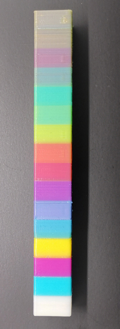

<!-- ### Choose Language (Translated by google)

 -->

# Mixed multi-color operation manual
This guide introduce how to print 6 to 16 colors 3D model with a 4-IN-1-OUT Mixing Color Hotend.

-----
### :globe_with_meridians: Translate
We provide online documentation for files precisely because it is easy to translate into the language you are familiar with. Below, we list some common browser translation add-ons for your reference.
- [**Windows Edge Translate Add-on**](https://microsoftedge.microsoft.com/addons/detail/edge-translate/bfdogplmndidlpjfhoijckpakkdjkkil?hl=en-US)    
- [**Firefox Translations Add-on**](https://support.mozilla.org/en-US/kb/firefox-translations-add-on?redirectslug=firefox-translations&redirectlocale=en-US)
- [**Google Translate Chrome Extension**](https://chrome.google.com/webstore/detail/google-translate/aapbdbdomjkkjkaonfhkkikfgjllcleb)

-----
### :warning: NOTE
- **This guide is based on PrusaSlicer slicing software. How to download, install and use PrusaSlicer, please refer to [:point_right:here](https://github.com/ZONESTAR3D/Slicing-Guide/tree/master/PrusaSlicer).**     
- **To know more about mix color feature, please refer to [:point_right:here](https://github.com/ZONESTAR3D/Document-and-User-Guide/tree/master/Mixing_Color).**
- **To know more about ZONESTAR 4-IN-1-OUT mix color extruder, please refer to [:point_right:here](https://github.com/ZONESTAR3D/Upgrade-kit-guide/tree/main/HOTEND/M4%20%204-IN-1-OUT%20Mixing%20Color%20Hotend).**

-----
## Slicing steps
### Step 1: Set the number of extruders

### Step 2: Set the mixing ratios of VTOOLs
Add mixing ratios of VTOOLs setting into the "Start G-code". [:page_with_curl: How to set mixing ratio of Virtual extruder](#how-to-set-mixing-ratio-of-virtual-extruder)

### :pushpin:Note
You can download the setting from the bewlow link and unzip it, and then import the setting to your PrusaSlicer.
- [:arrow_down: Download config file](./config_WCMY.zip)    
- [:clapper: Video tutorial](https://user-images.githubusercontent.com/29502731/232972117-387a9e15-f3c7-417b-aff6-d876e119b70d.mp4)
### Step 3: Assign an extruder to the components of 3d model or "painting color" to the 3d model

#### Step 4: Slicing and save gcode to SD card
#### Step 5: Print the file from SD card

-----
## Examples
### 6 color OWL

- **[:clapper:Slicing video tutorial](https://user-images.githubusercontent.com/29502731/232977232-4e8031b2-9142-4db2-9cef-12b85759fa17.mp4)**
- **[:arrow_down:Download stl file](https://www.thingiverse.com/thing:2373415)**
- **[:arrow_down:Download 3mf & gcode file](https://github.com/ZONESTAR3D/Document-and-User-Guide/tree/master/Mixing_Color/M4_6c_owl.zip)**
### 10 color Noahs

- **[Slicing video tutorial::clapper:Part1](https://user-images.githubusercontent.com/29502731/233287512-25575666-60ff-4b08-88a2-e3ff8149599f.mp4) [:clapper:Part2](https://user-images.githubusercontent.com/29502731/233287715-8dd8517e-8260-41ec-888b-8ba28b692c27.mp4)  [:clapper:Part3](https://user-images.githubusercontent.com/29502731/233287893-a31ec2ab-e4e6-4080-8a97-6ccf92502fa4.mp4)**
- **[:arrow_down:Download stl file](https://github.com/ZONESTAR3D/Document-and-User-Guide/tree/master/Mixing_Color/noahs.zip)**
- **[:arrow_down:Download 3mf & gcode file](https://github.com/ZONESTAR3D/Document-and-User-Guide/tree/master/Mixing_Color/M4_10c_noahs.zip)**
### 16 color tower
     
#### :warning:Note
1. When slicing, the wipe tower (prime tower) is disabled, so the color at the boundary may be inaccurate.
2. To print this color tower, you can check the actual print color after setting the mixing ratio.
- **[:clapper:Slicing video tutorial](https://user-images.githubusercontent.com/29502731/233582725-251e2a25-62b9-4c75-b5f1-ad7929ffa192.mp4)**
- **[:arrow_down:Download stl file](https://github.com/ZONESTAR3D/Document-and-User-Guide/tree/master/Mixing_Color/colortower_stl.zip)**
- **[:arrow_down:Download 3mf & gcode file](https://github.com/ZONESTAR3D/Document-and-User-Guide/tree/master/Mixing_Color/M4_16c_colortower.zip)**

-----
### Appendix: Color mixing ratio reference settings 
Here is a set of reference mixing ratio settings to mix Cyan, Magenta, and Yellow filament to another color.
-	**Filament color:**
	-	E1: White
	- E2: Cyan
	- E3: Magenta
	- E4: Yellow
-	**mix ratio and extruder color:**

|VTOOL number|Mixing Ratio| Color after Mixed  |Extruder Color * |
|:----------:|:----------:|:------------------:|:--------------------------:|
|    0       |  100/0/0/0 |      White         |      R255 G255 B255        |
|    1       |  0/100/0/0 |      Cyan          |      R0   G255 B255        |
|    2       |  0/0/100/0 |      Magenta       |      R255 G0   B255        |
|    3       |  0/0/0/100 |      Yellow        |      R255 G255 B0          |
|    4       |  0/84/16/0 |      Ocean-Blue    |      R0   G191 B255         |
|    5       |  0/50/50/0 |      Blue          |      R0   G0   B255        |
|    6       |  0/17/83/0 |      Violet        |      R169 G0   B255        |
|    7       |  0/0/83/17 |      red           |      R255 G0   B0          |
|    8       |  0/0/50/50 |      Orange        |      R255 G159 B0          |
|    9       |  0/17/0/83 |      Spring-Green  |      R191 G255 B0          |
|   10       |  0/50/0/50 |      Green         |      R0   G255 B0          |
|   11       |  0/50/0/50 |      Turquoise     |      R0   G255 B191        |
|   12       |  75/0/25/5 |      skin          |      R255 G210 B255        |
|   13       | 0/25/50/25 |      Magenta-Brown |      R106 G83  B83         |
|   14       | 0/25/25/50 |      Yellow-Brown  |      R106 G106 B83         |
|   15       | 0/33/33/34 |      Brown         |      R83  G83  B83         |

**\*Extruder color:** The RGB value is used to set the extruder color in the slicing software, and it is only used to distinguish different parts of the 3D model, it isn't the actual printed color.

 

-	**Gcodes list:**     
You can copy the below to the "Start G-code" in slicing software to set the mixing ratios of the virtual extruders.
>
		;White
		M163 S0 P100
		M163 S1 P0
		M163 S2 P0
		M163 S3 P0
		M164 S0
		;Cyan
		M163 S0 P0
		M163 S1 P100
		M163 S2 P0
		M163 S3 P0
		M164 S1
		;Magenta
		M163 S0 P0
		M163 S1 P0
		M163 S2 P100
		M163 S3 P0
		M164 S2
		;Yellow
		M163 S0 P0
		M163 S1 P0
		M163 S2 P0
		M163 S3 P100
		M164 S3
		;Ocean-Blue
		M163 S0 P0
		M163 S1 P83
		M163 S2 P17
		M163 S3 P0
		M164 S4
		;Blue
		M163 S0 P0
		M163 S1 P50
		M163 S2 P50
		M163 S3 P0
		M164 S5
		;Violet
		M163 S0 P0
		M163 S1 P17
		M163 S2 P83
		M163 S3 P0
		M164 S6
		;Red
		M163 S0 P0
		M163 S1 P0
		M163 S2 P83
		M163 S3 P17
		M164 S7
		;Orange
		M163 S0 P0
		M163 S1 P0
		M163 S2 P50
		M163 S3 P50
		M164 S8
		;Spring-Green
		M163 S0 P0
		M163 S1 P17
		M163 S2 P0
		M163 S3 P83
		M164 S9
		;Green
		M163 S0 P0
		M163 S1 P50
		M163 S2 P0
		M163 S3 P50
		M164 S10
		;Turquoise
		M163 S0 P0
		M163 S1 P83
		M163 S2 P0
		M163 S3 P17
		M164 S11
		;skin
		M163 S0 P18
		M163 S1 P0
		M163 S2 P5
		M163 S3 P1
		M164 S12
		;Magenta-Brown
		M163 S0 P0
		M163 S1 P25
		M163 S2 P50
		M163 S3 P25
		M164 S13
		;Yellow-Brown
		M163 S0 P0
		M163 S1 P25
		M163 S2 P25
		M163 S3 P50
		M164 S14
		;Brown
		M163 S0 P0
		M163 S0 P33
		M163 S1 P33
		M163 S2 P34
		M164 S15
