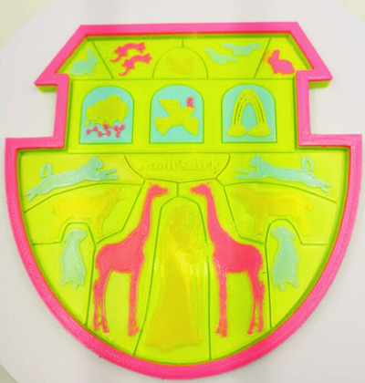

### Choose Language (Translated by google)

-----
# Color Mixing Feature User Guide
### :warning: This guide is made for 4 extruders with 4-IN-1-OUT mix color hot end.
The color mixing feature is a function to mix multi different color filaments and extruded from one nozzle to get a new color filament. By adjusting the extrude ratio of each extruder, it can get different color filament. For example, mix Magenta and Yellow filament as a ratio 5:1 to get Red filament, and mix Magenta and Yellow filament as a ratio 1:1 to get Orange filament.  

### ZONESTAR mix color 3d printer can achieve the following functions:
1. **Manual color mixing feature:** Manually adjust the extrusion ratio of each extruder ([mixing ratio](#mixing-ratio)) by the LCD control panel to change the printing color.
2. **Gradient color mixing feature:** The gradient mix function is a feature of changing the [mixing ratio](#mixing-ratio) according to printing height automatically. It can be activated from the LCD control panel or by adding gcode to "Start G-code" when slicing.
3. **Random color mixing feature:** The random mix function is a feature of changing the [mixing ratio](#mixing-ratio) according to printing height randomly. It can be activated from the LCD control panel or by adding gcode to "Start G-code" when slicing.
4. **Mixed multi-color feature** To use a [**virtual extruder**](#virtual-extruder--virtual-tool--vtool), the mixing color 3d printer can print more colors than the actual extruders. For example, printing 8 color 3d models by using a 4 extruders. Now ZONESTAR mix color 3d printer can set up to 16 virtual extruders.

-----
## Term explanation
Some proper noun are used in mixing color printing, this section made a detail description to these names, to understand the following documents better.
#### Bowden extruder
A Bowden extruder is a type of extruder that pushes filament through a long and flexible PTFE tube (Bowden tube) to the hot end. ZONESTAR multi color 3d printers are used Bowden extruder. [:page_with_curl:wiki page](https://en.wikipedia.org/wiki/3D_printer_extruder)        
      
>
		A. Filament feeding mechanism   B. PTFE tube    C. Hot end
#### Extruder / Tool Chain
Sometimes we call the entire extrusion system (A+B+C in the figure above) as an extruder, but sometimes extruder specifically refers to the Filament feeding mechanism (A in the figure above), which needs to be determined based on the context. In some slicing software, the extruder also be called "Tool Chain", "Tool head" or "Tool".  
#### Mixing ratio
The volume ratio of each filament added during mixing is called "mixing ratio", for FDM mixing color 3D printers, the mixing ratio is achieved by controlling the rotation speed of the filament feeding mechanism. 
The ZONESTAR 3D printer supports setting the mixing ratio based on percentage or extruder ratio relationships. For example, "E1:E2:E3:E4 = 10:20:30:40" and "E1:E2:E3:E4 = 1:2:3:4" and "E1:E2:E3:E4 = 0.2: 0.4: 0.6: 0.8" are equivalent. But when the mix ratio showed on LCD screen, they are always displayed at a percentage.
#### Virtual extruder / Virtual Tool / VTool
Since in slicing software, one extruder corresponds to one filament, in order to use the mixed filament, we can make the slicing software think that this is a new extruder. And in order to distinguish it from the actual extruder, it is called "virtual extruder". The "virtual extruder" also be called "virtual Tool" or simply as "VTOOL".   
For ZONESTAR mix color 3d printer, 16 virtual extruders has been set and they have a default mixing ratio. You can change the mixing ratio of each virtual extruder any time, but after the machine restart, a process of printing from SD card is finished or abort, they will be reset to default value automatically.     
##### :warning: Note 
1. To distinguish between an actual extruder and a virtual extruder, the actual extruder will be written as "Extruder #n" or "En" (n is from 1 to 4), such as "Extruder #1" or "E1", and the virtual extruder will be written as "VTOOLm" (m is from 0 to 15), such as "VTOOL4".
2. The default mixing ratio of virtual extruder may different in the different versions firmware, please read the release note of the firmware.          
3. When using mixed multi color printing, it is recommended to use the the virtual extruder instead of the actual extruder as much as possible. Default the mix ratio of "VTOOL 0" is "E1:E2:E3:E4 = 100: 0: 0: 0", so it is completely equivalent to actual extruder #1; The mix ratio of "VTOOL 1" is "0: 100: 0: 0", so it is completely equivalent to actual extruder #2; The mix ratio of "VTOOL 2" is "0: 0: 100: 0", so it is completely equivalent to actual extruder #3; The mix ratio of "VTOOL 3" is "0: 0: 0: 100", so it is completely equivalent to actual extruder #4.

-----
## How to set mixing ratio of virtual extruder (for 4-IN-1-OUT mix Color hot end)
We can set the mixing ratio of each virtual extruder by LCD control panel or by adding command in the gcode file.
### Set mixing ratio by LCD control panel
Steps:
- **Control>>Mixer>>Mix>>VTOOL: x** Choose the virtual extruder number which you need to set(x is from 0 to 15)
- **Control>>Mixer>>Mix>>Extruder1~4:** Adjust the percentage of extruder #1 to extruder #4, the range is 0 ~ 100.  
- **Control>>Mixer>>Mix>>Comit:** Redistribute the percentage of all extruders in proportion and save it to the virtual extruder x. 
### Set mixing ratio by adding command
We can also add M163 and M164 command into the "Start G-code" of slicing software, to set the mixing ratio of the virtual extruder.
Commands list as below:
>
	M163 S0 Px		; set the mix ratio of actual extruder #1, "x" is from 0 to 100
	M163 S1 Py		; set the mix ratio of actual extruder #2, "y" is from 0 to 100
	M163 S2 Pz		; set the mix ratio of actual extruder #3, "z" is from 0 to 100
	M163 S3 Pn		; set the mix ratio of actual extruder #4, "n" is from 0 to 100
	M164 Sm   		; save the mix ratio of extruders to the "VTOOLm", "m" is from 0 to 16
	
	For example, you added the below commands into the "Start G-code" of slicing software
	M163 S0 P10		
	M163 S1 P20		
	M163 S2 P30		
	M163 S3 P40		
	M164 S4
	
	After that, the VTOOL4 has been set mix ratio "E1:E2:E3:E4 = 10:20:30:40". When using VTOOL4, 4 actual extruders will feed 
	filaments in a ratio of 10:20:30:40.

:warning: You can use a "M163 R" command to reset the mixing ratio settings of all virtual extruders to default.

-----
## [:book:Auto mixing color operation manual][auto_mixing]
The manual color mixing, gradient color mixing and random color mixing feature usually be used for printing models such as gradient vases. About the detail operation manuals, please refer to [:book:**this guide**][auto_mixing].     
   
## [:book:Mixed multi-color operation manual][mixed_multi_color]
For how to use a virtual extruder to print 3D models with more colors than the number of extruders, please refer to [:book:**this guide**][mixed_multi_color].     
  

-----
[auto_mixing]: https://github.com/ZONESTAR3D/Document-and-User-Guide/tree/master/Mixing_Color/Auto_Mixing.md
[mixed_multi_color]: https://github.com/ZONESTAR3D/Document-and-User-Guide/tree/master/Mixing_Color/Mixed_MultiColor.md