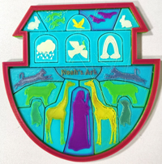

[auto_mixing]: https://github.com/ZONESTAR3D/Document-and-User-Guide/tree/master/Mixing_Color/Auto_Mixing.md
[mixed_multi_color]: https://github.com/ZONESTAR3D/Document-and-User-Guide/tree/master/Mixing_Color/Mixed_MultiColor.md
[mix_color_principle]: https://github.com/ZONESTAR3D/Document-and-User-Guide/assets/29502731/2b9f4d75-b6fd-486f-aaa7-7a1163383316

----
## <a id="choose-language">:globe_with_meridians: Choose language </a>

<!--  -->

----
# <a id="en">Introduction of Color Mixing Extruder </a>
### Working principle of mixed color extruder
[][mix_color_principle]

### :warning: This guide is made for 4 extruders with 4-IN-1-OUT mix color hot end.
The color mixing feature is a function to mix multi different color filaments and extruded from one nozzle to get a new color filament. By adjusting the extrude ratio of each extruder, it can get different color filament. For example, mix Magenta and Yellow filament as a ratio 5:1 to get Red filament, and mix Magenta and Yellow filament as a ratio 1:1 to get Orange filament.    

## ZONESTAR mix color 3d printer can achieve the following functions:
1. **Manual color mixing feature:** Manually adjust the extrusion ratio of each extruder ([mixing ratio](#a3)) by the LCD control panel to change the printing color.
2. **Gradient color mixing feature:** The gradient mix function is a feature of changing the [mixing ratio](#a3) according to printing height automatically. It can be activated from the LCD control panel or by adding gcode to "Start G-code" when slicing.
3. **Random color mixing feature:** The random mix function is a feature of changing the [mixing ratio](#a3) according to printing height randomly. It can be activated from the LCD control panel or by adding gcode to "Start G-code" when slicing.
4. **Mixed multi-color feature** To use a [**virtual extruder**](#a4), the mixing color 3d printer can print more colors than the actual extruders. For example, printing 8 color 3d models by using a 4 extruders. Now ZONESTAR mix color 3d printer can set up to 16 virtual extruders.

## <a id="a">Terminology </a>
Some proper noun are used in mixing color printing, this section made a detail description to these names, to understand the following documents better.
#### <a id="a1">Bowden extruder </a>
A Bowden extruder is a type of extruder that pushes filament through a long and flexible PTFE tube (Bowden tube) to the hot end. ZONESTAR multi color 3d printers are used Bowden extruder. [:page_with_curl:wiki page](https://en.wikipedia.org/wiki/3D_printer_extruder)        
######       
>
		A. Filament feeding mechanism   B. PTFE tube    C. Hot end
#### <a id="a2">Extruder / Tool Chain </a>
Sometimes we call the entire extrusion system (A+B+C in the figure above) as an extruder, but sometimes extruder specifically refers to the Filament feeding mechanism (A in the figure above), which needs to be determined based on the context. In some slicing software, the extruder also be called "Tool Chain", "Tool head" or "Tool".  
#### <a id="a3">Mixing ratio </a>
The volume ratio of each filament added during mixing is called "mixing ratio", for FDM mixing color 3D printers, the mixing ratio is achieved by controlling the rotation speed of the filament feeding mechanism. 
The ZONESTAR 3D printer supports setting the mixing ratio based on percentage or extruder ratio relationships. For example, "E1:E2:E3:E4 = 10:20:30:40" and "E1:E2:E3:E4 = 1:2:3:4" and "E1:E2:E3:E4 = 0.2: 0.4: 0.6: 0.8" are equivalent. But when the mix ratio showed on LCD screen, they are always displayed at a percentage.
#### <a id="a4">Virtual extruder / Virtual Tool / VTool </a>
Since in slicing software, one extruder corresponds to one filament, in order to use the mixed filament, we can make the slicing software think that this is a new extruder. And in order to distinguish it from the actual extruder, it is called "virtual extruder". The "virtual extruder" also be called "virtual Tool" or simply as "VTOOL".   
For ZONESTAR mix color 3d printer, 16 virtual extruders has been set and they have a default mixing ratio. You can change the mixing ratio of each virtual extruder any time, but after the machine restart, a process of printing from SD card is finished or abort, they will be reset to default value automatically.     
##### :warning: Note 
1. To distinguish between an actual extruder and a virtual extruder, the actual extruder will be written as "Extruder #n" or "En" (n is from 1 to 4), such as "Extruder #1" or "E1", and the virtual extruder will be written as "VTOOLm" (m is from 0 to 15), such as "VTOOL4".
2. The default mixing ratio of virtual extruder may different in the different versions firmware, please read the release note of the firmware.          
3. When using mixed multi color printing, it is recommended to use the the virtual extruder instead of the actual extruder as much as possible. Default the mix ratio of "VTOOL 0" is "E1:E2:E3:E4 = 100: 0: 0: 0", so it is completely equivalent to actual extruder #1; The mix ratio of "VTOOL 1" is "0: 100: 0: 0", so it is completely equivalent to actual extruder #2; The mix ratio of "VTOOL 2" is "0: 0: 100: 0", so it is completely equivalent to actual extruder #3; The mix ratio of "VTOOL 3" is "0: 0: 0: 100", so it is completely equivalent to actual extruder #4.

## <a id="b">How to set mixing ratio of virtual extruder (for 4-IN-1-OUT mix Color hot end) </a>
We can set the mixing ratio of each virtual extruder by LCD control panel or by adding command in the gcode file.
### Set mixing ratio by LCD control panel
Steps:
- **Control>>Mixer>>Mix>>VTOOL: x** Choose the virtual extruder number which you need to set(x is from 0 to 15)
- **Control>>Mixer>>Mix>>Extruder1~4:** Adjust the percentage of extruder #1 to extruder #4, the range is 0 ~ 100.  
- **Control>>Mixer>>Mix>>Comit:** Redistribute the percentage of all extruders in proportion and save it to the virtual extruder x. 
### <a id="b1">Set mixing ratio by adding command </a>
We can also add M163 and M164 command into the "Start G-code" of slicing software, to set the mixing ratio of the virtual extruder.
Commands list as below:
>
	M163 S0 Px		; set the mix ratio of actual extruder #1, "x" is from 0 to 100
	M163 S1 Py		; set the mix ratio of actual extruder #2, "y" is from 0 to 100
	M163 S2 Pz		; set the mix ratio of actual extruder #3, "z" is from 0 to 100
	M163 S3 Pn		; set the mix ratio of actual extruder #4, "n" is from 0 to 100
	M164 Sm   		; save the mix ratio of extruders to the "VTOOLm", "m" is from 0 to 16
	
For example, you added the below commands into the "Start G-code" of slicing software.
>
	M163 S0 P10		
	M163 S1 P20		
	M163 S2 P30		
	M163 S3 P40		
	M164 S4
	
After that, the VTOOL4 has been set mix ratio "E1:E2:E3:E4 = 10:20:30:40". When using VTOOL4, 4 actual extruders will feed filaments in a ratio of 10:20:30:40.    
:warning: You can use a "M163 R" command to reset the mixing ratio settings of all virtual extruders to default.

## <a id="c">[:book: Auto mixing color operation manual][auto_mixing] </a>
The manual color mixing, gradient color mixing and random color mixing feature usually be used for printing models such as gradient vases. About the detail operation manuals, please refer to [:book:**this guide**][auto_mixing].     
######    

## <a id="d">[:book: Mixed multi color operation manual][mixed_multi_color] </a>
For how to use a virtual extruder to print 3D models with more colors than the number of extruders, please refer to [:book:**this guide**][mixed_multi_color].     
######    

----
# <a id="es">Introducción de la extrusora de mezcla de colores</a>  [:arrow_heading_up:](#choose-language)
### Principio de funcionamiento de la extrusora de colores mixtos
[][mix_color_principle]

### :warning: Esta guía está hecha para 4 extrusoras con extremo caliente de mezcla de colores 4 EN 1 SALIDA.
La función de mezcla de colores es una función para mezclar filamentos de varios colores diferentes y extruirlos desde una boquilla para obtener un filamento de nuevo color. Al ajustar la relación de extrusión de cada extrusora, se pueden obtener filamentos de diferentes colores. Por ejemplo, mezcle el filamento magenta y amarillo en una proporción de 5:1 para obtener el filamento rojo, y mezcle el filamento magenta y amarillo en una proporción de 1:1 para obtener el filamento naranja.

## La impresora 3D de color mixto ZONESTAR puede lograr las siguientes funciones:
1. **Función de mezcla manual de colores:** Ajuste manualmente la proporción de extrusión de cada extrusor ([proporción de mezcla](#a3)) mediante el panel de control LCD para cambiar el color de impresión.
2. **Función de mezcla de colores degradados:** La función de mezcla de degradados es una característica que permite cambiar automáticamente la [proporción de mezcla](#a3) según la altura de impresión. Se puede activar desde el panel de control LCD o agregando gcode a "Iniciar código G" al cortar.
3. **Función de mezcla aleatoria de colores:** La función de mezcla aleatoria es una característica que permite cambiar la [proporción de mezcla](#a3) según la altura de impresión de forma aleatoria. Se puede activar desde el panel de control LCD o agregando gcode a "Iniciar código G" al cortar.
4. **Función de mezcla de colores** Para utilizar una [**extrusora virtual**](#a4), la impresora 3D de mezcla de colores puede imprimir más colores que las extrusoras reales. Por ejemplo, imprimir modelos 3D de 8 colores utilizando 4 extrusoras. Ahora la impresora 3D de color mixto ZONESTAR puede configurar hasta 16 extrusoras virtuales.

## <a id="a">Terminología </a>
Algunos nombres propios se utilizan al mezclar la impresión en color; en esta sección se hace una descripción detallada de estos nombres para comprender mejor los siguientes documentos.
#### <a id="a1">Extrusora Bowden </a>
Una extrusora Bowden es un tipo de extrusora que empuja el filamento a través de un tubo de PTFE largo y flexible (tubo Bowden) hasta el extremo caliente. Las impresoras 3D multicolores ZONESTAR utilizan una extrusora Bowden. [:page_with_curl:página wiki](https://en.wikipedia.org/wiki/3D_printer_extruder)
###### 
>
  A. Mecanismo de alimentación de filamento B. Tubo de PTFE C. Extremo caliente
#### <a id="a2">Extrusora/Cadena de herramientas </a>
A veces llamamos extrusor a todo el sistema de extrusión (A+B+C en la figura anterior), pero a veces extrusora se refiere específicamente al mecanismo de alimentación de filamentos (A en la figura anterior), que debe determinarse según el contexto. En algunos programas de corte, la extrusora también se denomina "Cadena de herramientas", "Cabezal de herramientas" o "Herramienta".
#### <a id="a3">Proporción de mezcla </a>
La proporción de volumen de cada filamento añadido durante la mezcla se denomina "proporción de mezcla". Para las impresoras 3D de color con mezcla FDM, la proporción de mezcla se logra controlando la velocidad de rotación del mecanismo de alimentación del filamento.
La impresora 3D ZONESTAR admite la configuración de la proporción de mezcla según el porcentaje o las relaciones de proporción del extrusor. Por ejemplo, "E1:E2:E3:E4 = 10:20:30:40" y "E1:E2:E3:E4 = 1:2:3:4" y "E1:E2:E3:E4 = 0,2: 0,4: 0,6: 0,8" son equivalentes. Pero cuando la proporción de mezcla se muestra en la pantalla LCD, siempre se muestra en porcentaje.
#### <a id="a4">Extrusora virtual/Herramienta virtual/VTool </a>
Dado que en el software de corte, una extrusora corresponde a un filamento, para utilizar el filamento mixto, podemos hacer que el software de corte piense que se trata de una nueva extrusora. Y para distinguirlo del extrusor real, se le llama "extrusor virtual". El "extrusor virtual" también podrá denominarse "Herramienta virtual" o simplemente como "VTOOL".
Para la impresora 3D de color mixto ZONESTAR, se han configurado 16 extrusoras virtuales y tienen una proporción de mezcla predeterminada. Puede cambiar la proporción de mezcla de cada extrusor virtual en cualquier momento, pero después de reiniciar la máquina, un proceso de impresión desde la tarjeta SD finaliza o se cancela, se restablecerán automáticamente al valor predeterminado.
##### :warning: Nota
1. Para distinguir entre una extrusora real y una extrusora virtual, la extrusora real se escribirá como "Extrusora #n" o "En" (n es de 1 a 4), como "Extrusora #1" o "E1", y el extrusor virtual se escribirá como "VTOOLm" (m es de 0 a 15), como por ejemplo "VTOOL4".
2. La proporción de mezcla predeterminada del extrusor virtual puede ser diferente en las diferentes versiones de firmware; lea la nota de versión del firmware.
3. Cuando utilice impresión multicolor mixta, se recomienda utilizar el extrusor virtual en lugar del extrusor real tanto como sea posible. La relación de mezcla predeterminada de "VTOOL 0" es "E1:E2:E3:E4 = 100: 0: 0: 0", por lo que es completamente equivalente a la extrusora n.º 1 real; La proporción de mezcla de "VTOOL 1" es "0: 100: 0: 0", por lo que es completamente equivalente a la extrusora n.° 2 real; La proporción de mezcla de "VTOOL 2" es "0: 0: 100: 0", por lo que es completamente equivalente a la extrusora n.° 3 real; La proporción de mezcla de "VTOOL 3" es "0: 0: 0: 100", por lo que es completamente equivalente a la extrusora n.° 4 real.

## <a id="b">Cómo configurar la proporción de mezcla del extrusor virtual (para el extremo caliente de color de mezcla 4 EN 1 SALIDA) </a>
Podemos configurar la proporción de mezcla de cada extrusor virtual mediante el panel de control LCD o agregando un comando en el archivo gcode.
### Establecer la proporción de mezcla mediante el panel de control LCD
Pasos:
- **Control>>Mezclador>>Mix>>VTOOL: x** Elija el número de extrusor virtual que necesita configurar (x es de 0 a 15)
- **Control>>Mezclador>>Mezcla>>Extrusor1~4:** Ajuste el porcentaje del extrusor n.° 1 al extrusor n.° 4, el rango es 0 ~ 100.
- **Control>>Mixer>>Mix>>Comit:** Redistribuye el porcentaje de todos los extrusores en proporción y guárdalo en el extrusor virtual x.
### <a id="b1">Establezca la proporción de mezcla agregando el comando </a>
También podemos agregar los comandos M163 y M164 al "Iniciar código G" del software de corte para establecer la proporción de mezcla del extrusor virtual.
La lista de comandos es la siguiente:
>
	M163 S0 Px	; establezca la proporción de mezcla del extrusor real #1, "x" es de 0 a 100
	M163 S1 Py	; establezca la proporción de mezcla del extrusor real #2, "y" es de 0 a 100
	M163 S2 Pz	; establezca la proporción de mezcla del extrusor real n.° 3, "z" es de 0 a 100
	M163 S3 Pn	; establezca la proporción de mezcla del extrusor real #4, "n" es de 0 a 100
	M164 Sm 		; guarde la proporción de mezcla de las extrusoras en "VTOOLm", "m" es de 0 a 16

Por ejemplo, agregó los siguientes comandos al "Iniciar código G" del software de corte.
>
	M163 S0 P10
	M163 S1 P20
	M163 S2 P30
	M163 S3 P40
	M164 S4

Después de eso, en el VTOOL4 se ha configurado la relación de mezcla "E1:E2:E3:E4 = 10:20:30:40". Cuando se utiliza VTOOL4, 4 extrusoras reales alimentarán filamentos en una proporción de 10:20:30:40.      
:warning: Puede utilizar un comando "M163 R" para restablecer la configuración de proporción de mezcla de todos los extrusores virtuales a los valores predeterminados.

## <a id="c">[:book: Manual de operación de mezcla automática de colores][auto_mixing] </a>
Las funciones de mezcla de colores manual, mezcla de colores degradados y mezcla de colores aleatoria generalmente se utilizan para imprimir modelos como jarrones degradados. Acerca de los manuales de operación detallados, consulte [:libro:**esta guía**][auto_mixing].
###### 

## <a id="d">[:book: Manual de funcionamiento de varios colores mixtos][mixed_multi_color] </a>
Para saber cómo utilizar un extrusor virtual para imprimir modelos 3D con más colores que el número de extrusores, consulte [:libro:**esta guía**][mixed_multi_color].
######  

# <a id="pt">Introdução da extrusora de mistura de cores </a> [:arrow_heading_up:](#choose-language)
### Princípio de funcionamento da extrusora de cores mistas
[][mix_color_principle]

### :warning: Este guia é feito para 4 extrusoras com hot end de cores misturadas 4-IN-1-OUT.
O recurso de mistura de cores é uma função para misturar vários filamentos de cores diferentes e extrudados de um bico para obter um novo filamento de cor. Ao ajustar a proporção de extrusão de cada extrusora, pode-se obter filamentos de cores diferentes. Por exemplo, misture os filamentos Magenta e Amarelo na proporção de 5:1 para obter o filamento Vermelho, e misture os filamentos Magenta e Amarelo na proporção de 1:1 para obter o filamento Laranja.

## A impressora 3D ZONESTAR mix color pode atingir as seguintes funções:
1. **Recurso de mistura manual de cores:** Ajuste manualmente a taxa de extrusão de cada extrusora ([proporção de mistura](#a3)) pelo painel de controle LCD para alterar a cor de impressão.
2. **Recurso de mistura de cores gradientes:** A função de mistura de gradientes é um recurso que altera automaticamente a [taxa de mistura](#a3) de acordo com a altura de impressão. Ele pode ser ativado no painel de controle LCD ou adicionando gcode a "Iniciar código G" ao fatiar.
3. **Recurso de mistura de cores aleatórias:** A função de mistura aleatória é um recurso de alteração aleatória da [taxa de mistura](#a3) de acordo com a altura de impressão. Ele pode ser ativado no painel de controle LCD ou adicionando gcode a "Iniciar código G" ao fatiar.
4. **Recurso multicolorido misto** Para usar uma [**extrusora virtual**](#a4), a impressora 3D de cores misturadas pode imprimir mais cores do que as extrusoras reais. Por exemplo, imprimir modelos 3D de 8 cores usando 4 extrusoras. Agora a impressora 3D mix color ZONESTAR pode configurar até 16 extrusoras virtuais.

## <a id="a">Terminologia </a>
Alguns nomes próprios são usados ​​na mistura de impressão em cores. Esta seção fez uma descrição detalhada desses nomes, para entender melhor os documentos a seguir.
#### <a id="a1">Extrusora Bowden </a>
Uma extrusora Bowden é um tipo de extrusora que empurra o filamento através de um tubo de PTFE longo e flexível (tubo Bowden) até a extremidade quente. As impressoras 3D multicoloridas ZONESTAR são usadas na extrusora Bowden. [:page_with_curl:página wiki](https://en.wikipedia.org/wiki/3D_printer_extruder)
###### 
>
  A. Mecanismo de alimentação de filamento B. Tubo de PTFE C. Extremidade quente
#### <a id="a2">Extrusora / Cadeia de ferramentas </a>
Às vezes chamamos todo o sistema de extrusão (A+B+C na figura acima) de extrusora, mas às vezes extrusora se refere especificamente ao mecanismo de alimentação do filamento (A na figura acima), que precisa ser determinado com base no contexto. Em alguns softwares de fatiamento, a extrusora também é chamada de "Cadeia de ferramentas", "Cabeça de ferramenta" ou "Ferramenta".
#### <a id="a3">Proporção de mistura </a>
A proporção de volume de cada filamento adicionado durante a mistura é chamada de "proporção de mistura". Para impressoras 3D coloridas de mistura FDM, a taxa de mistura é obtida controlando a velocidade de rotação do mecanismo de alimentação do filamento.
A impressora 3D ZONESTAR suporta a configuração da proporção de mistura com base nas relações percentuais ou de proporção da extrusora. Por exemplo, "E1:E2:E3:E4 = 10:20:30:40" e "E1:E2:E3:E4 = 1:2:3:4" e "E1:E2:E3:E4 = 0,2: 0,4: 0,6: 0,8" são equivalentes. Mas quando a taxa de mixagem é exibida na tela LCD, ela é sempre exibida em porcentagem.
#### <a id="a4">Extrusora virtual / Ferramenta virtual / VTool </a>
Como no software de fatiamento uma extrusora corresponde a um filamento, para utilizar o filamento misto podemos fazer o software de fatiamento pensar que se trata de uma nova extrusora. E para distingui-la da extrusora real, ela é chamada de “extrusora virtual”. A “extrusora virtual” também pode ser chamada de “Ferramenta Virtual” ou simplesmente como “VTOOL”.
Para a impressora 3D mix color ZONESTAR, 16 extrusoras virtuais foram configuradas e elas têm uma taxa de mistura padrão. Você pode alterar a proporção de mistura de cada extrusora virtual a qualquer momento, mas após a reinicialização da máquina, um processo de impressão do cartão SD for concluído ou abortado, eles serão redefinidos para o valor padrão automaticamente.
##### :warning: Nota
1. Para distinguir entre uma extrusora real e uma extrusora virtual, a extrusora real será escrita como "Extrusora #n" ou "En" (n é de 1 a 4), como "Extrusora #1" ou "E1", e a extrusora virtual será escrita como "VTOOLm" (m é de 0 a 15), como "VTOOL4".
2. A taxa de mistura padrão da extrusora virtual pode ser diferente nas diferentes versões do firmware. Leia a nota de lançamento do firmware.
3. Ao usar impressão multicolorida mista, é recomendado usar a extrusora virtual em vez da extrusora real, tanto quanto possível. O padrão de proporção de mistura de "VTOOL 0" é "E1:E2:E3:E4 = 100: 0: 0: 0", portanto é completamente equivalente à extrusora real nº 1; A proporção de mistura de "VTOOL 1" é "0: 100: 0: 0", portanto é completamente equivalente à extrusora real nº 2; A proporção de mistura de "VTOOL 2" é "0: 0: 100: 0", portanto é completamente equivalente à extrusora real nº 3; A proporção de mistura de "VTOOL 3" é "0: 0: 0: 100", portanto é completamente equivalente à extrusora real nº 4.

## <a id="b">Como definir a proporção de mistura da extrusora virtual (para mix 4-IN-1-OUT Color hot end) </a>
Podemos definir a taxa de mistura de cada extrusora virtual pelo painel de controle LCD ou adicionando o comando no arquivo gcode.
### Defina a proporção de mistura pelo painel de controle LCD
Passos:
- **Control>>Mixer>>Mix>>VTOOL: x** Escolha o número da extrusora virtual que você precisa definir (x é de 0 a 15)
- **Control>>Mixer>>Mix>>Extruder1~4:** Ajuste a porcentagem da extrusora #1 para a extrusora #4, o intervalo é de 0 ~ 100.
- **Control>>Mixer>>Mix>>Comit:** Redistribua a porcentagem de todas as extrusoras proporcionalmente e salve-a na extrusora virtual x.
### <a id="b1">Defina a taxa de mistura adicionando o comando </a>
Também podemos adicionar os comandos M163 e M164 ao "Iniciar código G" do software de fatiamento, para definir a taxa de mistura da extrusora virtual.
Lista de comandos conforme abaixo:
>
	M163 S0 Px	; defina a proporção de mistura da extrusora real nº 1, "x" é de 0 a 100
	M163 S1 Py	; defina a proporção de mistura da extrusora real nº 2, "y" é de 0 a 100
	M163 S2 Pz	; defina a proporção de mistura da extrusora real nº 3, "z" é de 0 a 100
	M163 S3 Pn	; defina a proporção de mistura da extrusora real nº 4, "n" é de 0 a 100
	M164 Sm			; salve a proporção de mistura das extrusoras para o "VTOOLm", "m" é de 0 a 16

Por exemplo, você adicionou os comandos abaixo ao "Iniciar código G" do software de fatiamento.
>
	M163 S0 P10
	M163 S1 P20
	M163 S2 P30
	M163 S3 P40
	M164 S4

Depois disso, o VTOOL4 foi definido na proporção de mixagem "E1:E2:E3:E4 = 10:20:30:40". Ao usar o VTOOL4, 4 extrusoras reais alimentarão os filamentos na proporção de 10:20:30:40.      
:warning: Você pode usar um comando "M163 R" para redefinir as configurações de proporção de mistura de todas as extrusoras virtuais para o padrão.

## <a id="c">[:book: Manual de operação de mistura automática de cores][auto_mixing] </a>
Os recursos de mistura manual de cores, mistura de cores gradiente e mistura aleatória de cores geralmente são usados ​​para imprimir modelos como vasos gradientes. Sobre os manuais de operação detalhados, consulte [:book: **este guia**][auto_mixing].
###### 

## <a id="d">[:book: Manual de operação multicolorido misto][mixed_multi_color] </a>
Para saber como usar uma extrusora virtual para imprimir modelos 3D com mais cores do que o número de extrusoras, consulte [:book: **este guia**][mixed_multi_color].
######  

----
# <a id="fr">Présentation de l'extrudeuse de mélange de couleurs </a> [:arrow_heading_up:](#choose-language)
### Principe de fonctionnement de l'extrudeuse de couleurs mélangées
[][mix_color_principle]

### :avertissement : Ce guide est destiné à 4 extrudeuses avec hot end de couleurs mélangées 4-IN-1-OUT.
La fonction de mélange de couleurs est une fonction permettant de mélanger plusieurs filaments de couleurs différentes et d'être extrudés à partir d'une buse pour obtenir un nouveau filament de couleur. En ajustant le taux d'extrusion de chaque extrudeuse, vous pouvez obtenir un filament de couleur différente. Par exemple, mélangez les filaments magenta et jaune dans un rapport de 5:1 pour obtenir un filament rouge, et mélangez les filaments magenta et jaune dans un rapport de 1:1 pour obtenir un filament orange.

## L'imprimante 3D ZONESTAR mix color peut réaliser les fonctions suivantes:
1. **Fonction de mélange manuel des couleurs :** Ajustez manuellement le taux d'extrusion de chaque extrudeuse ([rapport de mélange](#a3)) à l'aide du panneau de commande LCD pour modifier la couleur d'impression.
2. **Fonction de mélange de dégradés de couleurs :** La fonction de mélange de dégradés est une fonctionnalité permettant de modifier automatiquement le [taux de mélange] (#a3) en fonction de la hauteur d'impression. Il peut être activé à partir du panneau de commande LCD ou en ajoutant du gcode à « Démarrer le G-code » lors du découpage.
3. **Fonction de mélange aléatoire des couleurs :** La fonction de mélange aléatoire est une fonctionnalité permettant de modifier le [taux de mélange] (#a3) en fonction de la hauteur d'impression de manière aléatoire. Il peut être activé à partir du panneau de commande LCD ou en ajoutant du gcode à « Démarrer le G-code » lors du découpage.
4. **Fonction multicolore mixte** Pour utiliser une [**extrudeuse virtuelle**](#a4), l'imprimante 3D à mélange de couleurs peut imprimer plus de couleurs que les extrudeuses réelles. Par exemple, imprimer des modèles 3D en 8 couleurs à l'aide de 4 extrudeuses. Désormais, l'imprimante 3D ZONESTAR mix color peut configurer jusqu'à 16 extrudeuses virtuelles.

## <a id="a">Terminologie </a>
Certains noms propres sont utilisés dans le mélange d'impressions couleur, cette section a fait une description détaillée de ces noms, pour mieux comprendre les documents suivants.
#### <a id="a1">Extrudeuse Bowden </a>
Une extrudeuse Bowden est un type d'extrudeuse qui pousse le filament à travers un tube PTFE long et flexible (tube Bowden) jusqu'à l'extrémité chaude. Les imprimantes 3D multicolores ZONESTAR utilisent une extrudeuse Bowden. [:page_with_curl:page wiki](https://en.wikipedia.org/wiki/3D_printer_extruder)
###### 
>
  A. Mécanisme d'alimentation en filament B. Tube PTFE C. Hot end
#### <a id="a2">Extrudeuse / Chaîne d'outils </a>
Parfois, nous appelons l'ensemble du système d'extrusion (A+B+C dans la figure ci-dessus) une extrudeuse, mais parfois, l'extrudeuse fait spécifiquement référence au mécanisme d'alimentation en filament (A dans la figure ci-dessus), qui doit être déterminé en fonction du contexte. Dans certains logiciels de découpage, l'extrudeuse est également appelée « Tool Chain », « Tool head » ou « Tool ».
#### <a id="a3">Rapport de mélange </a>
Le rapport volumique de chaque filament ajouté lors du mélange est appelé « rapport de mélange ». Pour les imprimantes 3D couleur à mélange FDM, le rapport de mélange est obtenu en contrôlant la vitesse de rotation du mécanisme d'alimentation du filament.
L'imprimante 3D ZONESTAR prend en charge le réglage du rapport de mélange en fonction du pourcentage ou du rapport d'extrudeuse. Par exemple, "E1:E2:E3:E4 = 10:20:30:40" et "E1:E2:E3:E4 = 1:2:3:4" et "E1:E2:E3:E4 = 0,2 : 0,4 : 0,6 : 0,8" sont équivalents. Mais lorsque le rapport de mélange s'affiche sur l'écran LCD, il est toujours affiché en pourcentage.
#### <a id="a4">Extrudeuse virtuelle / Outil Virtuel / VTool </a>
Puisque dans le logiciel de slicing, un extrudeur correspond à un filament, pour utiliser le filament mélangé, on peut faire croire au logiciel de slicing qu'il s'agit d'un nouvel extrudeur. Et afin de la distinguer de l’extrudeuse réelle, elle est appelée « extrudeuse virtuelle ». L'« extrudeuse virtuelle » est également appelée « outil virtuel » ou simplement « VTOOL ».
Pour l'imprimante 3D ZONESTAR mix color, 16 extrudeuses virtuelles ont été définies et elles ont un rapport de mélange par défaut. Vous pouvez modifier le rapport de mélange de chaque extrudeuse virtuelle à tout moment, mais après le redémarrage de la machine, un processus d'impression à partir de la carte SD est terminé ou abandonné, ils seront automatiquement réinitialisés à la valeur par défaut.
##### :warning: Remarque
1. Pour distinguer une extrudeuse réelle d'une extrudeuse virtuelle, l'extrudeuse réelle sera écrite comme "Extruder #n" ou "En" (n est de 1 à 4), comme "Extruder #1" ou "E1", et l'extrudeuse virtuelle sera écrite sous la forme "VTOOLm" (m est compris entre 0 et 15), par exemple "VTOOL4".
2. Le rapport de mélange par défaut de l'extrudeuse virtuelle peut différer selon les différentes versions du firmware, veuillez lire la note de version du firmware.
3. Lors de l'utilisation d'une impression multicolore mixte, il est recommandé d'utiliser autant que possible l'extrudeuse virtuelle au lieu de l'extrudeuse réelle. Par défaut, le rapport de mélange de "VTOOL 0" est "E1:E2:E3:E4 = 100 : 0 : 0 : 0", il est donc complètement équivalent à l'extrudeuse n°1 ; Le rapport de mélange de « VTOOL 1 » est « 0 : 100 : 0 : 0 », il est donc tout à fait équivalent à l'extrudeuse n°2 réelle ; Le rapport de mélange de « VTOOL 2 » est « 0 : 0 : 100 : 0 », il est donc tout à fait équivalent à l'extrudeuse n° 3 ; Le rapport de mélange de « VTOOL 3 » est « 0 : 0 : 0 : 100 », il est donc tout à fait équivalent à l’extrudeuse n°4 réelle.

## <a id="b">Comment définir le rapport de mélange de l'extrudeuse virtuelle (pour l'extrémité chaude 4-IN-1-OUT mix Color) </a>
Nous pouvons définir le rapport de mélange de chaque extrudeuse virtuelle via le panneau de commande LCD ou en ajoutant une commande dans le fichier gcode.
### Régler le rapport de mélange via le panneau de commande LCD
Pas:
- **Control>>Mixer>>Mix>>VTOOL: x** Choisissez le numéro d'extrudeuse virtuelle que vous devez définir (x est de 0 à 15)
- **Contrôle>>Mixeur>>Mix>>Extruder1~4 :** Ajustez le pourcentage de l'extrudeuse n°1 à l'extrudeuse n°4, la plage est de 0 à 100.
- **Control>>Mixer>>Mix>>Comit:** Redistribuez le pourcentage de toutes les extrudeuses en proportion et enregistrez-le sur l'extrudeuse virtuelle x.
### <a id="b1">Définir le rapport de mélange en ajoutant une commande </a>
Nous pouvons également ajouter les commandes M163 et M164 dans le « Start G-code » du logiciel de découpage, pour définir le rapport de mélange de l'extrudeuse virtuelle.
Liste des commandes comme ci-dessous :
>
	M163 S0 Px 	; définir le rapport de mélange de l'extrudeuse n°1 réelle, "x" est compris entre 0 et 100
	M163 S1 Py 	; définir le rapport de mélange de l'extrudeuse n°2 réelle, "y" est compris entre 0 et 100
	M163 S2 Pz 	; définir le rapport de mélange de l'extrudeuse n°3 réelle, "z" est compris entre 0 et 100
	M163 S3 Pn 	; définir le rapport de mélange de l'extrudeuse réelle n°4, "n" est compris entre 0 et 100
	M164 Sm 		; enregistrez le rapport de mélange des extrudeuses sur le "VTOOLm", "m" est de 0 à 16

Par exemple, vous avez ajouté les commandes ci-dessous dans le « Démarrer le G-code » du logiciel de découpage.
>
	M163 S0 P10
	M163 S1 P20
	M163 S2 P30
	M163 S3 P40
	M164 S4

Après cela, le VTOOL4 a réglé le rapport de mélange "E1:E2:E3:E4 = 10:20:30:40". Lors de l'utilisation de VTOOL4, 4 extrudeuses réelles alimenteront les filaments dans un rapport de 10:20:30:40.     
:warning: Vous pouvez utiliser une commande "M163 R" pour réinitialiser les paramètres de rapport de mélange de toutes les extrudeuses virtuelles par défaut.

## <a id="c">[:book: Manuel d'utilisation du mélange automatique des couleurs][auto_mixing] </a>
Les fonctions de mélange manuel des couleurs, de mélange de couleurs dégradées et de mélange aléatoire de couleurs sont généralement utilisées pour imprimer des modèles tels que des vases dégradés. À propos des manuels d'utilisation détaillés, veuillez vous référer à [:book: **ce guide**][auto_mixing].
###### 

## <a id="d">[:book: Manuel d'utilisation multicolore mixte][mixed_multi_color] </a>
Pour savoir comment utiliser une extrudeuse virtuelle pour imprimer des modèles 3D avec plus de couleurs que le nombre d'extrudeuses, veuillez vous référer à [:book: **ce guide**][mixed_multi_color].
######  

----
# <a id="de">Einführung in den Farbmischextruder </a>  [:arrow_heading_up:](#choose-language)
### Funktionsprinzip des Mischfarbenextruders
[][Mischfarbenprinzip]

### :warning: Diese Anleitung ist für 4 Extruder mit 4-IN-1-OUT-Mischfarben-Hot-Enden gedacht.
Die Farbmischfunktion ist eine Funktion zum Mischen mehrerer unterschiedlicher Farbfilamente und zum Extrudieren aus einer Düse, um ein neues Farbfilament zu erhalten. Durch Anpassen des Extrusionsverhältnisses jedes Extruders können unterschiedliche Farbfilamente erhalten werden. Mischen Sie beispielsweise Magenta- und Gelbfilament im Verhältnis 5:1, um rotes Filament zu erhalten, und mischen Sie Magenta- und Gelbfilament im Verhältnis 1:1, um oranges Filament zu erhalten.

## Der ZONESTAR-Mischfarben-3D-Drucker kann die folgenden Funktionen ausführen:
1. **Manuelle Farbmischfunktion:** Passen Sie das Extrusionsverhältnis jedes Extruders ([Mischverhältnis](#a3)) manuell über das LCD-Bedienfeld an, um die Druckfarbe zu ändern.
2. **Funktion zum Mischen von Farbverläufen:** Die Funktion zum Mischen von Farbverläufen ist eine Funktion zum automatischen Ändern des [Mischverhältnisses](#a3) entsprechend der Druckhöhe. Sie kann über das LCD-Bedienfeld aktiviert werden oder indem beim Slicen G-Code zu „G-Code starten“ hinzugefügt wird.
3. **Funktion zum zufälligen Mischen von Farben:** Die Funktion zum zufälligen Mischen ist eine Funktion zum zufälligen Ändern des [Mischverhältnisses](#a3) entsprechend der Druckhöhe. Sie kann über das LCD-Bedienfeld aktiviert werden oder indem beim Slicen G-Code zu „G-Code starten“ hinzugefügt wird.
4. **Funktion für gemischte Mehrfarben** Durch die Verwendung eines [**virtuellen Extruders**](#a4) kann der 3D-Drucker mit Farbverläufen mehr Farben drucken als die tatsächlichen Extruder. Beispielsweise können 8-farbige 3D-Modelle mit 4 Extrudern gedruckt werden. Jetzt kann der 3D-Drucker mit Farbverläufen von ZONESTAR bis zu 16 virtuelle Extruder einrichten.

## <a id="a">Terminologie </a>
Beim Mischfarbdruck werden einige Eigennamen verwendet. In diesem Abschnitt werden diese Namen ausführlich beschrieben, damit Sie die folgenden Dokumente besser verstehen.
#### <a id="a1">Bowden-Extruder </a>
Ein Bowden-Extruder ist ein Extrudertyp, der Filament durch ein langes und flexibles PTFE-Rohr (Bowden-Rohr) zum heißen Ende schiebt. ZONESTAR-Mehrfarb-3D-Drucker verwenden Bowden-Extruder. [:page_with_curl: Wiki-Seite](https://en.wikipedia.org/wiki/3D_printer_extruder)
###### 
>
A. Filamentzufuhrmechanismus B. PTFE-Schlauch C. Heißes Ende
#### <a id="a2">Extruder / Werkzeugkette </a>
Manchmal bezeichnen wir das gesamte Extrusionssystem (A+B+C in der Abbildung oben) als Extruder, aber manchmal bezieht sich Extruder speziell auf den Filamentzufuhrmechanismus (A in der Abbildung oben), was je nach Kontext bestimmt werden muss. In einigen Slicing-Programmen wird der Extruder auch als „Werkzeugkette“, „Werkzeugkopf“ oder „Werkzeug“ bezeichnet.
#### <a id="a3">Mischverhältnis </a>
Das Volumenverhältnis jedes Filaments, das während des Mischens hinzugefügt wird, wird als „Mischverhältnis“ bezeichnet. Bei FDM-Farbmisch-3D-Druckern wird das Mischverhältnis durch die Steuerung der Rotationsgeschwindigkeit des Filamentzufuhrmechanismus erreicht.
Der ZONESTAR 3D-Drucker unterstützt das Einstellen des Mischverhältnisses basierend auf Prozent- oder Extruderverhältnisverhältnissen. Beispielsweise sind „E1:E2:E3:E4 = 10:20:30:40“ und „E1:E2:E3:E4 = 1:2:3:4“ und „E1:E2:E3:E4 = 0,2: 0,4: 0,6: 0,8“ gleichwertig. Aber wenn das Mischverhältnis auf dem LCD-Bildschirm angezeigt wird, wird es immer als Prozentsatz angezeigt.
#### <a id="a4">Virtueller Extruder / Virtuelles Werkzeug / VTool </a>
Da in der Slicing-Software ein Extruder einem Filament entspricht, können wir, um das gemischte Filament zu verwenden, die Slicing-Software glauben lassen, dass dies ein neuer Extruder ist. Und um ihn vom tatsächlichen Extruder zu unterscheiden, wird er „virtueller Extruder“ genannt. Der „virtuelle Extruder“ wird auch „virtuelles Werkzeug“ oder einfach „VTOOL“ genannt.
Für den ZONESTAR-Mix-Color-3D-Drucker wurden 16 virtuelle Extruder eingestellt und sie haben ein Standard-Mischverhältnis. Sie können das Mischverhältnis jedes virtuellen Extruders jederzeit ändern, aber nach dem Neustart des Geräts, wenn ein Druckvorgang von der SD-Karte abgeschlossen oder abgebrochen wird, werden sie automatisch auf den Standardwert zurückgesetzt.
##### :Warnung: Hinweis
1. Um zwischen einem tatsächlichen und einem virtuellen Extruder zu unterscheiden, wird der tatsächliche Extruder als „Extruder #n“ oder „En“ (n ist eine Zahl von 1 bis 4) geschrieben, z. B. „Extruder #1“ oder „E1“, und der virtuelle Extruder wird als „VTOOLm“ (m ist eine Zahl von 0 bis 15) geschrieben, z. B. „VTOOL4“.
2. Das Standard-Mischverhältnis des virtuellen Extruders kann in den verschiedenen Firmware-Versionen unterschiedlich sein, lesen Sie bitte die Versionshinweise der Firmware.
3. Bei gemischtem Mehrfarbendruck wird empfohlen, so oft wie möglich den virtuellen Extruder anstelle des tatsächlichen Extruders zu verwenden. Das Standard-Mischverhältnis von „VTOOL 0“ ist „E1:E2:E3:E4 = 100: 0: 0: 0“, es ist also vollständig gleichwertig mit dem tatsächlichen Extruder Nr. 1; Das Mischungsverhältnis von „VTOOL 1“ ist „0: 100: 0: 0“, also ist es völlig gleichwertig mit dem tatsächlichen Extruder Nr. 2; Das Mischungsverhältnis von „VTOOL 2“ ist „0: 0: 100: 0“, also ist es völlig gleichwertig mit dem tatsächlichen Extruder Nr. 3; Das Mischungsverhältnis von „VTOOL 3“ ist „0: 0: 0: 100“, also ist es völlig gleichwertig mit dem tatsächlichen Extruder Nr. 4.

## <a id="b">So legen Sie das Mischverhältnis des virtuellen Extruders fest (für 4-IN-1-OUT-Mix-Color-Hot-End) </a>
Wir können das Mischverhältnis jedes virtuellen Extruders über das LCD-Bedienfeld oder durch Hinzufügen eines Befehls in der G-Code-Datei festlegen.
### Mischverhältnis über das LCD-Bedienfeld festlegen
Schritte:
- **Control>>Mixer>>Mix>>VTOOL:: x** Wählen Sie die virtuelle Extrudernummer, die Sie festlegen möchten (x ist von 0 bis 15)
- **Control>>Mixer>>Mix>>Extruder1~4:** Passen Sie den Prozentsatz von Extruder Nr. 1 zu Extruder Nr. 4 an, der Bereich ist 0 ~ 100.
- **Control>>Mixer>>Mix>>>Commit:** Verteilen Sie den Prozentsatz aller Extruder proportional neu und speichern Sie ihn im virtuellen Extruder x.
### <a id="b1">Mischverhältnis durch Hinzufügen eines Befehls festlegen </a>
Wir können auch die Befehle M163 und M164 in den „G-Code starten“ der Slicing-Software einfügen, um das Mischverhältnis des virtuellen Extruders festzulegen.
Befehlsliste wie folgt:
>
	M163 S0 Px	; Mischverhältnis des tatsächlichen Extruders Nr. 1 festlegen, „x“ ist von 0 bis 100
	M163 S1 Py	; Mischverhältnis des tatsächlichen Extruders Nr. 2 festlegen, „y“ ist von 0 bis 100
	M163 S2 Pz	; Mischverhältnis des tatsächlichen Extruders Nr. 3 festlegen, „z“ ist von 0 bis 100
	M163 S3 Pn	; Mischverhältnis des tatsächlichen Extruders Nr. 4 festlegen, „n“ ist von 0 bis 100
	M164 Sm			; Speichern Sie das Mischungsverhältnis der Extruder im „VTOOLm“, „m“ ist von 0 bis 16

Beispiel: Sie haben die folgenden Befehle in den „Start-G-Code“ der Slicing-Software eingefügt.
>
	M163 S0 P10
	M163 S1 P20
	M163 S2 P30
	M163 S3 P40
	M164 S4

Danach wurde das Mischungsverhältnis im VTOOL4 auf „E1:E2:E3:E4 = 10:20:30:40“ eingestellt. Bei Verwendung von VTOOL4 führen 4 tatsächliche Extruder Filamente im Verhältnis 10:20:30:40 zu.     
:warning: Sie können den Befehl „M163 R“ verwenden, um die Mischungsverhältniseinstellungen aller virtuellen Extruder auf die Standardeinstellungen zurückzusetzen.

## <a id="c">[:book: Bedienungsanleitung für automatische Farbmischung][auto_mixing] </a>
Die Funktionen für manuelle Farbmischung, Farbverlaufsmischung und zufällige Farbmischung werden normalerweise zum Drucken von Modellen wie Farbverlaufsvasen verwendet. Detaillierte Bedienungsanleitungen finden Sie in [:book: **dieser Anleitung**][auto_mixing].
###### 

## <a id="d">[:book: Bedienungsanleitung für gemischte Mehrfarben][mixed_multi_color] </a>
Informationen zum Verwenden eines virtuellen Extruders zum Drucken von 3D-Modellen mit mehr Farben als der Anzahl der Extruder finden Sie in [:book: **dieser Anleitung**][mixed_multi_color].
######  

----
# <a id="it">Introduzione dell'estrusore per la miscelazione dei colori </a> [:arrow_heading_up:](#choose-language)
### Principio di funzionamento dell'estrusore a colori misti
[][mix_color_principle]

### :warning: questa guida è fatta per 4 estrusori con hot end di colore mix 4-IN-1-OUT.
La funzione di miscelazione del colore è una funzione per mescolare filamenti di colore diverso ed estrusi da un ugello per ottenere un nuovo filamento di colore. Regolando il rapporto di estrusione di ciascun estrusore, è possibile ottenere filamenti di colore diverso. Ad esempio, mescola il filamento magenta e giallo in un rapporto 5:1 per ottenere il filamento rosso e mescola il filamento magenta e giallo in un rapporto 1:1 per ottenere il filamento arancione.

## La stampante 3D a colori mix ZONESTAR può ottenere le seguenti funzioni:
1. **Funzione di miscelazione manuale dei colori:** Regola manualmente il rapporto di estrusione di ciascun estrusore ([rapporto di miscelazione](#a3)) tramite il pannello di controllo LCD per modificare il colore di stampa.
2. **Funzione di miscelazione del colore sfumato:** La funzione di miscelazione del gradiente consente di modificare automaticamente il [rapporto di miscelazione](#a3) in base all'altezza di stampa. Può essere attivato dal pannello di controllo LCD o aggiungendo gcode a "Avvia G-code" durante l'affettatura.
3. **Funzione di miscelazione casuale dei colori:** La funzione di miscelazione casuale consente di modificare il [rapporto di miscelazione](#a3) in base all'altezza di stampa in modo casuale. Può essere attivato dal pannello di controllo LCD o aggiungendo gcode a "Avvia G-code" durante l'affettatura.
4. **Funzione multicolore mista** Per utilizzare un [**estrusore virtuale**](#a4), la stampante 3D a colori miscelati può stampare più colori rispetto agli estrusori reali. Ad esempio, stampando modelli 3D a 8 colori utilizzando 4 estrusori. Ora la stampante 3D a colori mix ZONESTAR può impostare fino a 16 estrusori virtuali.

## <a id="a">Terminologia </a>
Alcuni nomi propri vengono utilizzati nella miscelazione della stampa a colori, questa sezione fornisce una descrizione dettagliata di questi nomi, per comprendere meglio i seguenti documenti.
#### <a id="a1">Estrusore Bowden </a>
Un estrusore Bowden è un tipo di estrusore che spinge il filamento attraverso un tubo PTFE lungo e flessibile (tubo Bowden) fino all'estremità calda. Le stampanti 3D multicolori ZONESTAR utilizzano l'estrusore Bowden. [:page_with_curl:pagina wiki](https://en.wikipedia.org/wiki/3D_printer_extruder)
###### 
>
  A. Meccanismo di alimentazione del filamento B. Tubo in PTFE C. Estremità calda
#### <a id="a2">Estrusore/Catena portautensili </a>
A volte chiamiamo estrusore l'intero sistema di estrusione (A+B+C nella figura sopra), ma a volte l'estrusore si riferisce specificamente al meccanismo di alimentazione del filamento (A nella figura sopra), che deve essere determinato in base al contesto. In alcuni software di slicing, l'estrusore viene anche chiamato "Catena utensile", "Testa utensile" o "Utensile".
#### <a id="a3">Rapporto di miscelazione </a>
Il rapporto volumetrico di ciascun filamento aggiunto durante la miscelazione è chiamato "rapporto di miscelazione", per le stampanti 3D a colori con miscelazione FDM, il rapporto di miscelazione si ottiene controllando la velocità di rotazione del meccanismo di alimentazione del filamento.
La stampante 3D ZONESTAR supporta l'impostazione del rapporto di miscelazione in base alla percentuale o alle relazioni del rapporto di estrusione. Ad esempio, "E1:E2:E3:E4 = 10:20:30:40" e "E1:E2:E3:E4 = 1:2:3:4" e "E1:E2:E3:E4 = 0,2: 0,4: 0,6: 0,8" sono equivalenti. Ma quando il rapporto di miscelazione viene visualizzato sullo schermo LCD, viene sempre visualizzato in percentuale.
#### <a id="a4">Estrusore virtuale/Strumento virtuale/VTool </a>
Poiché nel software di slicing, un estrusore corrisponde a un filamento, per utilizzare il filamento misto, possiamo far credere al software di slicing che si tratti di un nuovo estrusore. E per distinguerlo dall'estrusore vero e proprio, viene chiamato "estrusore virtuale". L'"estrusore virtuale" può essere chiamato anche "strumento virtuale" o semplicemente "VTOOL".
Per la stampante 3D a colori ZONESTAR Mix, sono stati impostati 16 estrusori virtuali e hanno un rapporto di miscelazione predefinito. È possibile modificare il rapporto di miscelazione di ciascun estrusore virtuale in qualsiasi momento, ma dopo il riavvio della macchina, il completamento o l'interruzione di un processo di stampa dalla scheda SD, verranno ripristinati automaticamente al valore predefinito.
##### :warning: Nota
1. Per distinguere tra un estrusore reale e un estrusore virtuale, l'estrusore reale verrà scritto come "Extruder #n" o "En" (n va da 1 a 4), come "Extruder #1" o "E1", e l'estrusore virtuale verrà scritto come "VTOOLm" (m va da 0 a 15), come "VTOOL4".
2. Il rapporto di miscelazione predefinito dell'estrusore virtuale può variare nelle diverse versioni del firmware, leggere la nota di rilascio del firmware.
3. Quando si utilizza la stampa multicolore mista, si consiglia di utilizzare il più possibile l'estrusore virtuale anziché quello reale. Per impostazione predefinita, il rapporto di miscelazione di "VTOOL 0" è "E1:E2:E3:E4 = 100: 0: 0: 0", quindi è completamente equivalente all'effettivo estrusore n. 1; Il rapporto di miscelazione di "VTOOL 1" è "0: 100: 0: 0", quindi è completamente equivalente all'effettivo estrusore n. 2; Il rapporto di miscelazione di "VTOOL 2" è "0: 0: 100: 0", quindi è completamente equivalente all'effettivo estrusore n. 3; Il rapporto di miscelazione di "VTOOL 3" è "0: 0: 0: 100", quindi è completamente equivalente all'effettivo estrusore n. 4.

## <a id="b">Come impostare il rapporto di miscelazione dell'estrusore virtuale (per hot end colore mix 4-IN-1-OUT) </a>
Possiamo impostare il rapporto di miscelazione di ciascun estrusore virtuale tramite il pannello di controllo LCD o aggiungendo un comando nel file gcode.
### Imposta il rapporto di miscelazione tramite il pannello di controllo LCD
Passaggi:
- **Control>>Mixer>>Mix>>VTOOL: x** Scegli il numero dell'estrusore virtuale che devi impostare (x è compreso tra 0 e 15)
- **Control>>Mixer>>Mix>>Extruder1~4:** Regola la percentuale dall'estrusore n. 1 all'estrusore n. 4, l'intervallo è 0 ~ 100.
- **Control>>Mixer>>Mix>>Comit:** Ridistribuisci la percentuale di tutti gli estrusori in proporzione e salvala nell'estrusore virtuale x.
### <a id="b1">Imposta il rapporto di miscelazione aggiungendo il comando </a>
Possiamo anche aggiungere i comandi M163 e M164 nel "Codice G iniziale" del software di slicing, per impostare il rapporto di miscelazione dell'estrusore virtuale.
Elenco dei comandi come di seguito:
>
	M163 S0 Px 	; imposta il rapporto di miscelazione dell'estrusore effettivo n. 1, "x" va da 0 a 100
	M163 S1 Py 	; impostare il rapporto di miscelazione dell'effettivo estrusore n. 2, "y" va da 0 a 100
	M163 S2 Pz 	; impostare il rapporto di miscelazione dell'effettivo estrusore n. 3, "z" va da 0 a 100
	M163 S3 Pn	; impostare il rapporto di miscelazione dell'estrusore effettivo n. 4, "n" va da 0 a 100
	M164 Sm 		; salvare il rapporto di miscelazione degli estrusori su "VTOOLm", "m" va da 0 a 16

Ad esempio, hai aggiunto i comandi seguenti nel "Avvia codice G" del software di slicing.
>
	M163 S0 P10
	M163 S1 P20
	M163 S2 P30
	M163 S3 P40
	M164 S4

Successivamente, su VTOOL4 è stato impostato il rapporto di mix "E1:E2:E3:E4 = 10:20:30:40". Quando si utilizza VTOOL4, 4 estrusori effettivi alimenteranno i filamenti in un rapporto di 10:20:30:40.     
:warning: è possibile utilizzare un comando "M163 R" per ripristinare le impostazioni predefinite del rapporto di miscelazione di tutti gli estrusori virtuali.

## <a id="c">[:book: Manuale operativo per la miscelazione automatica del colore][auto_mixing] </a>
Le funzioni di miscelazione manuale dei colori, miscelazione dei colori sfumati e miscelazione casuale dei colori vengono solitamente utilizzate per la stampa di modelli come vasi sfumati. Per quanto riguarda i manuali operativi dettagliati, fare riferimento a [:book: **questa guida**][auto_mixing].
###### 

## <a id="d">[:book: Manuale operativo multicolore misto][mixed_multi_color] </a>
Per sapere come utilizzare un estrusore virtuale per stampare modelli 3D con più colori rispetto al numero di estrusori, fare riferimento a [:book: **questa guida**][mixed_multi_color].
######  

----
# <a id="ru">Представление экструдера для смешивания цветов </a> [:arrow_heading_up:](#choose-language)
### Принцип работы экструдера смешанных цветов
[][mix_color_principle]
### :warning: Это руководство предназначено для 4 экструдеров с горячим концом для смешивания цветов 4-В-1-ВЫХ.
Функция смешивания цветов — это функция, позволяющая смешивать нити разных цветов и выдавливать их из одного сопла для получения нити нового цвета. Регулируя коэффициент выдавливания каждого экструдера, можно получить нить разного цвета. Например, смешайте пурпурную и желтую нить в соотношении 5:1, чтобы получить красную нить, а смешайте пурпурную и желтую нить в соотношении 1:1, чтобы получить оранжевую нить.
## Цветной 3D-принтер ZONESTAR может выполнять следующие функции:
1. **Функция ручного смешивания цветов:** вручную отрегулируйте коэффициент экструзии каждого экструдера ([коэффициент смешивания](#a3)) с помощью ЖК-панели управления, чтобы изменить цвет печати.
2. **Функция градиентного смешивания цветов:** Функция градиентного смешивания — это функция автоматического изменения [коэффициента смешивания] (#a3) в зависимости от высоты печати. Его можно активировать с ЖК-панели управления или добавив gcode в поле «Начать G-код» при нарезке.
3. **Функция случайного смешивания цветов:** Функция случайного смешивания позволяет случайным образом изменять [коэффициент смешивания](#a3) в зависимости от высоты печати. Его можно активировать с ЖК-панели управления или добавив gcode в поле «Начать G-код» при нарезке.
4. **Функция смешанной многоцветной печати** Чтобы использовать [**виртуальный экструдер**](#a4), 3D-принтер со смешиванием цветов может печатать больше цветов, чем настоящие экструдеры. Например, печать 8-цветных 3D-моделей с помощью 4-х экструдеров. Теперь смешанный цветной 3D-принтер ZONESTAR может установить до 16 виртуальных экструдеров.
## <a id="a">Терминология </a>
Некоторые существительные собственные используются при смешанной цветной печати. ​​В этом разделе приведено подробное описание этих имен, чтобы лучше понять следующие документы.
#### <a id="a1">Экструдер Боудена </a>
Экструдер Боудена — это тип экструдера, который проталкивает нить через длинную и гибкую трубку из ПТФЭ (трубка Боудена) к горячему концу. В многоцветных 3D-принтерах ZONESTAR используется экструдер Боудена. [:page_with_curl: вики-страница](https://en.wikipedia.org/wiki/3D_printer_extrumer)
###### 
>
	A. Механизм подачи нити B. Трубка из ПТФЭ C. Горячий конец
#### <a id="a2">Экструдер/Цепочка инструментов </a>
Иногда мы называем всю экструзионную систему (A+B+C на рисунке выше) экструдером, но иногда экструдер конкретно относится к механизму подачи нити (A на рисунке выше), который необходимо определять в зависимости от контекста. В некоторых программах для нарезки экструдер также называется «Цепочка инструментов», «Головка инструмента» или «Инструмент».
#### <a id="a3">Пропорции смешивания </a>
Объемное соотношение каждой нити, добавляемой во время смешивания, называется «коэффициентом смешивания». Для цветных 3D-принтеров FDM со смешиванием соотношение смешивания достигается путем управления скоростью вращения механизма подачи нити.
3D-принтер ZONESTAR поддерживает настройку соотношения смешивания на основе процентного соотношения или соотношения экструдера. Например, «E1:E2:E3:E4 = 10:20:30:40» и «E1:E2:E3:E4 = 1:2:3:4» и «E1:E2:E3:E4 = 0,2: 0,4:0,6:0,8" эквивалентны. Но когда соотношение смеси отображается на ЖК-экране, оно всегда отображается в процентах.
#### <a id="a4">Виртуальный экструдер/Виртуальный инструмент/VTool </a>
Поскольку в программе нарезки один экструдер соответствует одной нити, чтобы использовать смешанную нить, мы можем заставить программу нарезки думать, что это новый экструдер. А чтобы отличить его от реального экструдера, его называют «виртуальным экструдером». «Виртуальный экструдер» также называют «виртуальным инструментом» или просто «VTOOL».
Для 3D-принтера ZONESTAR с смешиванием цветов установлено 16 виртуальных экструдеров, и у них есть соотношение смешивания по умолчанию. Вы можете изменить соотношение смешивания каждого виртуального экструдера в любое время, но после перезапуска машины, завершения или прерывания процесса печати с SD-карты они будут автоматически сброшены на значения по умолчанию.
##### :warning: Примечание
1. Чтобы отличить реальный экструдер от виртуального, реальный экструдер будет записываться как «Экструдер №n» или «En» (n — от 1 до 4), например «Экструдер №1» или «Е1». а виртуальный экструдер будет записан как «VTOOLm» (m от 0 до 15), например «VTOOL4».
2. Соотношение смешивания виртуального экструдера по умолчанию может отличаться в разных версиях прошивки. Пожалуйста, прочтите примечание к выпуску прошивки.
3. При использовании смешанной многоцветной печати рекомендуется по возможности использовать виртуальный экструдер вместо реального экструдера. По умолчанию соотношение смешивания «VTOOL 0» равно «E1:E2:E3:E4 = 100: 0: 0: 0», поэтому оно полностью эквивалентно реальному экструдеру №1; Соотношение смешивания «VTOOL 1» составляет «0: 100: 0: 0», поэтому оно полностью эквивалентно реальному экструдеру № 2; Соотношение смешивания «VTOOL 2» составляет «0: 0: 100: 0», поэтому оно полностью эквивалентно реальному экструдеру №3; Соотношение смешивания «VTOOL 3» составляет «0: 0: 0: 100», поэтому оно полностью эквивалентно реальному экструдеру №4.

## <a id="b">Как установить соотношение смешивания виртуального экструдера (для смесителя 4-В-1-ВЫХ Цветной горячий конец) </a>
Мы можем установить соотношение смешивания каждого виртуального экструдера с помощью ЖК-панели управления или добавив команду в файл gcode.
### Установите соотношение смешивания с помощью ЖК-панели управления.
Шаги:
- **Control>>Mixer>>Mix>>: x** Выберите номер виртуального экструдера, который вам нужно установить (x от 0 до 15)
- **Control>>Mixer>>Mix>>>>Extruder1~4:** Отрегулируйте процентное соотношение экструдера №1 к экструдеру №4, диапазон: 0 ~ 100.
- **Control>>Mixer>>Mix>>Comit:** Пропорционально перераспределите процентное соотношение всех экструдеров и сохраните его в виртуальном экструдере x.
### <a id="b1">Установите соотношение смешивания, добавив команду </a>
Мы также можем добавить команды M163 и M164 в «Запуск G-кода» программного обеспечения для нарезки, чтобы установить соотношение смешивания виртуального экструдера.
Список команд приведен ниже:
>
	M163 S0 Px 	; установите соотношение смешивания фактического экструдера №1, «x» от 0 до 100
  М163 S1 Ру	; установите соотношение смешивания фактического экструдера № 2, «y» от 0 до 100
  М163 S2 Pz	; установите соотношение смешивания фактического экструдера №3, «z» от 0 до 100.
  M163 S3 Pn 	; установите соотношение смешивания фактического экструдера № 4, «n» от 0 до 100
  М164 Sm    	; сохранить соотношение смешивания экструдеров в "VTOOLm", "m" от 0 до 16

Например, вы добавили приведенные ниже команды в «Запуск G-кода» программного обеспечения для нарезки.
>
  М163 S0 P10
  М163 S1 P20
  М163 S2 P30
  М163 S3 P40
  М164 S4

После этого в VTOOL4 было установлено соотношение смешивания «E1:E2:E3:E4 = 10:20:30:40». При использовании VTOOL4 4 реальных экструдера будут подавать нити в соотношении 10:20:30:40.    
:warning: Вы можете использовать команду «M163 R», чтобы сбросить настройки соотношения смешивания всех виртуальных экструдеров до значений по умолчанию.

## <a id="c">[:book: Руководство по эксплуатации автоматического смешивания цветов][auto_mixing] </a>
Функции ручного смешивания цветов, градиентного смешивания цветов и случайного смешивания цветов обычно используются для печати таких моделей, как градиентные вазы. Подробные инструкции по эксплуатации см. в [:book: **этом руководстве**][auto_mixing].
###### 

## <a id="d">[:book: Руководство по эксплуатации смешанного многоцветного цвета][mixed_multi_color] </a>
Чтобы узнать, как использовать виртуальный экструдер для печати 3D-моделей с количеством цветов, превышающим количество экструдеров, обратитесь к [:book: **этому руководству**][mixed_multi_color].
######  

----
# <a id="jp">カラー混合押出機の紹介 </a> [:arrow_heading_up:](#choose-language)
### 混合カラー押出機の動作原理
[][mix_color_principle]

### :warning: このガイドは、4-IN-1-OUT 混合カラーホットエンドを備えた 4 つの押出機向けに作成されています。
カラー混合機能は、複数の異なるカラーフィラメントを混合し、1 つのノズルから押し出して新しいカラーフィラメントを作成する機能です。各押出機の押し出し比率を調整することで、異なるカラーフィラメントを作成できます。たとえば、マゼンタとイエローのフィラメントを 5:1 の比率で混合するとレッドフィラメントが作成され、マゼンタとイエローのフィラメントを 1:1 の比率で混合するとオレンジフィラメントが作成されます。

## ZONESTAR ミックスカラー 3D プリンターは、次の機能を実現できます。
1. **手動カラー混合機能:** LCD コントロール パネルで各押出機の押し出し比率 ([混合比率](#a3)) を手動で調整して、印刷色を変更します。
2. **グラデーション カラー混合機能:** グラデーション混合機能は、印刷の高さに応じて [混合比率](#a3) を自動的に変更する機能です。LCD コントロール パネルからアクティブにするか、スライス時に「開始 G コード」に gcode を追加することでアクティブにできます。
3. **ランダム カラー混合機能:** ランダム混合機能は、印刷の高さに応じて [混合比率](#a3) をランダムに変更する機能です。LCD コントロール パネルからアクティブにするか、スライス時に「開始 G コード」に gcode を追加することでアクティブにできます。
4. **混合マルチカラー機能** [**仮想押出機**](#a4) を使用するため、ミックスカラー 3D プリンターは実際の押出機よりも多くの色を印刷できます。たとえば、4 つの押し出し機を使用して 8 色の 3D モデルを印刷します。現在、ZONESTAR ミックス カラー 3D プリンターは、最大 16 個の仮想押し出し機を設定できます。

## <a id="a">用語 </a>
ミックス カラー印刷ではいくつかの固有名詞が使用されています。このセクションでは、以降のドキュメントをよりよく理解できるように、これらの名前について詳しく説明しました。
#### <a id="a1">ボーデン押し出し機 </a>
ボーデン押し出し機は、長くて柔軟な PTFE チューブ (ボーデン チューブ) を通してフィラメントをホット エンドに押し出すタイプの押し出し機です。ZONESTAR マルチ カラー 3D プリンターでは、ボーデン押し出し機が使用されています。 [:page_with_curl:wiki ページ](https://en.wikipedia.org/wiki/3D_printer_extruder)
###### 
>
A. フィラメント供給機構 B. PTFE チューブ C. ホットエンド
#### <a id="a2">押出機 / ツール チェーン </a>
押出機システム全体 (上の図の A+B+C) を押出機と呼ぶこともありますが、押出機は特にフィラメント供給機構 (上の図の A) を指すこともあります。これは状況に応じて判断する必要があります。一部のスライス ソフトウェアでは、押出機は「ツール チェーン」、「ツール ヘッド」、または「ツール」と呼ばれることもあります。
#### <a id="a3">混合比</a>
混合時に追加される各フィラメントの体積比は「混合比」と呼ばれます。FDM 混合カラー 3D プリンターの場合、混合比はフィラメント供給機構の回転速度を制御することによって実現されます。
ZONESTAR 3D プリンターは、パーセンテージまたは押し出し比の関係に基づいて混合比を設定することをサポートしています。たとえば、「E1:E2:E3:E4 = 10:20:30:40」と「E1:E2:E3:E4 = 1:2:3:4」と「E1:E2:E3:E4 = 0.2: 0.4: 0.6: 0.8」は同等です。ただし、混合比が LCD 画面に表示される場合は、常にパーセンテージで表示されます。
#### <a id="a4">仮想押出機 / 仮想ツール / VTool </a>
スライス ソフトウェアでは、1 つの押出機が 1 つのフィラメントに対応しているため、混合フィラメントを使用するには、スライス ソフトウェアにこれを新しい押出機であると認識させることができます。実際の押出機と区別するために、「仮想押出機」と呼ばれます。「仮想押出機」は、「仮想ツール」または単に「VTOOL」とも呼ばれます。
ZONESTAR ミックス カラー 3D プリンターには、16 個の仮想押出機が設定されており、デフォルトの混合比があります。各仮想押出機の混合比はいつでも変更できますが、マシンの再起動後、SD カードからの印刷プロセスが終了または中止されると、自動的にデフォルト値にリセットされます。
##### :warning: 注意
1. 実際の押出機と仮想押出機を区別するため、実際の押出機は「Extruder #n」または「En」(n は 1 ～ 4) (例: 「Extruder #1」または「E1」) と表記され、仮想押出機は「VTOOLm」(m は 0 ～ 15) (例: 「VTOOL4」) と表記されます。
2. 仮想押出機のデフォルトの混合比はファームウェアのバージョンによって異なる場合があります。ファームウェアのリリース ノートをお読みください。
3. 混合多色印刷を使用する場合は、実際の押出機ではなく、できるだけ仮想押出機を使用することをお勧めします。「VTOOL 0」のデフォルトの混合比は「E1:E2:E3:E4 = 100:0:0:0」であるため、実際の押出機 #1 と完全に同等です。 「VTOOL 1」の混合比は「0: 100: 0: 0」なので、実際の押出機 #2 と完全に同等です。「VTOOL 2」の混合比は「0: 0: 100: 0」なので、実際の押出機 #3 と完全に同等です。「VTOOL 3」の混合比は「0: 0: 0: 100」なので、実際の押出機 #4 と完全に同等です。

## <a id="b">仮想押し出し機の混合比を設定する方法 (4-IN-1-OUT ミックス カラー ホット エンド用) </a>
各仮想押し出し機の混合比は、LCD コントロール パネルを使用するか、gcode ファイルにコマンドを追加することで設定できます。
### LCD コントロール パネルで混合比を設定する
手順:
- **Control>>Mixer>>Mix>>VTOOL: x** 設定する必要がある仮想押し出し機番号を選択します (x は 0 から 15 まで)
- **Control>>Mixer>>Mix>>Extruder 1~4:** 押し出し機 #1 から押し出し機 #4 の割合を調整します。範囲は 0 ~ 100 です。
- **Control>>Mixer>>Mix>Commit:** すべての押し出し機の割合を比例して再分配し、仮想押し出し機 x に保存します。
### <a id="b1">コマンドを追加して混合比を設定する </a>
スライス ソフトウェアの「G コードの開始」に M163 および M164 コマンドを追加して、仮想押し出し機の混合比を設定することもできます。
コマンドの一覧は次のとおりです:
>
	M163 S0 Px ; 実際の押し出し機 #1 の混合比を設定します。「x」は 0 ～ 100 です
	M163 S1 Py ; 実際の押し出し機 #2 の混合比を設定します。「y」は 0 ～ 100 です
	M163 S2 Pz ; 実際の押し出し機 #3 の混合比を設定します。「z」は 0 ～ 100 です
	M163 S3 Pn ; 実際の押し出し機 #4 の混合比を設定します。「n」は 0 ～ 100 です
	M164 Sm 	 ;押し出し機の混合比を「VTOOLm」に保存します。「m」は 0 から 16 です

たとえば、スライス ソフトウェアの「Start G-code」に以下のコマンドを追加しました。
>
	M163 S0 P10
	M163 S1 P20
	M163 S2 P30
	M163 S3 P40
	M164 S4

その後、VTOOL4 は混合比「E1:E2:E3:E4 = 10:20:30:40」に設定されました。VTOOL4 を使用すると、4 つの実際の押し出し機は 10:20:30:40 の比率でフィラメントを供給します。    
:warning: 「M163 R」コマンドを使用して、すべての仮想押し出し機の混合比設定をデフォルトにリセットできます。

## <a id="c">[:book: 自動カラーミキシング操作マニュアル][auto_mixing] </a>
手動カラーミキシング、グラデーションカラーミキシング、ランダムカラーミキシング機能は、通常、グラデーション花瓶などのモデルの印刷に使用されます。詳細な操作マニュアルについては、[:book:**このガイド**][auto_mixing]を参照してください。
###### 

## <a id="d">[:book: 混合マルチカラー操作マニュアル][mixed_multi_color] </a>
仮想エクストルーダーを使用して、エクストルーダーの数よりも多くの色で 3D モデルを印刷する方法については、[:book: **このガイド**][mixed_multi_color]を参照してください。
######  

----
# <a id="en">혼색압출기 소개</a> [:arrow_heading_up:](#choose-language)
### 혼합 색상 압출기의 작동 원리
[][mix_color_principle]

### :warning: 이 가이드는 4-IN-1-OUT 혼합 색상 핫엔드가 있는 4개의 압출기에 대해 작성되었습니다.
혼색 기능은 여러 가지 색상의 필라멘트를 혼합하여 하나의 노즐에서 압출하여 새로운 색상의 필라멘트를 얻는 기능입니다. 각 Extruder의 Extruding 비율을 조정하여 다양한 색상의 필라멘트를 얻을 수 있습니다. 예를 들어, 마젠타색과 노란색 필라멘트를 5:1 비율로 혼합하면 빨간색 필라멘트를 얻을 수 있고, 마젠타색과 노란색 필라멘트를 1:1 비율로 혼합하면 주황색 필라멘트를 얻을 수 있습니다.

## ZONESTAR 믹스 컬러 3D 프린터는 다음과 같은 기능을 수행할 수 있습니다.
1. **수동 색상 혼합 기능:** LCD 제어판을 통해 각 Extruder의 압출 비율([혼합 비율](#a3))을 수동으로 조정하여 인쇄 색상을 변경합니다.
2. **그라디언트 색상 혼합 기능:** 그라데이션 혼합 기능은 인쇄 높이에 따라 [혼합 비율](#a3)을 자동으로 변경하는 기능입니다. LCD 제어판에서 활성화하거나 슬라이싱 시 "Start G-code"에 gcode를 추가하여 활성화할 수 있습니다.
3. **랜덤 색상 혼합 기능:** 랜덤 혼합 기능은 인쇄 높이에 따라 [혼합 비율](#a3)을 무작위로 변경하는 기능입니다. LCD 제어판에서 활성화하거나 슬라이싱 시 "Start G-code"에 gcode를 추가하여 활성화할 수 있습니다.
4. **혼합 멀티 컬러 기능** [**가상 압출기**](#a4)를 사용하면 혼합 컬러 3D 프린터가 실제 압출기보다 더 많은 색상을 인쇄할 수 있습니다. 예를 들어, 4개의 압출기를 사용하여 8색 3D 모델을 인쇄합니다. 이제 ZONESTAR 믹스 컬러 3D 프린터는 최대 16개의 가상 압출기를 설정할 수 있습니다.

## <a id="a">용어 </a>
혼합 컬러 인쇄에는 일부 고유 명사가 사용됩니다. 이 섹션에서는 다음 문서를 더 잘 이해할 수 있도록 이러한 이름에 대한 자세한 설명을 작성했습니다.
#### <a id="a1">보우덴 압출기 </a>
Bowden 압출기는 길고 유연한 PTFE 튜브(Bowden 튜브)를 통해 필라멘트를 뜨거운 끝 부분까지 밀어내는 압출기 유형입니다. ZONESTAR 멀티 컬러 3D 프린터는 Bowden 압출기를 사용합니다. [:page_with_curl:wiki 페이지](https://en.wikipedia.org/wiki/3D_printer_extruder)
###### 
>
  A. 필라멘트 공급 메커니즘 B. PTFE 튜브 C. 핫 엔드
#### <a id="a2">압출기/툴 체인 </a>
때로는 전체 압출 시스템(위 그림의 A+B+C)을 압출기라고 부르기도 하지만 때로는 압출기가 구체적으로 필라멘트 공급 메커니즘(위 그림의 A)을 지칭하므로 상황에 따라 결정해야 합니다. 일부 슬라이싱 소프트웨어에서는 압출기를 "도구 체인", "도구 헤드" 또는 "도구"라고도 합니다.
#### <a id="a3">혼합 비율 </a>
혼합 중에 추가되는 각 필라멘트의 부피 비율을 "혼합 비율"이라고 하며, FDM 혼합 컬러 3D 프린터의 경우 필라멘트 공급 메커니즘의 회전 속도를 제어하여 혼합 비율을 달성합니다.
ZONESTAR 3D 프린터는 백분율 또는 압출기 비율 관계를 기반으로 혼합 비율 설정을 지원합니다. 예를 들어 "E1:E2:E3:E4 = 10:20:30:40" 및 "E1:E2:E3:E4 = 1:2:3:4" 및 "E1:E2:E3:E4 = 0.2: 0.4: 0.6: 0.8"은 동일합니다. 그러나 LCD 화면에 혼합 비율이 표시될 때는 항상 백분율로 표시됩니다.
#### <a id="a4">가상 압출기/가상 도구/VTool </a>
슬라이싱 소프트웨어에서는 하나의 Extruder가 하나의 필라멘트에 해당하므로, 혼합 필라멘트를 사용하기 위해서는 슬라이싱 소프트웨어가 이것이 새로운 Extruder라고 인식하도록 할 수 있습니다. 그리고 실제 압출기와 구별하기 위해 '가상 압출기'라 부른다. "가상 압출기"는 "가상 도구" 또는 간단히 "VTOOL"이라고도 합니다.
ZONESTAR 믹스 컬러 3D 프린터의 경우 16개의 가상 압출기가 설정되어 있으며 기본 혼합 비율이 있습니다. 각 가상 압출기의 혼합 비율은 언제든지 변경할 수 있지만, 기기를 다시 시작한 후 SD 카드에서 인쇄하는 과정이 완료되거나 중단되면 자동으로 기본값으로 재설정됩니다.
##### :warning: 참고
1. 실제 압출기와 가상 압출기를 구분하기 위해 실제 압출기는 "Extruder #n" 또는 "En"(n은 1~4)으로 표기합니다. 예를 들어 "Extruder #1" 또는 "E1"과 같습니다. 가상 압출기는 "VTOOL4"와 같이 "VTOOLm"(m은 0~15)으로 기록됩니다.
2. 가상 압출기의 기본 혼합 비율은 펌웨어 버전에 따라 다를 수 있습니다. 펌웨어 릴리스 노트를 읽어보십시오.
3. 혼합 다색 출력시 실제 압출기 대신 가상 압출기를 최대한 사용하는 것이 좋습니다. "VTOOL 0"의 기본 혼합 비율은 "E1:E2:E3:E4 = 100: 0: 0: 0"이므로 실제 압출기 #1과 완전히 동일합니다. "VTOOL 1"의 혼합비는 "0: 100: 0: 0"이므로 실제 압출기 #2와 완전히 동일합니다. "VTOOL 2"의 혼합비는 "0: 0: 100: 0"이므로 실제 압출기 #3과 완전히 동일합니다. "VTOOL 3"의 혼합비율은 "0: 0: 0: 100"이므로 실제 압출기#4와 완전히 동일합니다.

## <a id="b">가상압출기 혼합비 설정방법 (4-IN-1-OUT 믹스 컬러 핫엔드의 경우) </a>
LCD 제어판을 사용하거나 gcode 파일에 명령을 추가하여 각 가상 압출기의 혼합 비율을 설정할 수 있습니다.
### LCD 제어판으로 혼합 비율 설정
단계:
- **Control>>Mixer>>Mix>>VTOOL: x** 설정해야 하는 가상 압출기 번호를 선택합니다(x는 0에서 15 사이입니다).
- **Control>>Mixer>>Mix>>Extruder1~4:** Extruder #1과 Extruder #4의 비율을 조정합니다. 범위는 0 ~ 100입니다.
- **Control>>Mixer>>Mix>>Comit:** 모든 Extruder의 비율을 비율에 맞게 재분배하여 가상 Extruder x에 저장합니다.
### <a id="b1">명령어를 추가하여 혼합 비율 설정 </a>
가상 압출기의 혼합 비율을 설정하기 위해 슬라이싱 소프트웨어의 "시작 G 코드"에 M163 및 M164 명령을 추가할 수도 있습니다.
명령 목록은 다음과 같습니다.
>
	M163 S0 px ; 실제 Extruder #1의 혼합비를 설정합니다. "x"는 0에서 100까지입니다.
	M163 S1 Py ; 실제 Extruder #2의 혼합비를 설정합니다. "y"는 0 ~ 100입니다.
	M163 S2 Pz ; 실제 Extruder #3의 혼합비를 설정합니다. "z"는 0~100입니다.
	M163 S3 Pn ; 실제 Extruder #4의 혼합비를 설정합니다. "n"은 0~100입니다.
	M164 SM ; 압출기의 혼합 비율을 "VTOOLm"에 저장합니다. "m"은 0에서 16입니다.

예를 들어, 슬라이싱 소프트웨어의 "G 코드 시작"에 아래 명령을 추가했습니다.
>
	M163 S0 P10
	M163 S1 P20
	M163 S2 P30
	M163 S3 P40
	M164 S4

그 후 VTOOL4는 혼합 비율 "E1:E2:E3:E4 = 10:20:30:40"으로 설정되었습니다. VTOOL4를 사용하면 실제 압출기 4개가 10:20:30:40의 비율로 필라멘트를 공급합니다.    
:warning: "M163 R" 명령을 사용하여 모든 가상 압출기의 혼합 비율 설정을 기본값으로 재설정할 수 있습니다.

## <a id="c">[:book: 자동 혼합 색상 작동 설명서][auto_mixing] </a>
수동 색상 혼합, 그라데이션 색상 혼합 및 무작위 색상 혼합 기능은 일반적으로 그라데이션 꽃병과 같은 모델을 인쇄하는 데 사용됩니다. 자세한 사용설명서는 [:book:**이 가이드**][auto_mixing]를 참조하세요.
###### 

## <a id="d">[:book: 혼합 멀티 컬러 사용 설명서][mixed_multi_color] </a>
가상 압출기를 사용하여 압출기 수보다 더 많은 색상으로 3D 모델을 인쇄하는 방법은 [:book:**이 가이드**][mixed_multi_color]를 참조하세요.
######  

