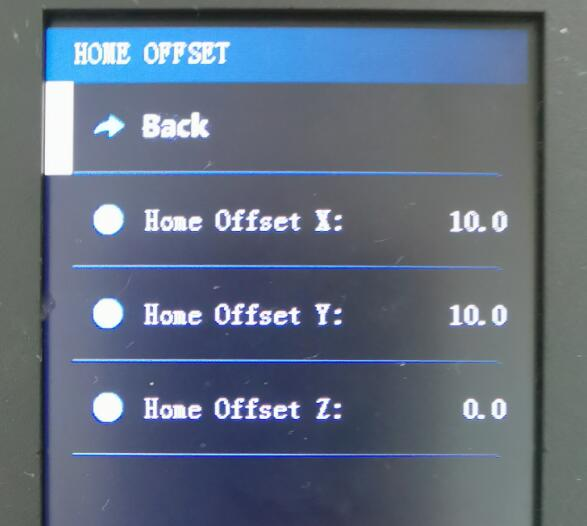
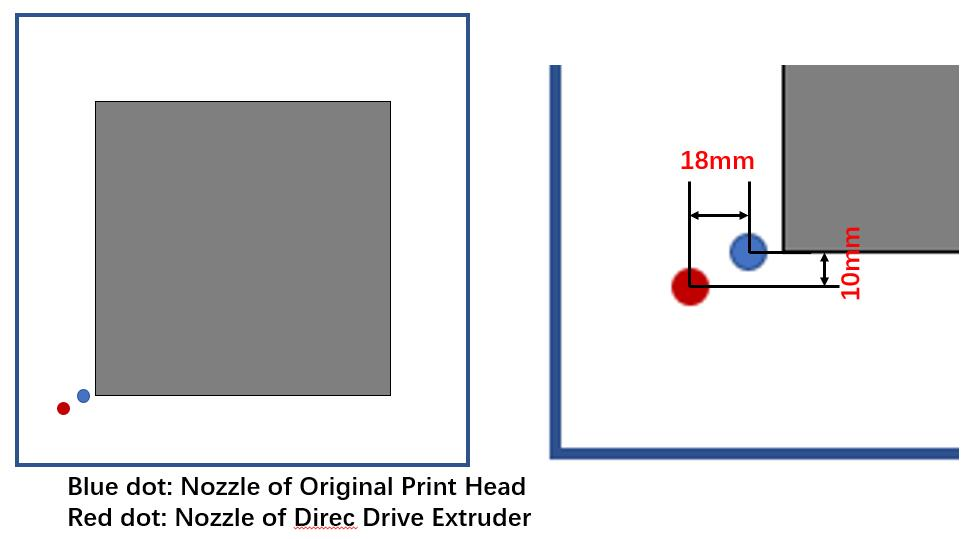
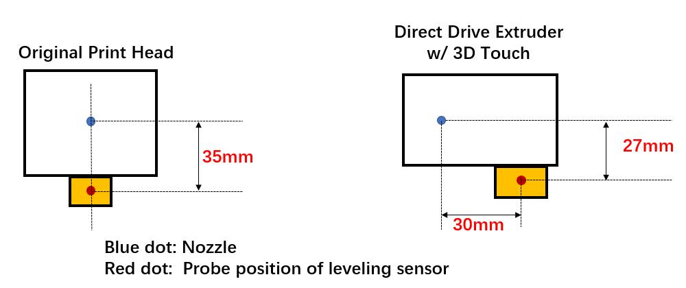
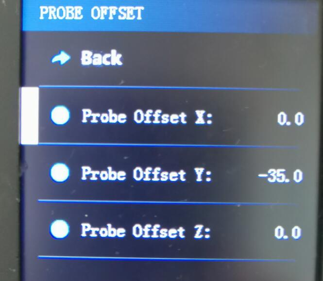

### :globe_with_meridians: Choose Language (Translated by google)

-----
## How to set the home offset
If you have upgraded the structure of the machine, a print head or changed the ENDSTOPs position etc., the original point of the machine may be changed. In this case, you need modify "Home offset" settings, otherwise the printer may not print the 3d model to the correct position on the hot bed.
- **Home Offset X:** The offset between the new nozzle position and the original nozzle position on the X-axis. If the new nozzle is closer to the X min ENDSTOP, the value is negative, otherwise it is positive.
- **Home Offset Y:** The offset between the new nozzle position and the original nozzle position on the Y-axis. If the new nozzle is closer to the Y min ENDSTOP, the value is negative, otherwise it is positive.    
- **Home Offset Z:** The offset between the new nozzle position and the original nozzle position on the Y-axis. If the new nozzle is lower than orignal, the offset value should be set to smaller. **NOTE**: Since usually the Z ENDSTOP or the device to trigger the Z ENDSTOP and the hot bed can be moved up and down, it is not recommended to adjust the "Home Offset Z" setting unless necessary.
### Set "Home Offset" on LCD screen
You can set the "home offset" on the LCD screen if there is a menu to set them.

### Set "Home Offset" by run a gcode command
You can use M206 command to set the home offset, the syntax is as follows: 
>
    M206 Xxx.x Yyy.y Zzz.z  ; set X/Y/Z offset, change xx.x yy.y zz.z to the value you need to set
    M500                    ; store to the NVRAM of control board

You can also [:arrow_down:download this gcode file](./M206.zip) (it is zipped, unzip it after downloaded), open the gcode file by "text editor" software and change the offset value, and then save it to SD card, and print this file on your 3d printer.

### Example
The following figure describes the distance between the position of the original print head nozzle (blue) and the position of the new Direct Drive Extruder nozzle after upgrading the Direct Drive Extruder on the Z9V5 machine. So, you should set:
- **Home Offset X:** -18 
- **Home Offset Y:** -10

-----
## How to set the probe offset 
If you have upgraded a print head or a new bed leveling sensor etc., the postion of bed leveling sensor probe may be changed. In this case, you can modify "Probe Offset" settings on LCD screen, otherwise the printer may not do "bed auto leveling" correctly. 
- **Probe Offset X:** The offset between the probe and the nozzle on the X-axis. If the probe is closer to the X min ENDSTOP than nozzle, the value is negative, otherwise it is positive.
- **Probe Offset Y:** The offset between the probe and the nozzle on the Y-axis. If the probe is closer to the Y min ENDSTOP than nozzle, the value is negative, otherwise it is positive.    
- **Probe Offset Z:** The offset between the probe sensing position and the Z original position. **NOTE**: The printer can "catch Probe Z offset" when doing bed leveling, so it is not recommended to adjust the Probe Z offset directly.
### Example
The following figure describes the "Probe Offset" setting of the original print head of Z9V5Pro/Z8PM4 with PL-08N leveling sensor and a Direct Drive Extruder with 3D touch bed leveling sensor. If you changed the print head, you need to change the "Probe Offset" too.

### Set "Probe Offset" on LCD screen
You can set the "home offset" on the LCD screen if there is a menu to set them.

### Set "Probe Offset" by run a gcode command
You can use M851 command to set the home offset, the syntax is as follows: 
>
    M851 Xxx.x Yyy.y Zzz.z  ; set X/Y/Z offset, change xx.x yy.y zz.z to the value you need to set
    M500                    ; store to the NVRAM of control board

You can also [:arrow_down:download this gcode file](./M851.zip) (it is zipped, unzip it after downloaded), open the gcode file by "text editor" software and change the offset value, and then save it to SD card, and print this file on your 3d printer.
