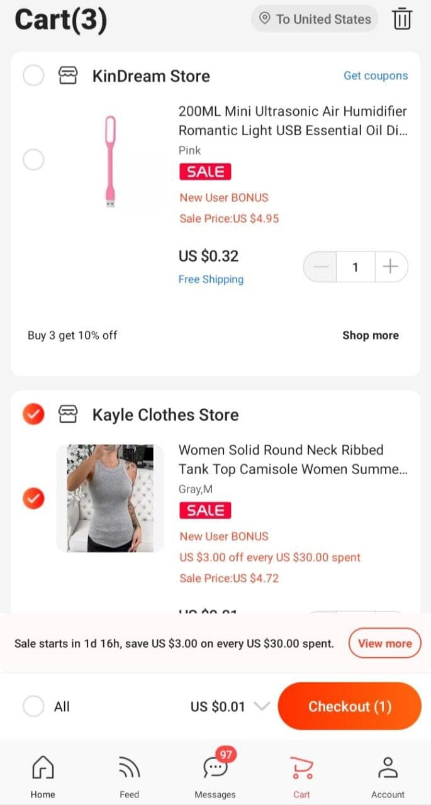
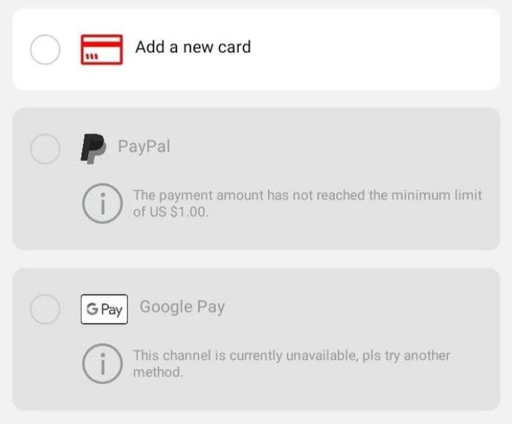
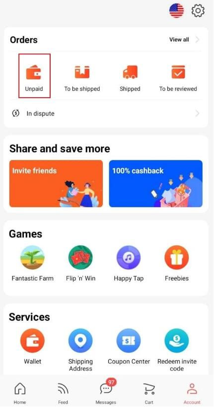

## How to place an order on AliExpress without paying
AliExpress does not have a direct option to leave an order in “pending payment”, so you will have to use a little trick. But don't worry because it's totally allowed, and you won't have any problems if you do it.

##### First, add the item you want to buy to the shopping cart (here) and click “Checkout”.

##### In the next step (“Order Confirmation”) click on the “Payment Methods” tab to see all the payment options you can choose from.
- If you are a regular buyer, you probably already have your bank card information saved and if not, just fill in your card information; but in both **cases change your CVV number to a random number** and click on “Save and confirm”.  

- It's important that you do this so that when you click on “Pay now”, you will get a warning telling you to update your CVV number because the one you have entered is incorrect.  
##### Now close the AliExpress page or app completely. Note that if you are doing this from the app, you must close it completely and not leave it open in the background.
#### Reopen the page or app, and you will see that the order now appears as “Pending payment”.

##### If you prefer, you can send a message to the seller to notify them, although it is not necessary to do so, since a purchase order is generated directly, and they receive it immediately.
##### In the event that the seller has to modify the price of your purchase, you will receive a notice, and you will be able to pay it directly by going to the orders section, clicking on “Pending payment” and “Pay now”.
##### Previously, you could approach this process by selecting “Other payment methods”, clicking on “Pay” and leaving the app or the web. But now this payment method is no longer available and the only viable way is the one we have indicated above.

--------
### What is the purpose of leaving an order pending payment?
Leaving an order on back-order can be useful in many cases:
- **If a seller offers you a discount on an item.** You may have a small problem with an order and instead of opening a dispute, you agree with the seller to them giving you a discount on the next order. This way, the seller can modify the amount of your purchase if you have agreed to do so.
- **Reduce or eliminate shipping costs.** In the same way as before, if you reach an agreement with the seller, you can also reduce or remove the shipping costs of a product leaving the order as the pending payment.
- **For customized orders.** There are items that have the option to be customized (such as custom-made clothing). In this case, normally the seller will send you a link and will ask you to leave the order pending payment so that he modifies it with the price that you have agreed.
- **To put pressure on the seller.** If you are going to place a large order in the same store, one way to pressure the seller to give you a discount on your purchase is to leave it in pending payment and send him a message with your proposal. For large orders, this usually works, and you can always save some money.
- **Buy something and pay for it later.** When you put an order on back-order you have 20 days to make the payment before it's cancelled. You may have a coupon or discount code that you don't want to miss out on, but you may not want to pay for it right now: by leaving it pending payment, you won't miss the opportunity, and you will still have many days to confirm the payment with your bank.