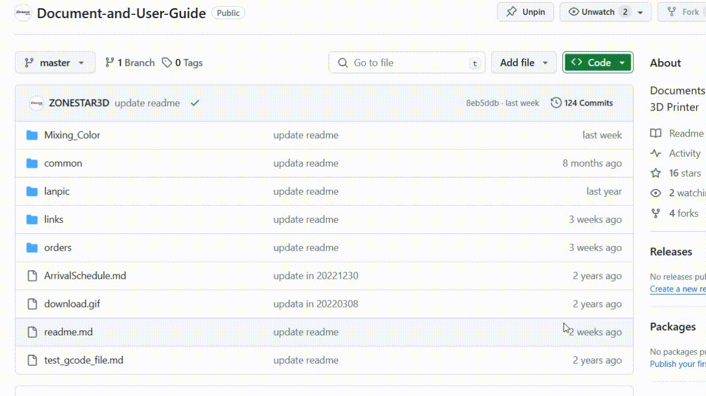

### :globe_with_meridians: Choose Language (Translated by google)

-----
## ZONESTAR 3D Printer DIY Kits User Manual
### :file_folder: Z5 series
  - :open_file_folder: **Z5 User guide: https://github.com/ZONESTAR3D/Z5**
  - :open_file_folder: **Z5X  User guide: https://github.com/ZONESTAR3D/Z5X**
### :file_folder: Z6 series
  - :open_file_folder: **Z6 User guide: https://github.com/ZONESTAR3D/Z6**
### :file_folder: Z8 series
  - :open_file_folder: **Z8S User guide: https://github.com/ZONESTAR3D/Z8S**
  - :open_file_folder: **Z8T User guide: https://github.com/ZONESTAR3D/Z8T**
  - :open_file_folder: **Z8P User guide: https://github.com/ZONESTAR3D/Z8P**
    - :blue_book:**Z8P User guide: https://github.com/ZONESTAR3D/Z8P/tree/main/Z8P**
    - :blue_book:**Z8P-MK2 User guide: https://github.com/ZONESTAR3D/Z8P/tree/main/Z8P-MK2**
### :file_folder: [Z9 series](https://github.com/ZONESTAR3D/Z9)
  - :open_file_folder: **Z9M3 User guide: https://github.com/ZONESTAR3D/Z9/tree/main/Z9M3**
  - :open_file_folder: **Z9M4 User guide: https://github.com/ZONESTAR3D/Z9/tree/main/Z9M4**
  - :open_file_folder: **Z9V5 User guide: https://github.com/ZONESTAR3D/Z9/tree/main/Z9V5**     
   **:warning: [What's different between MK1/MK2/MK3/MK4/MK5?](https://github.com/ZONESTAR3D/Z9/tree/main/Z9V5#whats-different-on-z9v5-mk1mk2mk3mk4mk5)**
    - :blue_book:**Z9V5-MK1 User guide: https://github.com/ZONESTAR3D/Z9/tree/main/Z9V5/Z9V5-MK1**
    - :blue_book:**Z9V5-MK2 User guide: https://github.com/ZONESTAR3D/Z9/tree/main/Z9V5/Z9V5-MK2**
    - :blue_book:**Z9V5-MK3 User guide: https://github.com/ZONESTAR3D/Z9/tree/main/Z9V5/Z9V5-MK3**
    - :blue_book:**Z9V5-MK4 User guide: https://github.com/ZONESTAR3D/Z9/tree/main/Z9V5/Z9V5-MK4**  
    - :blue_book:**Z9V5-MK5 User guide: https://github.com/ZONESTAR3D/Z9/tree/main/Z9V5/Z9V5-MK5**  
 
-----
## Slicing guide  
Slicing is a piece of software that everyone uses when creating objects and products on a 3D printer. The software gives the printer a path to follow. The slicing software takes your image and converts it into G codes that your 3D printer can understand. These G codes are a type of instruction on how the printer needs to print your design. For more information, please refer to  :page_with_curl: [**Reference 1**](https://loveandrobots.com/what-is-slicing-in-3d-printing/)  :page_with_curl: [**Reference 2**](https://en.wikipedia.org/wiki/Slicer_(3D_printing))  
For details, please refer to **[https://github.com/ZONESTAR3D/Slicing-Guide](https://github.com/ZONESTAR3D/Slicing-Guide)**.

-----
## Mixing color guide
The color mixing feature is a function to mix multi different color filaments and extruded from one nozzle to get a new color filament. By adjusting the extrude ratio of each extruder, it can get different color filament. For example, mix Magenta and Yellow filament as a ratio 5:1 to get Red filament, and mix Magenta and Yellow filament as a ratio 1:1 to get Orange filament.    
For details, please refer to **[https://github.com/ZONESTAR3D/Document-and-User-Guide/Mixing_Color](https://github.com/ZONESTAR3D/Document-and-User-Guide/Mixing_Color)**.

-----
## Firmware
**Firmware bin file** is the exact memory that is written to the embedded flash.    
**Firmware source code** is the core part of the firmware. The entire firmware can be thought of as different sub modules. It is divided into many sub files. These files are called source files. And, the entire program files are called source file or source code. Now our firmware source code is base on [**marlin**](https://www.marlinfw.org).  
- :blue_book: **ZONESTAR 3D Printer Firmware Bin files: https://github.com/ZONESTAR3D/Firmware**
- :blue_book: **ZONESTAR 3D Printer Firmware Source code: https://github.com/ZONESTAR3D/source-code-for-3d-printer**

-----
## Upgrade kits and parts
We provide some upgradeable features for our 3D printers. If you are interested in these upgradeable parts / kits, please refer to the following links. **Primary link**: https://github.com/ZONESTAR3D/Upgrade-kit-guide
- :blue_book: [**WiFi Module**](https://github.com/ZONESTAR3D/Upgrade-kit-guide/tree/main/WiFi) - wireless control feature 
- :blue_book: [**Filament run out sensor**](https://github.com/ZONESTAR3D/Upgrade-kit-guide/tree/main/FROD) - Detect that filaments are exhausted and automatically pause printing.
- :blue_book: [**HOTENDs(Extruder)**](https://github.com/ZONESTAR3D/Upgrade-kit-guide/tree/main/HOTEND) - Various types of hot ends meet different kinds of filaments and printing requirements.
- :blue_book: [**Bed Leveling Sensor**](https://github.com/ZONESTAR3D/Upgrade-kit-guide/tree/main/Bed_Leveling_Sensor) - Automatica Bed Leveling feature and parts.
- :blue_book: [**Direct Drive Extruder**](https://github.com/ZONESTAR3D/Upgrade-kit-guide/tree/main/Direct_Drive_Extrruder) - The direct drive extruder can print flexible filament. Moreover, the printing quality is better, and the possibility of printing failure and defects is lower.
- :blue_book: [**Laser Engraving**](https://github.com/ZONESTAR3D/Upgrade-kit-guide/tree/main/Laser_Engraving) - Let your 3D printer have simple laser engraving function.
- :blue_book: [**Motor Drive Modules**](https://github.com/ZONESTAR3D/Upgrade-kit-guide/tree/main/Motor_Driver) - Some motor drive modules can provide higher drive current and lower operating noise.
- :blue_book: [**TFT LCD Screen**](https://github.com/ZONESTAR3D/Upgrade-kit-guide/tree/main/TFT-LCD) - Improved human-machine interface.
- :blue_book: [**Auto Repeat Printing Module**](https://github.com/ZONESTAR3D/Upgrade-kit-guide/tree/main/Auto_Repeat_Printing) - Turn your 3D printer into an automatic continuous production machine (only applicable to z9v5).
- :blue_book: [**Build Volume Upgrade Kit for Z9V5**](https://github.com/ZONESTAR3D/Upgrade-kit-guide/tree/main/Z9V5_500x500) - Upgrade the build volume to 500x500x400mm.
- :blue_book: [**Linear Rail Upgrade Kit for Z9V5**](https://github.com/ZONESTAR3D/Upgrade-kit-guide/tree/main/Z9V5_LinearRail) - Upgrade wheels to linear rail.
-----
## 3D Printer Control Boards  
3D printer control board user manual and documents: https://github.com/ZONESTAR3D/Control-Board  
- :blue_book: **ZRIB & ZMIB:** https://github.com/ZONESTAR3D/Control-Board/tree/main/8bit
- :blue_book: **ZM3E2 & ZM3E4:** https://github.com/ZONESTAR3D/Control-Board/tree/main/32bit

-----
### :memo: How to downlod files from Github page?
#### Step 1: Click this link [**https://downgit.github.io/**](https://downgit.github.io/) 
#### Step 2: Copy the Github file or direcotry link which you want to download.
#### Step 3: Click download button and wait a few seconds, it will start to download automatically. 
   
